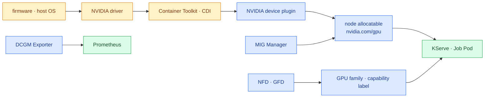

import { Steps, LinkCard } from '@astrojs/starlight/components';
import TermIntro from '../../../components/docs/TermIntro.astro';

> `nvidia-smi`가 된다는 사실과 **Kubernetes Pod가 GPU를 받을 수 있다는 사실은 다르다**

<TermIntro
  terms={[
    ['device plugin', '', 'kubelet에 GPU 개수와 health를 알리고 선택된 장치를 Pod에 전달하는 벤더 plugin이다.'],
    ['CDI', 'Container Device Interface', 'container runtime이 GPU 같은 복합 장치를 표준화된 명세로 container에 넣는 방식이다.'],
    ['NFD · GFD', 'Node/GPU Feature Discovery', 'PCI 장치·GPU 제품·기능을 node label로 만드는 발견 계층이다.'],
    ['MIG', 'Multi-Instance GPU', '한 물리 GPU를 메모리와 연산 자원이 격리된 여러 GPU instance로 나누는 기능이다.'],
  ]}
/>

## GPU Operator가 채우는 사슬



GPU Operator는 이 조각을 같은 release matrix로 관리한다. 제품을 쓰지 않더라도 이 기능은 하나씩
직접 설치해야 하므로 이 환경에서는 Operator가 기본값이다.

## preinstalled driver를 함부로 덮지 않는다

DGX 계열은 OS image에 driver와 toolkit이 들어 있는 경우가 많다. 운영 방식은 둘 중 하나로 고정한다.

| 방식 | 설정 방향 | 주의 |
|---|---|---|
| host가 driver 소유 | `driver.enabled=false` | DGX OS update와 Kubernetes drain을 함께 운영 |
| Operator가 driver 소유 | driver container·CRD | 해당 시스템·kernel·driver 조합이 지원되는지 확인 |

Toolkit도 같은 판단이 필요하다. Spark에서 Docker GPU container가 실행되어도 Kubernetes가 쓰는
containerd의 CDI/runtime 설정은 다를 수 있다. 이미 CRI까지 검증됐을 때만 `toolkit.enabled=false`로 둔다.

:::caution[cluster 전체에 한 값을 바로 적용하지 않는다]
Spark·A100·B300의 OS와 driver 주인이 다를 수 있다. node label과 `NVIDIADriver` CR을 사용하거나,
실행 cluster를 나누어 한 세대의 변경이 다른 세대를 동시에 재부팅하지 않게 한다.
:::

## MIG와 full GPU는 서로 다른 상품이다

A100은 MIG를 지원한다. 같은 node에서 작은 serving과 8-GPU 학습을 모두 받고 싶어도 MIG geometry를
바꾸는 순간 실행 중 workload와 GPU reset 조건이 얽힌다.

권장 pool은 다음처럼 분리한다.

```text
a100-full     → 학습·대형 inference, nvidia.com/gpu
a100-mig-1g   → 작은 serving·개발, 고정 MIG resource
a100-mig-3g   → 중형 serving, 고정 MIG resource
```

MIG profile을 job마다 동적으로 바꾸는 것은 나중 문제다. 초기에는 node별 geometry를 고정하고
변경을 maintenance로 취급한다. time-slicing은 memory·fault isolation이 없으므로 Backend.AI의 fractional
GPU와 같은 것으로 간주하지 않는다.

## node contract를 검증한다

<Steps>

1. **host** — firmware·OS·kernel·driver와 `nvidia-smi` 결과를 기록한다.
2. **runtime** — containerd/CDI로 CUDA sample container가 실행되는지 본다.
3. **Kubernetes resource** — node의 `Capacity`와 `Allocatable`에 GPU·MIG resource가 나타나는지 확인한다.
4. **label** — architecture·GPU product·MIG strategy와 운영 label이 예상대로 붙었는지 본다.
5. **placement** — 잘못된 architecture·pool에는 Pod가 배치되지 않는지 negative test를 한다.
6. **telemetry** — DCGM metric과 node·Pod label이 연결되는지 확인한다.
7. **maintenance** — cordon·drain·driver update·reboot·uncordon 순서를 rehearsal한다.

</Steps>

## 최소 확인 명령

```bash
kubectl get nodes -L kubernetes.io/arch,nvidia.com/gpu.product,accelerator.pool
kubectl describe node a100-01
kubectl -n gpu-operator get pods -o wide
kubectl get runtimeclass
```

합격은 DaemonSet이 `Running`인 것이 아니다. 올바른 image가 올바른 node에서 실제 CUDA 계산을 하고,
잘못된 Pod는 `Pending` 또는 admission 거부가 되는 상태다.

## 참고 자료

- [GPU Operator 개요](https://docs.nvidia.com/datacenter/cloud-native/gpu-operator/latest/) — 관리하는 software component 전체.
- [GPU Operator 설치](https://docs.nvidia.com/datacenter/cloud-native/gpu-operator/latest/getting-started.html) — preinstalled driver·toolkit 구성.
- [NVIDIA Driver CRD](https://docs.nvidia.com/datacenter/cloud-native/gpu-operator/latest/gpu-driver-configuration.html) — node별 driver version·type.
- [GPU Operator MIG](https://docs.nvidia.com/datacenter/cloud-native/gpu-operator/latest/gpu-operator-mig.html) — MIG Manager와 strategy.

<LinkCard
  title="3. KServe는 어디까지 맡는가"
  description="Standard InferenceService를 기본으로 두고 LLMInferenceService를 필요한 곳에만 붙인다."
  href="/gpu-platform/03-kserve/"
/>
