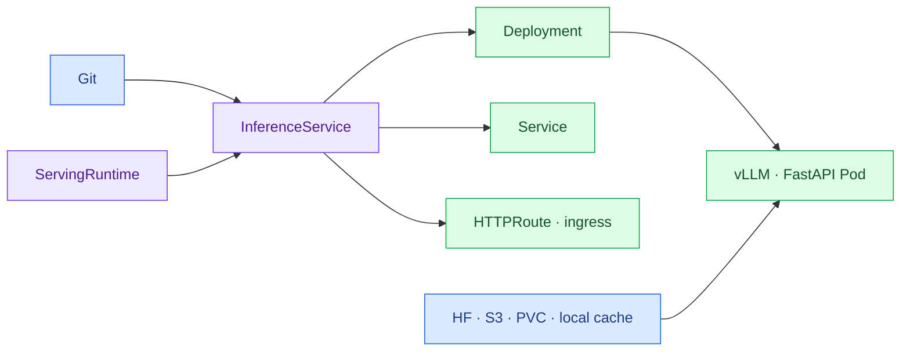

import { Card, CardGrid, LinkCard } from '@astrojs/starlight/components';
import TermIntro from '../../../components/docs/TermIntro.astro';

> KServe의 첫 역할은 똑똑한 LLM scheduler가 아니라 **모델 server를 Kubernetes 객체로 만드는 것**이다

<TermIntro
  terms={[
    ['InferenceService', '', 'predictor·transformer·explainer와 runtime·resource를 선언하는 KServe의 기본 serving 객체다.'],
    ['ServingRuntime', '', '어떤 container image와 command가 어떤 model format을 실행하는지 정한 재사용 template다.'],
    ['LLMInferenceService', '', '분산 LLM·지능형 routing·prefill/decode 같은 topology를 위한 별도 CRD다.'],
    ['Standard mode', '', 'Knative 없이 Kubernetes Deployment·Service를 직접 사용하는 KServe 실행 방식이다.'],
  ]}
/>

## 기본 객체는 InferenceService다

운영자는 model source·runtime·resource·replica를 선언한다. KServe controller가 일반 Kubernetes 객체를
만들고 상태를 다시 `InferenceService.status`에 모은다. Argo CD가 추적할 원본은 상위 CR이다.

## Standard mode부터 시작한다

<CardGrid>
<Card title="Standard InferenceService" icon="approve-check">
Spark single-node vLLM.

A100 full GPU·MIG serving.

embedding·reranker·FastAPI.

명시적인 replica와 resource control.
</Card>
<Card title="LLMInferenceService" icon="puzzle">
prefix/KV-cache-aware routing.

LeaderWorkerSet multi-node inference.

prefill·decode 분리.

Gateway API inference extension.
</Card>
</CardGrid>

처음부터 오른쪽을 설치하면 Gateway·scheduler·LeaderWorkerSet·CRD까지 동시에 디버깅하게 된다.
먼저 Standard mode에서 image·GPU·model artifact·streaming을 합격시키고, 실제 병목이 확인된 모델만
`LLMInferenceService`로 옮긴다.

## Knative는 기본값이 아니다

LLM은 크고 시작이 느리며 streaming 요청이 길다. 온프렘 GPU는 cloud처럼 즉시 늘어나지도 않는다.
따라서 기본은 raw Kubernetes Deployment를 쓰는 Standard mode다.

| 요구 | 선택 |
|---|---|
| 상시 LLM·embedding | Standard mode |
| 예측형 CPU 모델의 scale-to-zero | Knative mode 검토 |
| 대형 LLM 고급 topology | LLMInferenceService |

scale-to-zero로 GPU 비용을 줄이려다 수분짜리 model load를 첫 사용자에게 넘기지 않는다.

## runtime catalog가 제품 UI를 대신한다

다음 template를 platform team이 검증·배포한다.

| runtime | 대상 | image 조건 |
|---|---|---|
| `vllm-spark` | GB10 single-node | ARM64·Spark driver/CUDA 검증 |
| `vllm-a100` | A100 full·MIG | x86_64·A100 benchmark 통과 |
| `vllm-b300` | B300 | B300 driver/CUDA·kernel 검증 |
| `fastapi-cuda` | classification·custom embedding | health·SIGTERM·metric contract |
| `fastapi-cpu` | 작은 예측형 모델 | GPU resource를 요구하지 않음 |

`latest` image나 범용 runtime 하나로 세 pool을 모두 받지 않는다. runtime name이 architecture·가속기
계약을 드러내고, admission policy가 맞지 않는 조합을 거부해야 한다.

## KServe가 맡지 않는 것

- 최종 이용자의 API key와 quota — LiteLLM
- batch job queue와 fair sharing — Kueue
- 학습 job의 worker lifecycle — JobSet·Trainer
- GPU driver와 device discovery — GPU Operator
- 모델 품질 평가와 승인 — 별도 CI·registry workflow
- model memory에 맞는 GPU 자동 추천 — platform preset·benchmark

## 참고 자료

- [KServe Administrator Guide](https://kserve.github.io/website/docs/next/admin-guide/overview) — Standard·Knative·LLMInferenceService 선택.
- [KServe 설치 개념](https://kserve.github.io/website/docs/install/overview) — component와 CRD 관계.
- [KServe runtime overview](https://kserve.github.io/website/docs/model-serving/generative-inference/overview) — vLLM·Hugging Face runtime.

<LinkCard
  title="4. LiteLLM에서 모델 Pod까지"
  description="이용자 정책과 실행 상태를 분리하고 Spark·A100·B300에 같은 API 계약을 건다."
  href="/gpu-platform/04-serving/"
/>
