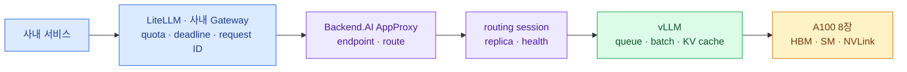

import { Card, CardGrid, Steps, LinkCard } from '@astrojs/starlight/components';
import TermIntro from '../../../components/docs/TermIntro.astro';

> GPU 사용률은 원인이 아니라 상태다 — 먼저 **요청이 어느 층에서 얼마나 기다렸는지**를 찾는다

<TermIntro
  terms={[
    ['SLO', 'Service Level Objective', '이용자에게 제공할 성공률·응답 시간을 측정 가능한 목표로 정한 것이다.'],
    ['TTFT', 'Time To First Token', '요청을 보낸 뒤 첫 출력 token을 받기까지 걸린 시간이다. queue와 prefill 영향을 크게 받는다.'],
    ['ITL', 'Inter-Token Latency', '첫 token 이후 인접한 출력 token 사이의 시간이다. 생성 중 끊김과 decode 포화를 보여준다.'],
    ['load shedding', '부하 차단', '처리할 수 없는 요청을 오래 기다리게 하지 않고 경계에서 빠르게 거절해 전체 장애를 막는 정책이다.'],
  ]}
/>

## 타임아웃이 생기는 전체 경로

사내 서비스가 같은 LLM endpoint를 공유하면 요청 수보다 **동시에 처리해야 할 token 양**이 먼저 한계에
도달한다. 긴 prompt 하나는 짧은 요청 여러 개의 prefill 시간을 쓰고, 긴 답변은 KV cache를 오래 점유한다.
따라서 `requests/s`와 GPU utilization만으로는 어느 서비스가 포화를 만들었는지 알 수 없다.



현재는 Backend.AI AppProxy와 routing session이 가운데 있지만 KServe로 전환한 뒤에는 Gateway와
InferenceService replica가 그 자리를 맡는다. 이용자 SLO, vLLM 내부 지표, GPU health라는 세 관측 축은
바뀌지 않는다.

## 한 화면에서 볼 네 줄

Grafana dashboard는 GPU panel부터 시작하지 않는다. 같은 시간 축에 아래 네 줄을 위에서 아래로 놓으면
타임아웃이 이용자 경계, 대기열, model engine, hardware 중 어디서 시작됐는지 비교할 수 있다.

| 줄 | 핵심 지표 | 반드시 나눌 차원 |
|---|---|---|
| 이용자 영향 | 요청 수, 성공률, timeout·429·5xx, p50·p95·p99 전체 지연, 취소율 | service·endpoint·model·stream 여부 |
| 생성 경험 | TTFT, ITL, stream duration, 입력·출력 token 수, 성공 output tokens/s | prompt·output 길이 구간 |
| vLLM 포화 | running·waiting request, queue time, KV cache, preemption, prefix cache hit | model·replica·revision |
| 실행 기반 | healthy replica, session restart, GPU HBM·SM·Tensor·DRAM, XID·ECC·NVLink, CPU·RAM·network | node·GPU UUID·replica |

`request_id`는 metric label로 넣지 않는다. 시계열 수가 요청마다 늘어나기 때문이다. metric에는
`service`, `endpoint`, `model`, `replica`, `status`, `timeout_source`처럼 값의 수가 제한된 label만 두고,
request ID는 AppProxy·vLLM log와 trace를 잇는 데 사용한다.

### vLLM에서 먼저 수집할 metric

vLLM OpenAI-compatible server의 `/metrics`를 Prometheus가 직접 scrape한다. 배포 버전에 따라 이름이
바뀔 수 있으므로 문서의 예제를 복사하는 데서 끝내지 말고, 운영 image의 실제 출력과 dashboard를 함께
version control한다.

| 질문 | 대표 metric | 해석 |
|---|---|---|
| 지금 기다리는가 | `vllm:num_requests_waiting`, `vllm:request_queue_time_seconds` | 지속 상승하면 유입이 처리 용량을 넘는다 |
| 몇 요청을 실행하는가 | `vllm:num_requests_running` | waiting과 함께 봐야 안전한 동시성을 알 수 있다 |
| 첫 token이 왜 늦나 | `vllm:time_to_first_token_seconds`, `vllm:request_prefill_time_seconds` | queue와 prefill을 분리한다 |
| 생성이 왜 끊기나 | `vllm:inter_token_latency_seconds`, `vllm:request_decode_time_seconds` | decode 경쟁과 긴 출력을 찾는다 |
| cache가 버티는가 | `vllm:kv_cache_usage_perc`, `vllm:num_preemptions` | 고수위와 preemption 동시 발생은 cache thrashing 신호다 |
| 실제 일을 얼마나 했나 | prompt·generation token counter, request token histogram | 요청 수 대신 input·output tokens/s를 계산한다 |
| 공통 prefix를 재사용하나 | prefix cache query·hit counter | hit 비율과 TTFT 개선을 함께 검증한다 |

Prometheus histogram은 `_bucket` 시계열에서 분위수를 계산한다. 예를 들어 운영 version에 해당 metric이
노출된다면 queue p95는 다음 형태로 구한다.

```text
histogram_quantile(
  0.95,
  sum by (le, model_name) (
    rate(vllm:request_queue_time_seconds_bucket[5m])
  )
)
```

### Backend.AI와 node에서 붙일 것

Backend.AI에서는 endpoint의 desired·actual replica, route health, inference session 상태·재시작,
AppProxy upstream error와 active connection을 모은다. Agent의 available·occupied slot과 live statistics는
"replica를 늘리도록 설정했지만 실제로 배치할 GPU가 없는 상태"를 구분하는 데 필요하다.

GPU node에는 DCGM Exporter를 둔다. GPU utilization 하나 대신 framebuffer used/free, graphics·tensor·DRAM
activity, power·temperature·clock event, XID·row remap, NVLink throughput·health를 함께 수집한다. vLLM queue가
길지만 GPU activity가 낮다면 CPU tokenizer, AppProxy, network, NCCL rank 또는 unhealthy process를 먼저
의심한다.

## SLO와 timeout budget을 먼저 정한다

모든 서비스에 같은 timeout 숫자를 주지 않는다. interactive chat, 내부 자동화, 긴 문서 요약은 기다릴 수
있는 시간과 재시도 위험이 다르다. 최소한 다음 두 service class를 나눈다.

| class | SLO의 중심 | 과부하 때의 동작 |
|---|---|---|
| interactive | 성공률·TTFT·ITL | 짧게 기다린 뒤 429·503, 긴 요청 제한 |
| asynchronous·batch | 완료율·queue age·deadline | 접수 후 별도 queue, 결과를 나중에 조회 |

절대 목표는 model·prompt 분포를 측정한 뒤 정한다. 다만 deadline의 순서는 고정한다.

```text
호출자 전체 deadline > Gateway upstream budget > model 실행 budget
```

각 경계가 같은 순간 끊기지 않도록 작은 여유를 두고, connect timeout·첫 token timeout·stream idle timeout·
전체 생성 deadline을 분리한다. client가 연결을 끊으면 AppProxy를 거쳐 vLLM request도 취소되어야 한다.
응답을 받을 곳이 없는데 GPU가 계속 token을 만들면 장애 중 처리 용량이 더 줄어든다.

:::caution[재시도 폭풍]
첫 token을 받기 전의 연결 실패나 명시적인 429·503만 제한적으로 재시도한다. 이미 오래 실행한 요청의
timeout을 즉시 다시 보내거나 streaming 도중 다른 replica에서 재시작하면 같은 일을 중복해 포화를 키운다.
재시도는 횟수 상한과 jitter를 갖고, 남은 deadline 안에서만 수행한다.
:::

## 지표 조합으로 병목을 가른다

| 함께 변한 지표 | 우선 의심할 것 | 첫 대응 |
|---|---|---|
| waiting·queue time·TTFT 상승 | 유입량이 scheduler 처리량을 초과 | admission 제한·긴 요청 분리 |
| queue는 낮고 prefill·TTFT 상승 | 긴 prompt·tokenization·CPU 병목 | 입력 token 상한·공통 prefix 정규화 |
| ITL과 decode time 상승, GPU activity 높음 | 생성 동시성 과다 | output 상한·interactive 예약량 보호 |
| KV cache 고수위와 preemption 증가 | context·동시 sequence 과다 | 동시성·context 제한, cache 설정 재시험 |
| vLLM은 정상, AppProxy timeout 증가 | proxy deadline·buffering·connection 문제 | 경계별 timeout과 stream 전달 확인 |
| queue는 증가, GPU activity는 낮음 | CPU·network·NCCL·process health | host·rank·route health 확인 |
| XID·ECC·restart 동시 발생 | GPU·driver·runtime 장애 | route에서 제외하고 hardware triage |

GPU가 계속 95%라는 이유만으로 alert하지 않는다. 높은 utilization은 정상적으로 batch가 채워졌다는 뜻일 수
있다. **이용자 SLO 악화, queue 누적, 오류율** 가운데 둘 이상이 함께 움직일 때 포화로 판단한다.

## GPU를 늘리지 않고 지키는 순서

<Steps>

1. **대기열을 유한하게 만든다** — service별 concurrency와 queue 상한을 두고, 넘친 요청은 deadline까지 붙잡지 말고 `429` 또는 `503`과 `Retry-After`로 빠르게 돌려준다.
2. **한 요청의 최대 비용을 제한한다** — 입력 token·`max_tokens`·`n`의 기본값과 상한을 둔다. 긴 문서·대량 생성은 batch 경로로 보낸다.
3. **서비스끼리 공정하게 나눈다** — team quota·weighted concurrency·예약량으로 한 서비스의 burst가 전체 endpoint를 점유하지 못하게 한다. 운영 interactive 요청을 batch보다 보호한다.
4. **반복 계산을 없앤다** — 공통 system prompt와 문서 prefix의 byte·token 형태를 정규화하고 Automatic Prefix Caching의 hit 비율과 TTFT를 비교한다. 정답 cache는 데이터 신선도와 권한이 명확한 요청에만 쓴다.
5. **8장의 배치를 다시 시험한다** — model이 4장에 들어가면 TP=8 replica 1개와 TP=4 replica 2개를 비교한다. 2장에 들어가면 TP=2 replica 4개도 후보지만 weight 복제·KV cache 분산·routing 비용을 포함해 판단한다.
6. **scheduler 값을 workload에 맞춘다** — `max_num_seqs`, `max_num_batched_tokens`, chunked prefill, GPU memory utilization을 한 번에 하나씩 바꾸고 TTFT·ITL·preemption·성공 output tokens/s를 함께 기록한다.
7. **작은 model로 보낼 일을 분리한다** — 분류·간단 요약·형식 변환은 작은 model이나 quantized revision으로 보내고, 품질이 필요한 요청만 큰 model을 사용한다.

</Steps>

streaming은 첫 결과를 빨리 보여 주지만 계산량을 없애지 않는다. Backend.AI autoscaling도 비어 있는 GPU가
없으면 replica를 늘릴 수 없다. 상시 inference의 minimum replica·resource group을 예약하고, 비핵심
interactive·batch session이 그 자리를 점유하지 못하게 해야 한다.

### TP보다 replica가 나은지 확인하는 표

| 후보 | 기대 효과 | 확인할 위험 |
|---|---|---|
| TP=8 × 1 | 가장 큰 model·넓은 KV 공간 | 모든 요청이 한 scheduler와 장애 단위를 공유 |
| TP=4 × 2 | 독립 queue·throughput·장애 격리 | weight 두 벌, replica별 cache, load imbalance |
| TP=2 × 4 | 짧은 요청의 높은 병렬성 | model 적재 가능 여부, HBM 여유, route overhead |
| 작은 model fallback | 요청당 token 비용과 지연 감소 | 품질·context·응답 contract 차이 |

TP를 줄였다는 사실만으로 성공으로 보지 않는다. 실제 서비스별 prompt·output 길이 분포에서 SLO를 만족하는
성공 output tokens/s가 가장 높은 구성을 선택한다.

## 부하 시험으로 안전선을 만든다

평균 prompt 하나를 반복하는 benchmark는 운영 용량을 과대평가한다. 최근 요청에서 민감한 본문은 제거하되
service별 prompt token·output token·stream 비율·도착 간격 분포를 보존한 replay dataset을 만든다.

<CardGrid>
<Card title="1. 기준선" icon="analytics">
현재 image·model·TP·vLLM argument에서 낮은 동시성의 TTFT·ITL·tokens/s를 기록한다.
</Card>
<Card title="2. 계단 부하" icon="up-arrow">
동시성을 단계적으로 올려 queue가 계속 줄지 않는 지점과 첫 SLO 위반을 찾는다.
</Card>
<Card title="3. 긴 요청 혼합" icon="open-book">
짧은 interactive 요청 사이에 실제 비율의 긴 prompt·긴 output을 섞어 head-of-line 영향을 본다.
</Card>
<Card title="4. 지속 부하" icon="clock">
최소 30분 유지하며 KV cache·preemption·memory·temperature·XID와 queue 회복을 확인한다.
</Card>
</CardGrid>

안전 동시성은 "GPU가 죽지 않은 최대값"이 아니다. **timeout 없이 TTFT·ITL SLO를 지키고 burst 뒤 queue가
다시 0 근처로 돌아오는 최대값**이다. 운영 admission 상한은 이 값보다 낮게 두고 model revision이나
vLLM image가 바뀔 때 다시 측정한다.

## 알림과 첫 10분 대응

| alert | 조건의 방향 |
|---|---|
| 이용자 영향 | timeout·5xx error budget이 빠르게 소진 |
| queue 포화 | p95 queue time이 가장 짧은 client deadline의 일정 비율을 지속 초과 |
| cache 압력 | KV cache 고수위와 preemption 증가가 동시에 발생 |
| replica 부족 | healthy replica가 desired보다 작거나 restart 반복 |
| route 문제 | AppProxy upstream error 상승, vLLM queue는 정상 |
| hardware | 새로운 XID·row remap failure·NVLink health 이상 |

<Steps>

1. **영향 범위를 고정한다** — 어느 service·model·endpoint에서 언제부터 timeout이 늘었는지 확인하고 배포 변경과 겹치는지 본다.
2. **queue와 생성 단계를 나눈다** — waiting·queue time, TTFT·prefill, ITL·decode, KV cache·preemption을 같은 구간에서 비교한다.
3. **포화면 새 일을 줄인다** — batch·긴 output·낮은 priority 요청부터 제한하고 자동 retry를 끈다. timeout 숫자만 늘리지 않는다.
4. **경계 문제면 deadline을 추적한다** — client, Gateway, AppProxy log에서 누가 먼저 연결을 끊었는지 확인하고 vLLM 취소까지 이어졌는지 본다.
5. **replica·GPU 문제면 route를 비운다** — unhealthy session을 새 요청 대상에서 제외하고 log·DCGM event를 보존한 뒤 restart 또는 hardware 점검을 결정한다.

</Steps>

## 참고 자료

- [vLLM Production Metrics](https://docs.vllm.ai/en/latest/usage/metrics/) — `/metrics` endpoint와 queue·TTFT·ITL·KV cache metric.
- [vLLM Optimization and Tuning](https://docs.vllm.ai/en/latest/configuration/optimization/) — preemption과 chunked prefill·batch token 조정의 trade-off.
- [vLLM Automatic Prefix Caching](https://docs.vllm.ai/en/latest/features/automatic_prefix_caching/) — 공통 prefix 재사용이 prefill에 주는 효과와 한계.
- [vLLM Data Parallel Deployment](https://docs.vllm.ai/en/latest/serving/data_parallel_deployment/) — TP와 함께 쓸 수 있는 replica·data parallel 실행 방식.
- [Backend.AI Deployments](https://webui.docs.backend.ai/26.4/en/deployment.html) — inference replica·health·Prometheus 기반 autoscaling 구성.
- [Backend.AI Agent Monitoring](https://docs.backend.ai/en/latest/manager/admin-api/agents.html) — Agent status와 available·occupied slot·live statistics.
- [NVIDIA DCGM Exporter Metrics](https://docs.nvidia.com/datacenter/dcgm/latest/reference/dcgm-exporter-metrics.html) — GPU activity·memory·XID·NVLink·health metric 목록.

<LinkCard
  title="5. GPU가 없을 때 기다리게 하기"
  description="상시 inference의 admission과 달리 batch·학습은 Kueue에서 quota가 준비될 때까지 기다린다."
  href="/gpu-platform/05-kueue/"
/>
