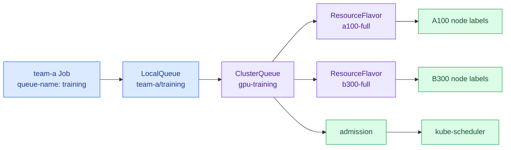

import { LinkCard } from '@astrojs/starlight/components';
import TermIntro from '../../../components/docs/TermIntro.astro';

> 온프렘 GPU는 늘어나지 않는다 — 그래서 autoscaling보다 먼저 필요한 것은 **누가 기다리고 누가 시작하는가**다

<TermIntro
  terms={[
    ['admission', '입장 허가', 'job 전체에 필요한 quota와 자원 종류가 준비됐을 때 실행을 허용하는 결정이다.'],
    ['LocalQueue', '', '사용자 namespace 안에서 job이 제출되는 queue다.'],
    ['ClusterQueue', '', '여러 LocalQueue가 공유할 수 있는 cluster 범위 quota와 정책이다.'],
    ['ResourceFlavor', '', 'A100·B300처럼 node label이 다른 자원 종류를 quota 안에서 구분하는 객체다.'],
  ]}
/>

## Kubernetes Job만으로는 queue가 생기지 않는다

Job을 만들면 기본 job controller는 곧바로 Pod를 만든다. GPU가 없으면 Pod가 `Pending`에 머문다.
여러 팀이 같은 방식으로 Pod를 쌓으면 다음을 알기 어렵다.

- 어떤 팀이 먼저 기다렸는가
- 팀별 보장 quota와 빌려 쓸 수 있는 여유분은 얼마인가
- GPU 여덟 장이 모일 때까지 일부 Pod가 먼저 자원을 잡아도 되는가
- A100 job을 B300으로 대체할 수 있는가
- 낮은 priority job을 언제 선점할 것인가

Kueue는 Pod를 직접 배치하지 않는다. job을 잠시 suspend하고 quota와 flavor가 준비되면 admission한 뒤,
실제 Pod 배치는 Kubernetes scheduler에 맡긴다.

## 세 객체가 연결되는 길



## flavor는 GPU 제품명보다 운영 약속이다

```yaml
apiVersion: kueue.x-k8s.io/v1beta1
kind: ResourceFlavor
metadata:
  name: a100-full
spec:
  nodeLabels:
    accelerator.gpu-family: a100
    accelerator.partition: full
```

예상 flavor는 다음과 같다.

| flavor | 용도 | 허용할 workload |
|---|---|---|
| `spark-full` | ARM64 inference·실험 | Spark image가 검증된 job만 |
| `a100-full` | multi-GPU 학습·대형 serving | 1·2·4·8 GPU preset |
| `a100-mig-small` | 작은 개발·추론 | MIG resource를 명시한 Pod |
| `b300-full` | 대형 학습·serving | 초기에는 승인된 image·full GPU |

Spark는 상시 KServe serving이 대부분이므로 batch ClusterQueue에 전량을 열지 않는다. reserved serving
capacity와 실험용 queue를 분리한다.

## quota는 소유가 아니라 빌려 쓰는 경계다

온프렘에서는 놀고 있는 GPU를 다른 팀이 쓸 수 있어야 한다. 팀별 최소 보장량, cohort 안의 borrowing,
priority와 preemption을 함께 설계한다.

| 정책 질문 | 먼저 정할 값 |
|---|---|
| 팀이 최소 몇 GPU를 보장받나 | nominal quota |
| 다른 팀의 빈 GPU를 빌릴 수 있나 | cohort·borrowing limit |
| 운영 inference를 batch가 밀어낼 수 있나 | 별도 pool·priority class |
| 오래 기다린 job과 높은 priority 중 누가 먼저인가 | queue strategy |
| deadline이 있는 job을 선점시킬 수 있나 | priority·preemption policy |

:::caution[ResourceQuota로 queue를 만들 수 없다]
namespace `ResourceQuota`는 생성 시 상한을 거부하는 안전장치다. 기다리는 순서·borrowing·fair sharing을
표현하지 않는다. 보호선은 ResourceQuota, 기다림과 배분은 Kueue가 맡는다.
:::

## Backend.AI와 비교할 때 볼 것

- project·user별 quota가 어떤 ClusterQueue·LocalQueue로 옮겨지는가
- Backend.AI scaling group이 어떤 resource flavor·node pool이 되는가
- pending 순서와 scheduler 정책이 새 환경에서도 같은 결과를 내는가
- fractional GPU request가 MIG 또는 별도 sharing policy로 정확히 번역되는가
- WebUI의 남은 quota·queue position을 사용자가 어디서 보는가

API 기능이 같아도 사용자에게 기다리는 이유가 보이지 않으면 운영 경험은 나빠진다. portal이나
Headlamp·Grafana view를 별도 delivery 항목으로 둔다.

## 참고 자료

- [Kueue 개념](https://kueue.sigs.k8s.io/docs/concepts/) — queue·workload·resource flavor 관계.
- [Kueue fair sharing](https://kueue.sigs.k8s.io/docs/concepts/fair_sharing/) — cohort 안의 공정 배분.
- [Kueue ResourceFlavor](https://kueue.sigs.k8s.io/docs/concepts/resource_flavor/) — node label과 자원 종류 연결.

<LinkCard
  title="6. 여러 Pod를 한 작업으로 시작하기"
  description="GPU가 모였어도 분산 job의 leader·worker가 함께 뜨고 함께 실패하도록 lifecycle을 묶어야 한다."
  href="/gpu-platform/06-distributed/"
/>
