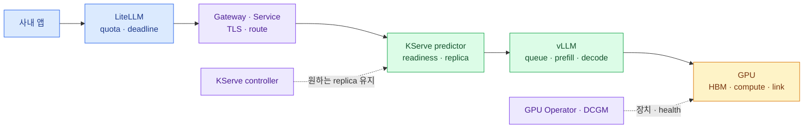
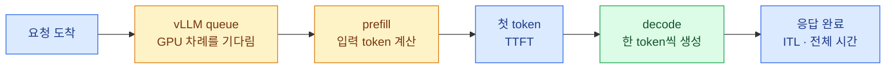

import { Card, CardGrid, Steps, LinkCard } from '@astrojs/starlight/components';
import TermIntro from '../../../components/docs/TermIntro.astro';

> GPU 사용률은 원인이 아니라 상태다 — 먼저 **요청이 어느 층에서 얼마나 기다렸는지**를 찾는다

<TermIntro
  terms={[
    ['SLO', 'Service Level Objective', '이용자에게 제공할 성공률·응답 시간을 측정 가능한 목표로 정한 것이다.'],
    ['TTFT', 'Time To First Token', '요청 뒤 첫 출력 token까지 걸린 시간이다. queue와 prefill 영향을 크게 받는다.'],
    ['ITL', 'Inter-Token Latency', '첫 token 이후 인접한 출력 token 사이의 시간으로 생성 중 끊김을 보여 준다.'],
    ['load shedding', '부하 차단', '처리할 수 없는 요청을 오래 기다리게 하지 않고 경계에서 빠르게 거절하는 정책이다.'],
  ]}
/>

## 느린 요청이 지나온 전체 경로



KServe controller는 request path 바깥에 있다. controller가 predictor replica를 유지하고, 실제 요청은
Gateway와 Service를 지나 준비된 Pod로 간다. timeout을 진단할 때는 각 경계에서 소비한 시간을 같은
request ID와 시간 축으로 이어야 한다.

## 대기와 계산을 분리한다

LLM 요청 비용은 요청 개수보다 token 양에 크게 좌우된다. 긴 prompt는 prefill 시간을, 긴 답변은 decode
시간과 KV cache를 오래 사용한다.



TTFT가 길다고 모두 GPU 연산이 느린 것은 아니다. queue에서 오래 기다렸을 수도 있고, 긴 prompt의
prefill이 원인일 수도 있다. ITL은 첫 token 뒤 decode 경쟁을 더 잘 보여 준다.

## 한 화면에서 볼 네 줄

| 줄 | 핵심 지표 | 반드시 나눌 차원 |
|---|---|---|
| 이용자 영향 | 성공률, 429·5xx·timeout, p50·p95·p99, 취소율 | service·model·stream 여부 |
| 생성 경험 | TTFT, ITL, stream duration, 입력·출력 token 수 | prompt·output 길이 구간 |
| model engine | running·waiting request, queue time, KV cache, preemption, prefix cache hit | model·replica·revision |
| 실행 기반 | desired·ready replica, restart, GPU memory·activity, XID·ECC·link | InferenceService·node·GPU UUID |

`request_id`는 metric label로 넣지 않는다. 요청마다 새 시계열이 생기기 때문이다. metric에는 값의 수가
제한된 `service`, `model`, `replica`, `status`를 두고, request ID는 LiteLLM·Gateway·vLLM log와 trace를
연결하는 데 쓴다.

## vLLM과 KServe에서 먼저 모을 것

| 질문 | 대표 신호 | 해석 |
|---|---|---|
| 지금 기다리는가 | waiting request·queue time | 계속 상승하면 유입이 처리량을 넘는다 |
| 첫 token이 왜 늦나 | TTFT·prefill time | queue와 긴 입력을 나눈다 |
| 생성이 왜 끊기나 | ITL·decode time | decode 경쟁과 긴 출력을 찾는다 |
| cache가 버티는가 | KV cache usage·preemption | 둘이 함께 높으면 cache 압력이 크다 |
| 실제 일을 얼마나 했나 | prompt·generation token counter | requests/s보다 실제 계산량에 가깝다 |
| replica가 실제로 떴나 | InferenceService Ready·Deployment available·Pod event | 선언과 실행 가능 자원을 구분한다 |
| GPU가 건강한가 | DCGM memory·activity·XID·ECC·link | engine 병목과 hardware 이상을 나눈다 |

vLLM metric 이름은 release에 따라 바뀔 수 있다. 문서 예제를 그대로 dashboard에 박지 말고 운영 image의
`/metrics` 출력과 dashboard를 같은 revision으로 관리한다.

## SLO와 timeout budget을 먼저 정한다

| 요청 class | SLO의 중심 | 과부하 때 동작 |
|---|---|---|
| 짧은 대화형 요청 | 성공률·TTFT·ITL | 짧게 기다린 뒤 429·503, 입력·출력 상한 |
| 긴 생성 요청 | 성공률·전체 deadline | 별도 endpoint·낮은 동시성, 짧은 요청 예약량 보호 |

deadline의 포함 관계는 고정한다.

```text
호출자 전체 deadline > LiteLLM · Gateway budget > model 실행 budget
```

connect timeout·첫 token timeout·stream idle timeout·전체 생성 deadline을 분리한다. client가 연결을 끊으면
vLLM request도 취소되어야 한다. 응답을 받을 곳이 없는데 GPU가 계속 token을 만들면 포화가 더 심해진다.

:::caution[재시도 폭풍]
첫 token 전에 명확히 실패한 연결이나 429·503만 제한적으로 재시도한다. 이미 오래 실행한 요청을 즉시 다시
보내거나 streaming 중 다른 replica에서 재시작하면 같은 계산을 중복해 포화를 키운다.
:::

## 지표 조합으로 병목을 가른다

| 함께 변한 지표 | 우선 의심할 것 | 첫 대응 |
|---|---|---|
| waiting·queue time·TTFT 상승 | 유입량이 처리량 초과 | concurrency·queue 상한, 빠른 429·503 |
| queue는 낮고 prefill·TTFT 상승 | 긴 prompt·tokenization·CPU | 입력 token 상한·prefix 정규화 |
| ITL·decode 상승, GPU activity 높음 | 생성 동시성 과다 | output 상한·짧은 요청 예약량 |
| KV cache 고수위·preemption 증가 | context·동시 sequence 과다 | 동시성·context 제한, cache 설정 재시험 |
| vLLM 정상, Gateway timeout 증가 | proxy deadline·buffering·connection | 경계별 timeout·stream 전달 확인 |
| queue 증가, GPU activity 낮음 | CPU·network·process health | Pod·route·host 상태 확인 |
| XID·ECC·restart 동시 발생 | GPU·driver·runtime 장애 | route 제외 후 hardware triage |

GPU utilization 95% 자체는 장애가 아니다. **이용자 SLO 악화, queue 누적, 오류율** 가운데 둘 이상이 함께
움직일 때 포화로 판단한다.

## GPU를 늘리기 전에 지키는 순서

<Steps>

1. **대기열을 유한하게 만든다** — service별 concurrency와 queue 상한을 두고 넘친 요청은 빠르게 돌려준다.
2. **한 요청의 최대 비용을 제한한다** — 입력 token·`max_tokens`·`n`의 기본값과 상한을 둔다.
3. **긴 요청을 격리한다** — 별도 endpoint와 낮은 동시성으로 짧은 대화형 요청의 예약량을 보호한다.
4. **반복 계산을 줄인다** — 공통 prefix를 정규화하고 prefix cache hit와 TTFT 개선을 함께 검증한다.
5. **tensor parallel과 replica를 비교한다** — 같은 GPU 수에서 TP를 낮춘 여러 replica가 더 나은지 실제 분포로 시험한다.
6. **vLLM 값을 한 번에 하나씩 바꾼다** — batched token·sequence·chunked prefill·memory 값을 바꾸며 TTFT·ITL·tokens/s를 기록한다.
7. **작은 model로 보낼 일을 분리한다** — 품질 contract를 통과한 단순 요청만 작은 model·quantized revision으로 보낸다.

</Steps>

autoscaling을 붙여도 비어 있는 GPU가 없으면 replica는 늘지 않는다. 상시 inference의 minimum replica와
전용 node pool을 먼저 확보한다.

## 부하 시험으로 안전선을 만든다

<CardGrid>
<Card title="1. 기준선" icon="analytics">
낮은 동시성에서 TTFT·ITL·성공 output tokens/s를 기록한다.
</Card>
<Card title="2. 계단 부하" icon="up-arrow">
동시성을 단계적으로 올려 queue가 계속 줄지 않는 지점과 첫 SLO 위반을 찾는다.
</Card>
<Card title="3. 긴 요청 혼합" icon="open-book">
실제 비율의 긴 prompt·긴 output을 섞어 짧은 요청에 미치는 영향을 본다.
</Card>
<Card title="4. 지속 부하" icon="clock">
KV cache·preemption·temperature·XID와 burst 뒤 queue 회복을 확인한다.
</Card>
</CardGrid>

안전 동시성은 GPU가 죽지 않은 최대값이 아니다. **TTFT·ITL SLO를 지키고 burst 뒤 queue가 다시 줄어드는
최대값**이다. model·vLLM image·GPU가 바뀌면 다시 측정한다.

## 첫 10분 대응

<Steps>

1. **영향 범위를 고정한다** — 어느 service·model·revision에서 언제부터 오류가 늘었는지 본다.
2. **queue와 생성 단계를 나눈다** — waiting·TTFT·prefill·ITL·decode·KV cache를 같은 구간에서 비교한다.
3. **포화면 새 일을 줄인다** — 긴 output·낮은 priority 요청과 자동 retry부터 제한한다.
4. **경계 문제면 연결 종료자를 찾는다** — client·LiteLLM·Gateway 중 누가 먼저 끊었고 취소가 vLLM까지 갔는지 본다.
5. **replica·GPU 문제면 route를 비운다** — unhealthy Pod를 새 요청에서 제외하고 log·DCGM event를 보존한다.

</Steps>

## 참고 자료

- [vLLM Production Metrics](https://docs.vllm.ai/en/latest/usage/metrics/) — queue·TTFT·ITL·KV cache metric.
- [vLLM Optimization and Tuning](https://docs.vllm.ai/en/latest/configuration/optimization/) — preemption·chunked prefill 조정.
- [KServe Control Plane](https://kserve.github.io/website/docs/concepts/architecture/control-plane) — InferenceService 상태와 Standard mode resource.
- [NVIDIA DCGM Exporter Metrics](https://docs.nvidia.com/datacenter/dcgm/latest/reference/dcgm-exporter-metrics.html) — GPU activity·memory·XID·link metric.

<LinkCard
  title="6. GPU를 굶기지 않는 데이터와 연결"
  description="model artifact·cache·Gateway·다중 노드 추론 network가 cold start와 지연에 미치는 영향을 본다."
  href="/gpu-platform/06-data-network/"
/>
