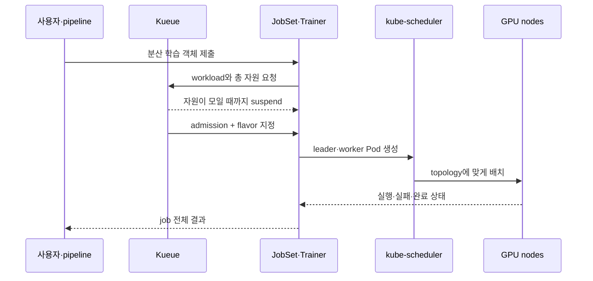

import { Card, CardGrid, LinkCard } from '@astrojs/starlight/components';
import TermIntro from '../../../components/docs/TermIntro.astro';

> GPU를 여럿 요청하는 것과 **여러 Pod가 하나의 작업으로 살아가는 것**은 다른 문제다

<TermIntro
  terms={[
    ['gang scheduling', '묶음 스케줄링', '분산 job의 최소 Pod 집합을 한꺼번에 시작하거나 전부 기다리게 하는 방식이다.'],
    ['JobSet', '', '서로 다른 역할의 Kubernetes Job 여러 개를 하나의 분산 workload로 묶는 API다.'],
    ['Kubeflow Trainer', '', 'PyTorch·JAX·DeepSpeed 등 학습 framework의 분산 실행을 Kubernetes 객체로 만드는 controller다.'],
    ['LeaderWorkerSet', '', 'leader와 worker Pod를 안정된 한 복제 단위로 관리하는 workload API다.'],
  ]}
/>

## 먼저 두 경우를 나눈다

<CardGrid>
<Card title="한 Pod · 여러 GPU" icon="server">
A100·B300 한 서버 안에서 `nvidia.com/gpu: 8`을 요청한다.

Pod 하나이므로 Kubernetes가 한 node에서 자원을 찾는다. 실패 단위도 Pod 하나다.
</Card>
<Card title="여러 Pod · 여러 node" icon="random">
각 node의 leader·worker가 동시에 필요하다.

부분 실행·주소 발견·시작 순서·전체 재시작을 별도 controller가 관리해야 한다.
</Card>
</CardGrid>

가능하면 먼저 한 node의 NVSwitch domain 안에 job을 넣는다. multi-node는 model·batch가 한 node에
들어가지 않거나 처리량 목표가 분명할 때만 사용한다.

## 학습은 Kueue와 JobSet·Trainer가 나눠 맡는다

Kueue는 누가 언제 시작하는지 결정한다. JobSet·Trainer는 시작한 workload의 Pod 관계와 lifecycle을
관리한다. 둘 중 하나만으로는 queue와 분산 lifecycle을 모두 풀 수 없다.

## inference의 분산 단위는 다르다

KServe `LLMInferenceService`는 worker가 있을 때 LeaderWorkerSet을 사용해 multi-node serving을
표현할 수 있다. 여기에는 학습과 다른 요구가 있다.

- leader endpoint가 계속 요청을 받음
- replica마다 같은 수의 worker가 필요함
- rolling update 중 old·new replica의 자원 중첩이 큼
- KV cache·prefix routing·prefill/decode topology가 route에 영향
- 한 worker 장애가 replica 전체 장애임

Spark pair도 이 범주지만, NVIDIA의 Spark vLLM recipe가 Docker·Ray로 성공했다는 사실만으로 KServe
LeaderWorkerSet이 같은 성능과 복구를 준다고 가정하지 않는다. ARM64 image·NCCL·network device·Pod
DNS·termination을 별도 PoC한다.

## topology를 자원 요청에 포함한다

| 범위 | 보존할 관계 | 표현 수단 |
|---|---|---|
| GPU 내부 | MIG profile·full GPU | device resource |
| node 내부 | NVLink·NVSwitch | full-node preset·GPU count |
| node 사이 | rack·NIC·RDMA fabric | label·affinity·topology-aware scheduling |
| job 전체 | leader·worker 동시 실행 | Kueue admission·JobSet·Trainer·LWS |

node 이름을 manifest에 박는 것은 PoC에서만 허용한다. 운영에서는 topology label과 flavor를 사용해
장비 교체 후에도 같은 계약을 유지한다.

## checkpoint가 복구의 기준이다

분산 학습은 Pod 재시작 자체가 복구가 아니다. 마지막 checkpoint에서 전체 job을 다시 시작할 수 있어야
한다. 다음을 함께 시험한다.

- worker 하나를 종료했을 때 전체 job 상태
- replacement Pod만 뜨는지, 전체 replica가 재시작하는지
- checkpoint가 원자적으로 기록됐는지
- 다른 node pool에서 resume 가능한지
- 실패한 GPU·NIC를 다음 실행에서 제외하는지
- 사용자에게 실패 원인과 resume 지점이 보이는지

## 참고 자료

- [JobSet 소개](https://kubernetes.io/blog/2025/03/23/introducing-jobset/) — distributed job의 역할·failure policy·Kueue 연동.
- [Kubeflow Trainer](https://www.kubeflow.org/docs/components/trainer/overview/) — framework별 분산 학습 platform.
- [KServe LLMInferenceService dependencies](https://kserve.github.io/website/docs/next/model-serving/generative-inference/llmisvc/llmisvc-dependencies) — LeaderWorkerSet과 Gateway API inference extension.

<LinkCard
  title="7. Backend.AI의 사용자 경험을 해체하기"
  description="session·portal·vfolder·quota를 목록으로 만들고 Kubernetes 구성에서 하나씩 대체한다."
  href="/gpu-platform/07-interactive/"
/>
