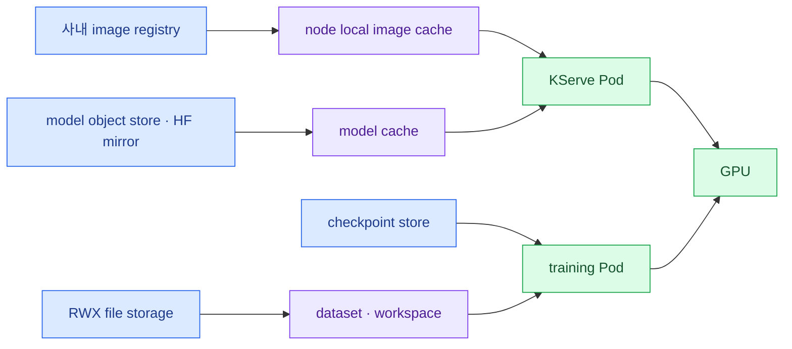

import { Card, CardGrid, LinkCard } from '@astrojs/starlight/components';
import TermIntro from '../../../components/docs/TermIntro.astro';

> GPU가 빨라도 model과 checkpoint가 늦게 도착하면 **비싼 장비가 다운로드를 기다린다**

<TermIntro
  terms={[
    ['cold start', '콜드 스타트', 'image와 model이 없는 node에서 다운로드·초기화·compile을 거쳐 Ready가 되는 시간이다.'],
    ['local cache', '로컬 캐시', '다시 받을 수 있는 model·compile 결과를 node NVMe에 보관해 다음 시작을 줄이는 층이다.'],
    ['RDMA', 'Remote Direct Memory Access', 'CPU copy 부담을 줄여 node 사이 memory 전송 지연을 낮추는 network 방식이다.'],
    ['east-west', '동서 트래픽', 'cluster 안의 model replica·학습 worker·storage 사이를 흐르는 통신이다.'],
  ]}
/>

## 데이터마다 다른 길을 쓴다



model artifact와 workspace를 같은 RWX PVC에 몰아넣지 않는다. model은 immutable revision·checksum·cache
적중률이 중요하고, workspace는 POSIX permission·작은 파일·사용자 quota가 중요하다.

## cold start budget을 분해한다

```text
Ready 시간 = image pull + model fetch + model load + kernel compile + health stabilization
```

각 항목을 metric으로 남긴다. `Pod Ready 12분`만 기록하면 registry가 느린지 model load가 느린지 알 수 없다.

| 줄일 대상 | 수단 | 함정 |
|---|---|---|
| image pull | 사내 registry·node pre-pull | architecture가 다른 image를 같은 tag로 덮음 |
| model fetch | object mirror·local cache | mutable model name·checksum 누락 |
| model load | 적절한 quantization·memory headroom | load 성공만 보고 실제 traffic OOM을 놓침 |
| compile | persistent compile cache | runtime·driver 변경 뒤 stale cache |
| readiness | 실제 warm-up request | 단순 TCP open을 Ready로 오인 |

KServe LocalModel cache의 지원 대상은 `InferenceService`와 `LLMInferenceService`에서 다를 수 있으므로
선택한 release의 지원표를 확인한다. 지원되지 않는 topology에는 generic DaemonSet cache나 image prefetch를
별도로 설계한다.

## 세 network를 분리해서 본다

<CardGrid>
<Card title="이용자 요청" icon="rocket">
LiteLLM → Gateway → KServe Service.

TLS·streaming·timeout·request ID가 핵심이다.
</Card>
<Card title="분산 계산" icon="random">
NCCL·Ray·MPI·LWS worker 통신.

NIC·MTU·RDMA·topology와 port가 핵심이다.
</Card>
<Card title="데이터 입출력" icon="open-book">
registry·model·dataset·checkpoint.

throughput·metadata·cache와 장애 격리가 핵심이다.
</Card>
</CardGrid>

Network Operator는 모든 serving에 필수인 것이 아니다. A100·B300 multi-node job이나 Spark pair가 RDMA를
실제로 사용할 때 GPU Operator와 별개로 NIC driver·RDMA device·network attachment를 관리할 필요가 생긴다.
single-node workload는 먼저 일반 Pod network로 합격시킨다.

## Gateway 역할을 겹치지 않는다

- 사내 Gateway API: TLS·host·network policy
- KServe route: model service·revision·inference pool
- LiteLLM: 최종 이용자 key·quota·alias·fallback

`LLMInferenceService`의 managed router는 Envoy Gateway·Envoy AI Gateway와 Gateway API inference extension을
요구할 수 있다. 사내 기본 Gateway가 Cilium·Traefik 등이라면 별도 GatewayClass로 격리하거나 Standard
InferenceService를 유지한다. 기존 Gateway를 무심코 교체하지 않는다.

## 관측은 네 label을 연결한다

```text
request_id → model alias → InferenceService revision → Pod → node → GPU UUID/MIG instance
```

서빙 SLO·queue 진단·알림 기준은 [4A장](/gpu-platform/04a-serving-operations/)에서 다룬다. 여기서는
data·network 병목까지 같은 요청에 연결하는 데 필요한 신호만 다시 모은다.

최소 지표는 다음과 같다.

- LiteLLM request rate·error·latency·token usage
- Gateway upstream error·stream duration
- KServe desired/ready replica·revision
- vLLM TTFT·inter-token latency·queue·KV cache·tokens
- Pod restart·OOM·node pressure
- DCGM utilization·memory·temperature·XID·NVLink
- Kueue pending·admission·quota·preemption
- storage throughput·cache hit·checkpoint duration

## 참고 자료

- [KServe model storage](https://kserve.github.io/website/docs/model-serving/storage/storage-containers) — storage initializer와 URI pattern.
- [KServe LocalModel](https://kserve.github.io/website/docs/model-serving/models/localmodel) — node local model cache.
- [GPU Operator RDMA](https://docs.nvidia.com/datacenter/cloud-native/gpu-operator/latest/gpudirect-rdma.html) — GPUDirect RDMA 구성 경계.
- [DGX Spark NCCL](https://build.nvidia.com/spark/nccl/overview) — multi-Spark network·NCCL 검증 흐름.

<LinkCard
  title="9. 서비스 중단 없이 옮기기"
  description="Spark inference부터 시작해 B300을 greenfield로 받고 A100을 한 대씩 Backend.AI에서 전환한다."
  href="/gpu-platform/09-migration/"
/>
