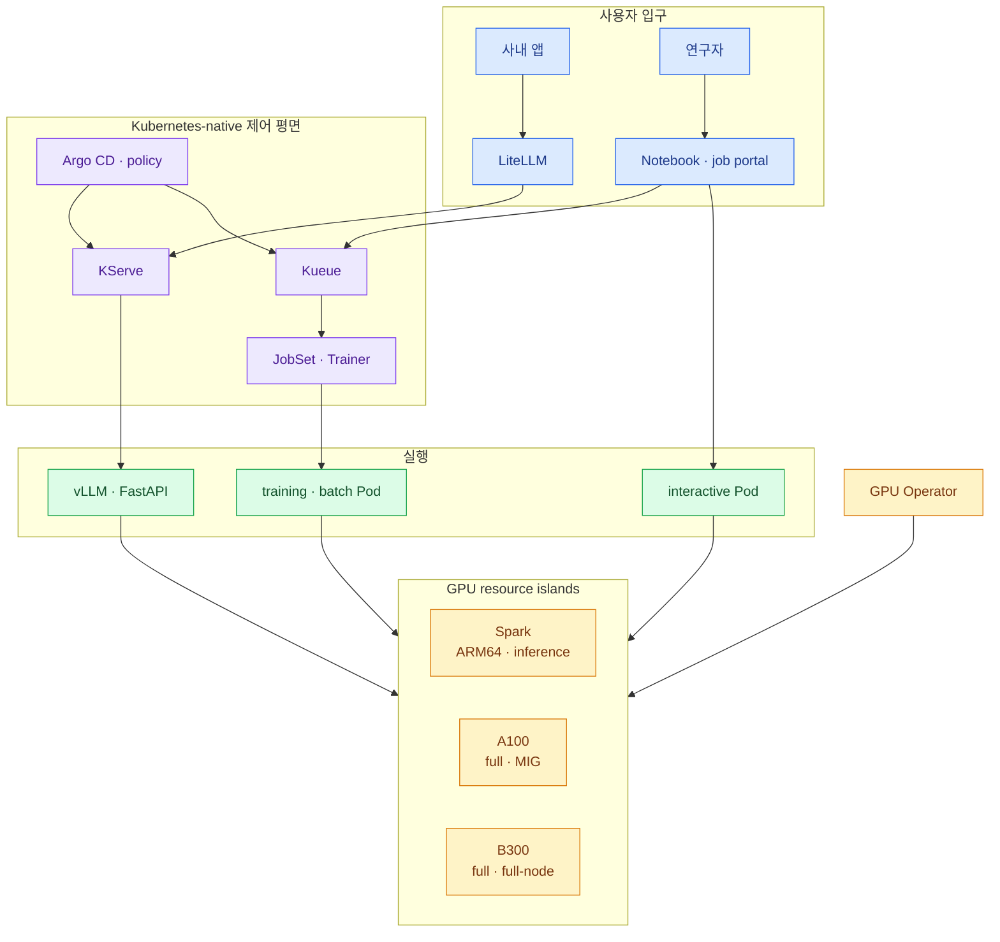

import { Card, CardGrid, Steps, LinkCard } from '@astrojs/starlight/components';
import TermIntro from '../../../components/docs/TermIntro.astro';

> 하나로 만드는 것은 cluster가 아니라 **API·정책·배포·관측의 문법**이다

<TermIntro
  title="이 장의 사용법"
  terms={[
    ['전체 지도', '', '이용자 요청과 interactive·batch 제출이 어느 controller를 거쳐 GPU에 닿는지 본다.'],
    ['선택표', '', 'workload를 KServe·Kueue·JobSet·Trainer·Notebook 중 어디에 놓을지 고른다.'],
    ['도입 체크리스트', '', 'GPU 기반부터 Backend.AI 종료까지 빠뜨리지 않을 gate다.'],
    ['장애 대응 카드', '', 'serving·queue·distributed·interactive 장애의 첫 확인 순서를 모았다.'],
  ]}
/>

## 전체 지도

LiteLLM은 이용자 정책을, KServe는 inference를, Kueue는 admission을, JobSet·Trainer는 분산 job의
lifecycle을 맡는다. GPU Operator는 이 모든 Pod가 GPU를 받을 수 있는 공통 바닥이다.

## workload 선택표

| 요구 | 제어 객체 | 기본 자원 |
|---|---|---|
| Spark single-node LLM | Standard `InferenceService` | `spark-full` 한 node |
| A100·B300 single-node LLM | Standard `InferenceService` | full GPU 1·2·4·8 preset |
| embedding·reranker | Standard `InferenceService` | Spark·MIG·full GPU 중 검증 profile |
| FastAPI prediction | custom predictor | CPU·MIG·full GPU |
| multi-node LLM | `LLMInferenceService` + LWS | 고정 topology·RDMA 검증 pool |
| 단일 batch | Job + Kueue | resource flavor·quota |
| 분산 학습 | JobSet·Trainer + Kueue | gang admission·checkpoint |
| Notebook·VSCode | interactive controller | user PVC·idle policy·GPU profile |

## 장별 한 문장

| 장 | 한 문장 |
|---|---|
| [0](/gpu-platform/00-decision/) | 단일 원본을 **Kubernetes API와 Git**으로 옮기는 결정이다 |
| [1](/gpu-platform/01-fleet/) | Spark·A100·B300은 같은 수가 아니라 **서로 다른 자원 섬**이다 |
| [2](/gpu-platform/02-gpu-foundation/) | GPU Operator가 driver부터 device plugin·metric까지 **node contract**를 만든다 |
| [3](/gpu-platform/03-kserve/) | **Standard InferenceService가 기본**, LLMInferenceService는 고급 topology다 |
| [4](/gpu-platform/04-serving/) | LiteLLM은 사용자를, KServe는 model revision과 replica를 안다 |
| [5](/gpu-platform/05-kueue/) | 온프렘 GPU에는 autoscaling보다 먼저 **queue와 fair sharing**이 필요하다 |
| [6](/gpu-platform/06-distributed/) | 여러 GPU 요청과 **여러 Pod의 atomic lifecycle**을 구분한다 |
| [7](/gpu-platform/07-interactive/) | Backend.AI는 제품이 아니라 **사용자 여정별 기능**으로 대체한다 |
| [8](/gpu-platform/08-data-network/) | cold start·checkpoint·RDMA를 GPU 바깥의 핵심 병목으로 본다 |
| [9](/gpu-platform/09-migration/) | Spark부터 검증하고 B300을 greenfield로, A100은 **한 대씩** 옮긴다 |

## 도입 체크리스트

<Steps>

1. **cluster 경계** — Spark와 datacenter GPU를 한 운영 모델·별도 실행 장애 영역으로 정했다.
2. **node contract** — architecture·GPU family·partition·network label과 taint를 고정했다.
3. **GPU 기반** — driver·toolkit·CDI·device plugin·MIG·DCGM을 실제 CUDA Pod로 검증했다.
4. **runtime catalog** — Spark·A100·B300용 image digest와 model·CUDA·driver matrix를 만들었다.
5. **Standard serving** — vLLM·embedding·FastAPI를 InferenceService와 LiteLLM으로 연결했다.
6. **admission** — Kueue flavor·quota·borrowing·priority와 pending reason을 시험했다.
7. **distributed lifecycle** — JobSet·Trainer·LWS의 gang start·failure·checkpoint를 검증했다.
8. **interactive parity** — Notebook·workspace·storage·idle·portal·usage 경로를 대표 사용자와 확인했다.
9. **data와 network** — cold start budget·cache·checkpoint·RDMA·Gateway 경계를 측정했다.
10. **rollback** — model endpoint와 A100 node 하나를 실제로 기존 환경으로 되돌렸다.
11. **B300 준비** — 도착 전 driver·image·full-node·fabric·burn-in 기준을 승인했다.
12. **Backend.AI 종료 gate** — active session·data·사용자·audit가 남지 않았음을 확인했다.

</Steps>

## 장애 대응 카드

<CardGrid>
<Card title="모든 inference가 안 된다" icon="warning">
LiteLLM과 Gateway health를 먼저 나눈다.

KServe controller보다 Service endpoint·DNS·TLS를 확인한다.

여러 InferenceService의 Ready 상태를 비교한다.
</Card>
<Card title="모델 하나만 안 된다" icon="warning">
InferenceService condition과 revision·Pod event를 본다.

image architecture·model fetch·readiness·OOM을 순서대로 확인한다.
</Card>
<Card title="job이 계속 기다린다" icon="warning">
Kueue workload의 admission condition을 본다.

ClusterQueue quota·flavor label·cohort borrowing과 실제 node allocatable을 비교한다.
</Card>
<Card title="분산 job만 안 뜬다" icon="warning">
전체 요청량과 gang admission을 확인한다.

leader·worker 수, topology label, RDMA device와 checkpoint를 본다.
</Card>
<Card title="Notebook만 접속 안 된다" icon="warning">
session Pod보다 먼저 portal·SSO·Gateway route를 나눈다.

PVC mount·idle controller·사용자 namespace policy를 확인한다.
</Card>
<Card title="GPU가 보이지 않는다" icon="warning">
host driver → toolkit/CDI → device plugin → allocatable 순서로 내려간다.

GPU Operator validator와 DCGM·XID event를 함께 본다.
</Card>
</CardGrid>

## 마지막 결정

사내 Kubernetes를 장기 platform으로 확정했다면 GPUStack을 중간에 넣지 않고 KServe로 간다. 다만
처음부터 모든 고급 기능을 설치하지 않는다. Standard InferenceService로 single-node serving을 먼저
안정화하고, 실제 필요가 증명된 모델만 LLMInferenceService로 확장한다.

Backend.AI도 같은 원칙으로 옮긴다. KServe가 inference를 먼저 가져오고, Kueue·JobSet·Trainer·interactive
환경이 나머지 사용자 여정을 대체한다. 마지막 A100을 옮기는 시점보다 첫 A100을 안전하게 되돌릴 수 있는
시점이 더 중요한 이정표다.

## 참고 자료

- [KServe](https://kserve.github.io/website/docs/intro) — inference CRD와 runtime.
- [Kueue](https://kueue.sigs.k8s.io/docs/overview/) — batch admission·quota.
- [JobSet](https://jobset.sigs.k8s.io/docs/overview/) — distributed workload API.
- [NVIDIA GPU Operator](https://docs.nvidia.com/datacenter/cloud-native/gpu-operator/latest/) — GPU node software stack.

<LinkCard
  title="온프렘 GPU 플랫폼 개요로 돌아가기"
  description="덱의 구성과 전체 목표 구조를 다시 본다."
  href="/gpu-platform/"
/>
