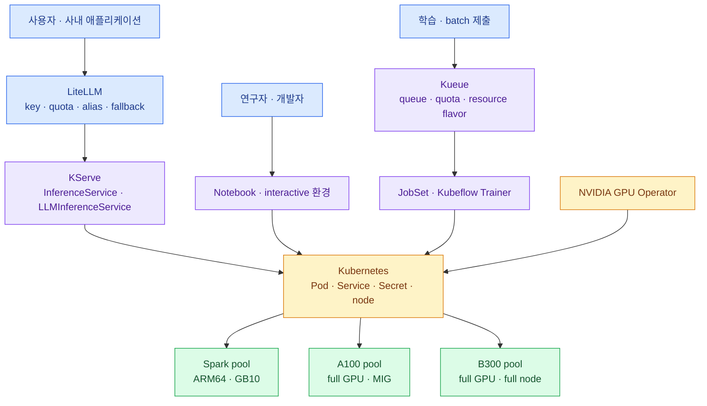

import { LinkCard, LinkButton } from '@astrojs/starlight/components';
import DeckMap from '../../../components/docs/DeckMap.astro';

> 목표는 GPU를 한 cluster에 몰아넣는 것이 아니라 **원하는 상태와 운영 방식을 하나로 만드는 것**이다

DGX Spark 열 대는 ARM64·단일 GPU inference cell이고, A100 8-GPU 서버 두 대는 NVSwitch 안에서
큰 job을 돌리거나 MIG로 나눌 수 있는 datacenter 자원이다. 향후 B300까지 들어오면 장비를
`nvidia.com/gpu`라는 한 이름으로 세는 것만으로는 부족하다. 같은 GPU 한 장이라도 실행 가능한 image,
메모리, interconnect, 장애 범위가 다르기 때문이다.

이 덱은 Kubernetes를 공통 기반으로 삼되 역할을 다음처럼 나눈다.

KServe는 inference만 맡는다. Backend.AI가 제공하던 interactive session·batch queue·분산 학습·virtual
folder까지 KServe로 옮길 수는 없다. 그래서 Kueue·JobSet·Trainer·Notebook·스토리지를 함께 설계하고,
기능 parity를 확인한 뒤 A100을 한 서버씩 옮긴다.

<LinkButton href="/gpu-platform/00-decision/" icon="right-arrow">첫 장부터 읽기</LinkButton>

## 구성

<DeckMap
  steps={[
    { label: '0~1장', href: '/gpu-platform/00-decision/', title: '목표와 자원 지도', tone: 'key',
      desc: 'Kubernetes-native를 택한 이유 · Spark·A100·B300을 서로 다른 resource island로 보는 법',
      note: '하나로 만들 것은 cluster인가, 운영 모델인가' },
    { label: '2장', href: '/gpu-platform/02-gpu-foundation/', title: 'GPU 기반', tone: 'warn',
      desc: 'GPU Operator · driver·toolkit·device plugin · MIG와 node contract',
      note: 'Pod가 GPU를 안전하게 받기 전에 무엇이 준비돼야 하는가' },
    { label: '3~4A장', href: '/gpu-platform/03-kserve/', title: '추론 평면', tone: 'zone',
      desc: 'KServe Standard부터 LiteLLM·vLLM·FastAPI를 연결하고 SLO·용량·timeout을 운영',
      note: '모델의 원하는 상태와 이용자 정책, 포화를 누가 제어하는가' },
    { label: '5~7장', href: '/gpu-platform/05-kueue/', title: '기다리고 함께 뜨는 작업', tone: 'ok',
      desc: 'Kueue resource flavor·quota · JobSet·Trainer · interactive 개발 환경과 Backend.AI parity',
      note: '상시 API가 아닌 작업은 어떤 lifecycle을 갖는가' },
    { label: '8장', href: '/gpu-platform/08-data-network/', title: '데이터와 연결', tone: 'bad',
      desc: 'model artifact·local cache·checkpoint · NVSwitch·RDMA·Gateway와 관측',
      note: '빠른 GPU를 굶기거나 서로 못 찾게 만드는 병목은 어디인가' },
    { label: '9장', href: '/gpu-platform/09-migration/', title: '전환', tone: 'warn',
      desc: 'Spark inference → B300 greenfield → A100 한 대씩 · Backend.AI 병행 종료',
      note: '현재 서비스를 잃지 않고 어떻게 옮기는가' },
    { label: '10장', href: '/gpu-platform/10-wrapup/', title: '운영 카드', tone: 'mute',
      desc: '전체 지도 · workload 선택표 · PoC 합격표 · 장애 확인 순서' },
  ]}
/>

## 이 덱의 결론을 먼저 말하면

- inference는 **KServe Standard `InferenceService`부터** 시작한다.
- prefix-aware routing·분산 inference·prefill/decode 분리가 필요할 때만 `LLMInferenceService`를 붙인다.
- LiteLLM에는 worker 주소가 아니라 KServe의 안정된 service endpoint를 등록한다.
- Spark·A100·B300은 label·taint·resource flavor가 다른 pool로 둔다.
- A100·B300의 batch·학습은 Kueue가 admission하고 JobSet·Trainer가 함께 실행한다.
- Backend.AI는 interactive·queue·storage parity가 확인될 때까지 병행한다.
- 공통 GitOps·인증·registry·관측을 사용하되 Spark와 datacenter GPU는 별도 실행 cluster를 기본안으로 본다.

## 기준 시점

**2026년 8월 18일 기준**으로 KServe·NVIDIA·Kubernetes·Backend.AI 공식 자료를 확인했다.
특히 KServe `LLMInferenceService`의 API와 의존성, B300 driver 지원, Backend.AI Kubernetes backend는
변화가 빠르므로 실제 도입 때 다시 확인한다.

## 참고 자료

- [KServe 공식 개요](https://kserve.github.io/website/docs/intro) — inference control plane과 runtime 범위.
- [NVIDIA GPU Operator](https://docs.nvidia.com/datacenter/cloud-native/gpu-operator/latest/) — Kubernetes GPU node의 software stack.
- [Kueue 개념](https://kueue.sigs.k8s.io/docs/concepts/) — queue·quota·resource flavor의 역할.
- [Backend.AI 개념](https://docs.backend.ai/en/latest/concepts/index.html) — 현재 대체해야 할 session·scheduler·storage 범위.

<LinkCard
  title="0. 왜 Kubernetes-native인가"
  description="GPUStack을 거치지 않고 KServe로 가는 선택이 무엇을 단순화하고 무엇을 직접 운영하게 하는지 정한다."
  href="/gpu-platform/00-decision/"
/>
