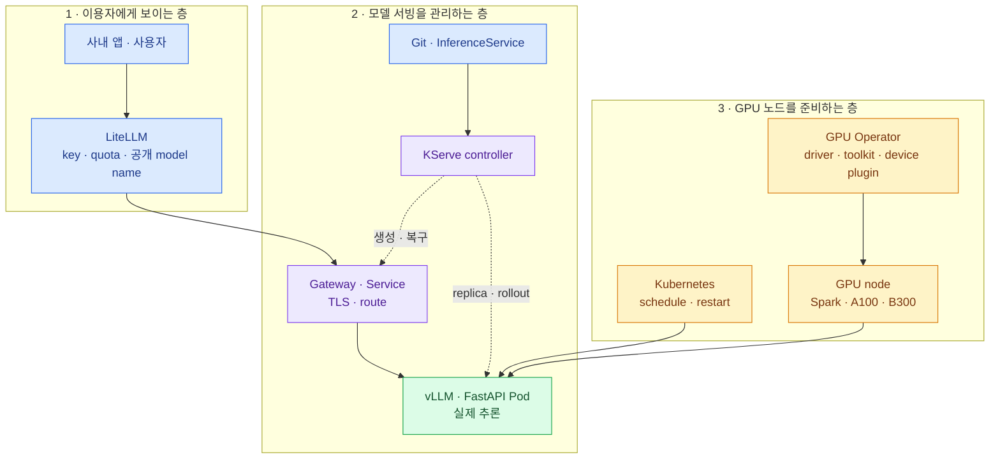

import { LinkCard, LinkButton } from '@astrojs/starlight/components';
import DeckMap from '../../../components/docs/DeckMap.astro';

> GPU Operator는 **GPU를 Pod가 쓸 수 있게 만들고**, KServe는 **모델 서버를 원하는 상태로 유지한다**

이 덱은 학습이나 batch queue를 설계하지 않는다. 사내 앱이 LLM·embedding·reranker·FastAPI 모델을
안정된 API로 호출하게 만드는 **상시 inference 경로**만 따라간다.

## 먼저 보는 전체 지도

그림을 위에서 아래로 읽는다. 요청은 `앱 → LiteLLM → Gateway/Service → 모델 Pod`로 흐른다. 반면
운영 명령은 `Git → KServe → Kubernetes 객체`로 흐른다. GPU Operator는 요청을 처리하지 않고, 맨 아래에서
노드의 GPU를 Kubernetes 자원으로 보이게 만든다.

이 구분만 잡으면 제품 이름이 덜 헷갈린다.

| 궁금한 것 | 답을 맡는 구성요소 |
|---|---|
| 누가 이 API를 얼마나 호출할 수 있나 | LiteLLM |
| 모델 서버를 몇 개 띄우고 죽으면 누가 복구하나 | KServe + Kubernetes |
| 어떤 image·명령으로 모델을 실행하나 | `ServingRuntime` 또는 custom predictor |
| 어느 GPU pool에 놓이나 | Kubernetes label·taint·resource request |
| Pod 안에서 GPU가 보이게 누가 준비하나 | GPU Operator |
| GPU가 아픈지 어떻게 아나 | DCGM Exporter + Prometheus |

<LinkButton href="/gpu-platform/00-decision/" icon="right-arrow">첫 장부터 읽기</LinkButton>

## 구성

<DeckMap
  steps={[
    { label: '0~1장', href: '/gpu-platform/00-decision/', title: '큰 그림과 자원 지도', tone: 'key',
      desc: '추론 요청과 제어 흐름 · Spark·A100·B300을 서로 다른 resource island로 보는 법',
      note: '각 제품이 어느 층에서 무슨 문제를 푸는가' },
    { label: '2장', href: '/gpu-platform/02-gpu-foundation/', title: 'GPU Operator', tone: 'warn',
      desc: 'driver·Container Toolkit·device plugin·GFD·MIG·DCGM이 이어지는 과정',
      note: 'GPU가 어떻게 Pod가 요청할 수 있는 자원이 되는가' },
    { label: '3장', href: '/gpu-platform/03-kserve/', title: 'KServe', tone: 'zone',
      desc: 'InferenceService·ServingRuntime·controller·Standard mode와 LLMInferenceService',
      note: '한 줄의 선언이 어떻게 실행 중인 모델 서버가 되는가' },
    { label: '4~5장', href: '/gpu-platform/04-serving/', title: '요청과 운영', tone: 'ok',
      desc: 'LiteLLM부터 model Pod까지 · streaming·SLO·용량·timeout·rollout',
      note: '실제 요청이 어디를 지나고, 느릴 때 어디부터 보는가' },
    { label: '6장', href: '/gpu-platform/06-data-network/', title: '데이터와 연결', tone: 'bad',
      desc: 'model artifact·local cache · Gateway·RDMA · 요청과 GPU 관측 연결',
      note: '빠른 GPU를 다운로드와 network가 굶기지 않게 하는 법' },
    { label: '7장', href: '/gpu-platform/07-migration/', title: '전환', tone: 'warn',
      desc: 'Spark PoC → B300 greenfield → A100 한 대씩 · traffic과 node rollback',
      note: '현재 inference endpoint를 잃지 않고 어떻게 옮기는가' },
    { label: '8장', href: '/gpu-platform/08-wrapup/', title: '운영 카드', tone: 'mute',
      desc: '전체 지도 · 구성요소 선택표 · 도입 체크리스트 · 장애 확인 순서' },
  ]}
/>

## 이 덱의 결론을 먼저 말하면

- 첫 서비스는 KServe Standard `InferenceService`로 만든다.
- 지능형 routing·다중 노드 추론·prefill/decode 분리가 실제로 필요할 때만 `LLMInferenceService`를 붙인다.
- LiteLLM에는 Pod IP가 아니라 KServe가 유지하는 안정된 endpoint를 등록한다.
- GPU Operator가 설치됐다는 사실보다 실제 CUDA Pod, node label, DCGM metric까지 이어지는지가 중요하다.
- Spark·A100·B300은 label·taint·runtime image가 다른 pool로 둔다.
- 공통 GitOps·인증·registry·관측을 사용하되 Spark와 datacenter GPU는 별도 실행 cluster도 허용한다.

:::caution[이 덱의 범위 밖]
Kueue·batch job·학습·Kubeflow Trainer·Notebook 운영은 다루지 않는다. `LLMInferenceService`의 다중 노드는
대형 모델을 여러 노드에서 **추론**하기 위한 경우만 설명한다.
:::

## 기준 시점

**2026년 8월 18일 기준**으로 KServe와 NVIDIA 공식 문서를 확인했다. 특히 `LLMInferenceService`의 API와
의존성, B300 driver 지원은 변화가 빠르므로 실제 도입 때 선택한 release 문서를 다시 확인한다.

## 참고 자료

- [KServe 개념](https://kserve.github.io/website/docs/concepts) — control plane과 data plane, 주요 CRD.
- [NVIDIA GPU Operator](https://docs.nvidia.com/datacenter/cloud-native/gpu-operator/latest/) — Kubernetes GPU node의 software stack.

<LinkCard
  title="0. 먼저 큰 그림부터"
  description="요청의 길과 운영의 길을 나누고 GPU Operator·KServe·LiteLLM의 자리를 고정한다."
  href="/gpu-platform/00-decision/"
/>
