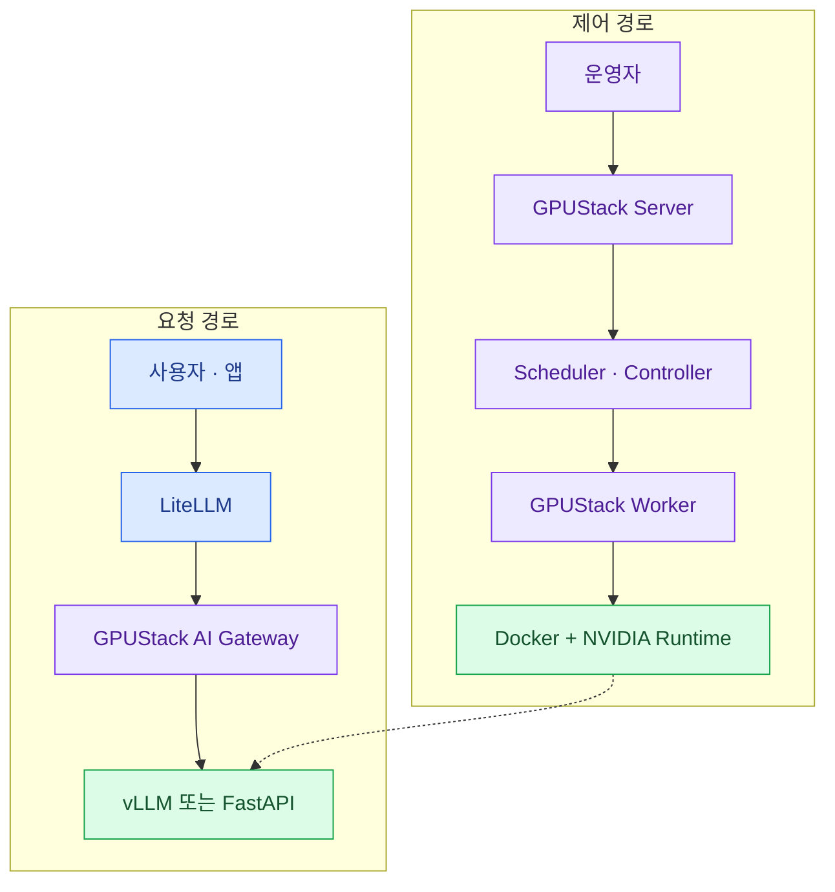

import { LinkCard } from '@astrojs/starlight/components';
import TermIntro from '../../../components/docs/TermIntro.astro';

> 요청 경로와 제어 경로를 나누면 **두 gateway가 있어도 역할이 겹치지 않는다**

<TermIntro
  terms={[
    ['northbound', 'Northbound interface', '이용자와 맞닿은 위쪽 경계. 이 구성에서는 LiteLLM이 사용자·키·정책을 받는다.'],
    ['southbound', 'Southbound interface', '실행 인프라와 맞닿은 아래쪽 경계. GPUStack이 worker와 container runtime을 제어한다.'],
    ['model route', 'Model route', '외부에 보이는 모델 이름을 하나 이상의 deployment target에 연결하는 GPUStack 객체다.'],
    ['reconciliation', '상태 조정', '원하는 replica 수와 실제 instance 수가 다르면 controller가 다시 맞추는 동작이다.'],
  ]}
/>

## 두 흐름을 분리한다



요청 경로에서는 LiteLLM이 모델 alias를 GPUStack endpoint로 바꾸고, GPUStack gateway가 route의
살아 있는 target으로 보낸다. 제어 경로에서는 운영자가 deployment를 만들고, scheduler가 worker를
고르며, worker가 실제 container를 실행한다. 장애 시 controller는 desired replica를 다시 맞춘다.

## 역할을 한 줄씩 고정한다

| 계층 | 소유하는 것 | 소유하지 않는 것 |
|---|---|---|
| LiteLLM | 이용자 key, 팀별 quota, 공개 model alias, 외부 provider fallback | Spark 선택, container 재시작 |
| GPUStack Server | deployment, replica, worker·GPU 상태, backend 버전 | 최종 이용자별 정책 |
| GPUStack AI Gateway | model route, target weight, health 기반 전달 | 모델 프로세스 내부 batching |
| vLLM | continuous batching, KV cache, OpenAI 호환 inference | 사용자 조직·GPU fleet |
| FastAPI | 전처리, model load, `/predict`·`/embed`, health | fleet 전체 배치 |

:::tip[핵심]
이 표의 가운데 선이 운영권 경계다. LiteLLM에는 **GPUStack route 하나**를 등록하고,
Spark 열 대의 개별 주소를 넣지 않는다. 개별 주소를 넣으면 GPUStack이 instance를 옮긴 순간
LiteLLM 설정이 실제 상태와 어긋난다.
:::

## OpenAI 호환과 일반 API가 갈라지는 곳

LLM과 표준 embedding은 같은 북쪽 경로를 쓸 수 있다.

```text
POST LiteLLM /v1/chat/completions
  → GPUStack /v1/chat/completions
  → vLLM

POST LiteLLM /v1/embeddings
  → GPUStack /v1/embeddings
  → vLLM embedding backend
```

classification의 `/predict`는 LiteLLM의 모델 API가 아니다. GPUStack의 Generic Proxy를 직접 쓰거나
사내 API Gateway가 이를 감싼다.

```text
POST /model/proxy/42/predict
  → GPUStack이 /model/proxy/42를 제거
  → FastAPI /predict
```

API contract를 OpenAI 형태로 억지로 바꾸는 것보다 **일반 모델 API라는 사실을 그대로 드러내는 것**이
관측·오류 처리·클라이언트 문서화에 낫다.

## 상태 저장과 장애 경계

GPUStack Server는 SQL database에 desired state를 보관한다. worker가 잠시 사라져도 deployment 정의는
남지만, Server와 database가 함께 사라지면 관리 평면을 잃는다. 그래서 운영에서는 Server를 Spark가 아닌
별도 CPU VM에 두고 외부 PostgreSQL과 backup을 붙이는 구성이 자연스럽다.

데이터 평면 장애와 관리 평면 장애도 다르다.

- GPUStack UI가 잠시 죽어도 이미 떠 있는 vLLM process가 즉시 사라지는 것은 아니다.
- worker가 죽으면 그 worker의 instance와 진행 중 요청은 사라진다.
- replica가 다른 worker에 있으면 gateway가 살아 있는 target으로 새 요청을 보낼 수 있다.
- 2대 pair는 어느 한쪽 장애에도 분산 instance 전체가 영향을 받는다.

## 참고 자료

- [GPUStack 아키텍처](https://docs.gpustack.ai/latest/architecture/) — controller, worker runtime, Higress 기반 AI Gateway.
- [GPUStack Model Route](https://docs.gpustack.ai/2.1/user-guide/model-route-management/) — target weight와 fallback.
- [LiteLLM 공식 문서](https://docs.litellm.ai/) — 인증·예산·routing을 맡는 proxy 기능.

<LinkCard
  title="2. 열 대를 cluster로 등록하기"
  description="별도 CPU 관리 노드와 DGX Spark worker를 설치하고, 처음부터 production 경계를 잡는다."
  href="/gpustack/02-install/"
/>
