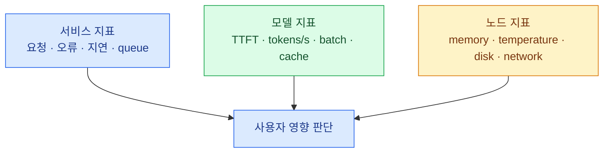

import { Tabs, TabItem, Steps, LinkCard } from '@astrojs/starlight/components';
import TermIntro from '../../../components/docs/TermIntro.astro';

> 모델이 Running이라는 사실보다 **부하를 받은 뒤에도 OS와 다음 요청이 살아 있는지**가 중요하다

<TermIntro
  terms={[
    ['unified memory', 'UMA', 'CPU와 GPU가 같은 물리 메모리 풀을 공유하는 구조. DGX Spark의 128GB는 전통적인 전용 VRAM 128GB와 다르다.'],
    ['headroom', '운영 여유', 'weight·cache 외에 OS, CPU process, page cache와 순간 peak를 위해 비워 두는 메모리다.'],
    ['artifact', 'Model artifact', 'weight, tokenizer, config처럼 배포 버전을 구성하는 불변 파일 묶음이다.'],
    ['drain', '트래픽 비우기', 'instance를 내리기 전에 새 요청을 막고 진행 중 요청이 끝날 시간을 주는 절차다.'],
  ]}
/>

## 메모리를 한 숫자로 보지 않는다

DGX Spark에서는 model weight, KV cache, FastAPI process의 CPU heap, OS와 file cache가 같은 128GB에
압력을 준다. NVIDIA도 UMA에서 `cudaMemGetInfo`가 회수 가능한 CPU page cache 등을 반영하지 못해
실제 allocatable memory보다 작게 보일 수 있다고 설명한다. 반대로 숫자 하나가 넉넉해 보여도 순간
요청 peak에서 host 전체가 메모리 압력을 받을 수 있다.

따라서 capacity test는 다음을 함께 기록한다.

- model load 직후와 steady state의 system used·available memory
- prompt 길이와 동시 요청별 KV cache 증가
- CPU RSS와 swap·page reclaim
- TTFT·tokens/s·queue depth·오류율
- OOM 직전 API 지연과 worker heartbeat 변화

`gpu-memory-utilization=0.9` 같은 기본값은 결론이 아니다. workload별 안전 headroom을 부하 시험으로 정한다.

## model file은 배포 상태의 절반이다

GPUStack은 Hugging Face, ModelScope와 local path에서 모델을 배포할 수 있지만 local file을 worker 사이에
자동 동기화하지 않는다. artifact 전략을 먼저 고른다.

| 방식 | 장점 | 운영 함정 |
|---|---|---|
| worker local NVMe cache | 실행 중 성능과 격리, shared storage 장애 영향이 작음 | 열 대의 download·disk 정리·version 일치 필요 |
| shared NFS path | path 하나와 빠른 failover | cold start 병목과 NFS 장애가 전체에 전파 |
| startup object download | version·checksum을 코드로 관리 | 시작 시간, credential과 egress 관리 |
| image에 포함 | artifact 하나로 재현 | image 비대화, weight 변경마다 rebuild |

LLM은 local NVMe cache를 pre-warm하고 revision을 고정하는 방식이 보통 낫다. 작은 classification은
image 포함도 단순하다. local path failover를 원하면 후보 worker 모두에서 같은 절대 경로가 보여야 한다.

## 관측은 세 층으로 나눈다

GPU 사용률만 보면 queue가 길어지는 이유를 알 수 없다. 이용자 관점 RED 지표, backend 내부 지표,
host 자원 지표를 같은 시간 축에 놓는다. LiteLLM request ID를 GPUStack gateway와 backend log까지 전달하면
한 요청을 세 층에서 찾을 수 있다.

### 최소 알림

- route의 healthy target이 0 또는 기대 replica보다 적음
- worker heartbeat 끊김·instance restart 반복
- system available memory 급감·swap 증가·disk 임계치
- API 오류율·p95/p99·queue depth 상승
- model download·load timeout
- pair의 worker 간 network/NCCL 오류
- certificate·API credential 만료

## 변경은 target을 하나씩 바꾼다

<Steps>

1. **변경 단위를 적는다** — DGX OS, driver, GPUStack worker, backend image, model revision을 한 번에 섞지 않는다.
2. **staging Spark에서 load test한다** — ARM64·GB10 compatibility와 headroom을 확인한다.
3. **새 deployment를 별도 route target으로 추가한다** — 처음 weight는 0 또는 소량이다.
4. **실제 요청을 일부 보낸다** — 결과 품질과 latency·memory를 함께 비교한다.
5. **weight를 넘기고 옛 target을 drain한다** — 진행 중 streaming 요청의 종료 시간을 준다.
6. **rollback 시간을 확인한 뒤 옛 artifact를 정리한다** — disk 정리를 배포 직후 자동으로 하지 않는다.

</Steps>

:::caution[보안 기준]
GPUStack v2.2.0~2.2.1에는 cluster takeover로 이어질 수 있는 권한 누락과 SAML 인증 우회 취약점이
공개됐고 v2.2.2에서 수정됐다. 관리 면을 내부망에 두는 것과 별개로 보안 릴리스는 즉시 검토하고,
검증되지 않은 오래된 버전을 신규 설치 기준으로 삼지 않는다.
:::

## 장애 진단 사다리

<Tabs>
<TabItem label="LLM·embedding 실패">

1. LiteLLM에서 upstream timeout인가, policy 거절인가
2. GPUStack route에 healthy target이 남았나
3. deployment desired replica와 actual instance가 같은가
4. backend log에서 load·OOM·CUDA·tokenizer 오류가 있나
5. worker의 memory·disk·temperature·network가 정상인가
6. pair라면 두 member와 Ray/NCCL 경로가 모두 정상인가

</TabItem>
<TabItem label="FastAPI 실패">

1. Generic Proxy가 올바른 numeric route ID를 가리키나
2. `/health/ready`가 model load 뒤 200이 되는가
3. GPUStack이 준 `{{port}}`와 실제 uvicorn bind port가 같은가
4. ARM64 image와 CUDA library가 맞나
5. artifact checksum·path·permission이 맞나
6. request schema 변경으로 기존 client가 깨지지 않았나

</TabItem>
</Tabs>

## 참고 자료

- [NVIDIA UMA memory reporting](https://nvidia.custhelp.com/app/answers/detail/a_id/5728/) — DGX Spark의 동적 공유 메모리 해석.
- [GPUStack Model Deployment](https://docs.gpustack.ai/latest/user-guide/model-deployment-management/) — local path 동기화 책임, replica 재생성, auto-restart.
- [GPUStack Architecture](https://docs.gpustack.ai/latest/architecture/) — worker metrics와 controller 역할.
- [GPUStack Releases](https://github.com/gpustack/gpustack/releases) — 보안 수정과 DGX Spark GB10 관련 변경.

<LinkCard
  title="7. GPUStack으로 시작할지 판단하기"
  description="PoC 합격선과 Kubernetes/KServe·Ray Serve·Slurm으로 넘어갈 경계를 결정표로 만든다."
  href="/gpustack/07-adoption/"
/>
