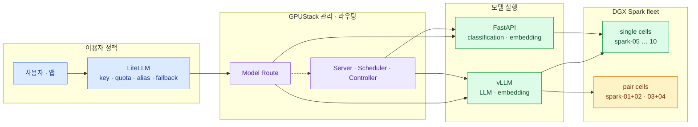

import { Card, CardGrid, Steps, LinkCard } from '@astrojs/starlight/components';
import TermIntro from '../../../components/docs/TermIntro.astro';

> 기본은 **한 Spark에 한 instance**, 확장은 **replica**, pair는 **필요할 때만**이다

<TermIntro
  title="이 장의 사용법"
  terms={[
    ['전체 지도', '', '이용자 요청부터 실제 Spark까지, 각 계층의 소유권을 한 번에 본다.'],
    ['선택표', '', 'LLM·embedding·classification을 어떤 backend와 route로 보낼지 바로 고른다.'],
    ['도입 체크리스트', '', '2대 PoC에서 10대 운영으로 넘어갈 때 빠뜨리지 않을 순서다.'],
    ['장애 대응 카드', '', '급할 때 어느 층부터 확인할지 workload별 첫 수를 모았다.'],
  ]}
/>

## 전체 지도

LiteLLM은 사용자를 알고, GPUStack은 route와 실행 상태를 알며, backend는 inference를 안다.
pair topology는 GPUStack 아래에 숨고 이용자에게는 모델 이름 하나만 보인다.

## workload 선택표

| 요구 | 배포 패턴 | 외부 경로 |
|---|---|---|
| 한 Spark에 들어가는 LLM | vLLM single replica, 필요 시 여러 worker에 replica | LiteLLM → GPUStack OpenAI API |
| 한 Spark에 안 들어가는 LLM | 고정 2대 pair의 distributed vLLM | LiteLLM → GPUStack route |
| 표준 text embedding | vLLM embedding replica | LiteLLM `/v1/embeddings` |
| 특수 전처리 embedding | FastAPI custom backend | Generic Proxy 또는 사내 Gateway |
| classification | FastAPI custom backend, single-node replica | Generic Proxy 또는 사내 Gateway |
| 동일 모델 두 pair | pair별 deployment + route weight | LiteLLM에는 alias 하나 |
| pair 하나만 있는 중요 모델 | pair + 작은 single model 또는 외부 fallback | route·LiteLLM fallback 정책 |

## 장별 한 문장

| 장 | 한 문장 |
|---|---|
| [0](/gpustack/00-position/) | GPUStack의 가치는 명령 실행보다 **열 곳의 원하는 상태를 계속 맞추는 것**에 있다 |
| [1](/gpustack/01-architecture/) | **LiteLLM은 이용자 정책, GPUStack은 모델 실행 상태**를 맡는다 |
| [2](/gpustack/02-install/) | 열 대 설치보다 먼저 **같은 worker 표준과 별도 관리 평면**을 만든다 |
| [3](/gpustack/03-vllm-embedding/) | 한 대에 들어가는 LLM·embedding은 **독립 replica로 확장**한다 |
| [4](/gpustack/04-custom-backends/) | FastAPI는 **실행 명령·ready·port 계약**만 맞추면 custom backend가 된다 |
| [5](/gpustack/05-pairs-routing/) | pair는 HA가 아니라 **용량을 늘리는 하나의 장애 셀**이다 |
| [6](/gpustack/06-operations/) | Spark의 128GB는 공유되므로 **weight 적재가 아니라 부하 뒤 headroom**을 본다 |
| [7](/gpustack/07-adoption/) | 배포 단위가 모델 container인 동안 GPUStack, 일반 application이 되면 Kubernetes를 다시 본다 |

## 도입 체크리스트

<Steps>

1. **소유권 경계** — LiteLLM과 GPUStack 중 key·alias·fallback·route의 주인을 각각 정했다.
2. **worker 표준** — OS·firmware·driver·Docker·NTP·CA·proxy·cache path를 열 대에서 맞췄다.
3. **artifact 고정** — backend image digest, model·tokenizer revision과 checksum을 기록했다.
4. **single-node 기준선** — LLM·embedding·classification의 latency·throughput·memory headroom을 측정했다.
5. **replica 장애 시험** — instance 종료와 worker 재부팅에서 새 요청·복구 시간을 확인했다.
6. **FastAPI contract** — readiness·SIGTERM·metrics·schema version·Generic Proxy를 검증했다.
7. **pair 시험** — 필요한 모델에만 두 worker를 수동 선택하고 NCCL·실제 model benchmark를 통과했다.
8. **route와 fallback** — target weight, drain, rollback과 pair 전체 장애를 시험했다.
9. **관측과 보안** — 세 층 지표·alert, TLS·관리망·key 회전과 database backup을 연결했다.
10. **확장 판정** — 2대 → 4대 → 10대 각 단계의 합격표를 남겼다.

</Steps>

## 장애 대응 카드

<CardGrid>
<Card title="모든 모델이 안 된다" icon="warning">
LiteLLM 자체와 GPUStack gateway부터 나눈다.

GPUStack Server·database·TLS·DNS를 확인한다.

route 전체 target이 사라졌는지 본다.
</Card>
<Card title="모델 하나만 안 된다" icon="warning">
route target과 desired/actual replica를 본다.

backend load·OOM·CUDA log를 확인한다.

model revision·image digest·artifact path를 비교한다.
</Card>
<Card title="FastAPI만 안 된다" icon="warning">
numeric route ID와 Generic Proxy path를 확인한다.

`/health/ready`, uvicorn bind port, request schema를 본다.

ARM64 image와 CUDA runtime을 검증한다.
</Card>
<Card title="pair만 안 된다" icon="warning">
두 member의 worker·container 상태를 모두 본다.

ConnectX-7 link와 Ray/NCCL port를 확인한다.

다른 pair 또는 single fallback으로 route를 돌린다.
</Card>
</CardGrid>

## 마지막 결정

이 환경에서는 GPUStack으로 시작하는 것이 맞다. 이유는 단순하다. 지금 관리할 대상이 Kubernetes의
모든 application이 아니라 **GPU에서 오래 실행되는 모델 server**이기 때문이다. vLLM은 내장 backend로,
FastAPI는 custom backend로 같은 worker pool에 놓고, LiteLLM에서 사용자에게 하나의 모델 catalog를 준다.

성공의 모습도 분명하다. 이용자는 Spark 이름을 모르고, 운영자는 SSH로 열 대를 돌아다니지 않으며,
한 node나 pair가 죽었을 때 route와 fallback이 정해진 동작을 한다. 이 상태를 먼저 만든 뒤에야
더 큰 orchestration platform이 정말 필요한지 판단할 수 있다.

<LinkCard
  title="GPUStack 개요로 돌아가기"
  description="덱의 구성과 두 역할 경계를 다시 본다."
  href="/gpustack/"
/>
