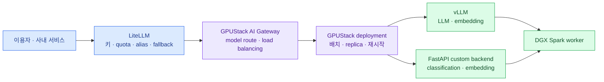

import { LinkCard, LinkButton } from '@astrojs/starlight/components';
import DeckMap from '../../../components/docs/DeckMap.astro';

> 열 대를 한 GPU로 만드는 것이 아니라, **열 개의 실행 자리를 한 관리 평면에서 다룬다**

DGX Spark가 열 대 있으면 가장 먼저 필요한 것은 거대한 분산 추론이 아니다.
어느 장비에 어떤 모델이 떠 있는지, 죽으면 누가 다시 띄우는지, 같은 모델 복제본에 요청을
어떻게 나누는지를 한곳에서 관리하는 일이다. GPUStack은 이 **모델 실행 평면**을 맡는다.

이 덱은 실제 도입 구성을 기준으로 한다. 사용자는 LiteLLM을 통해 들어오고, LLM은 vLLM으로,
임베딩은 vLLM 또는 FastAPI로, classification은 자체 FastAPI 컨테이너로 서빙한다.
대부분은 Spark 한 대에서 독립 실행하지만 일부는 두 대짜리 pair로 묶을 수 있다.

**2026년 8월 13일 기준**으로 공식 문서를 확인했다. GPUStack과 DGX Spark의 지원 범위가
빠르게 변하는 시기라 각 장의 판단은 안정적 원칙과 현재 구현을 구분해 적었다.

<LinkButton href="/gpustack/00-position/" icon="right-arrow">첫 장부터 읽기</LinkButton>

## 구성

<DeckMap
  steps={[
    { label: '0장', href: '/gpustack/00-position/', title: '자리 정하기', tone: 'key',
      desc: 'GPUStack이 푸는 문제 · 하지 않는 일 · 이 환경에서의 결론',
      note: '왜 Kubernetes보다 먼저 GPUStack을 시험하는가' },
    { label: '1~2장', href: '/gpustack/01-architecture/', title: '관리 평면', tone: 'zone',
      desc: 'LiteLLM → GPUStack → worker 요청 경로 · 서버와 worker 설치',
      note: '누가 정책을 맡고 누가 컨테이너를 살리는가' },
    { label: '3~4장', href: '/gpustack/03-vllm-embedding/', title: '워크로드', tone: 'ok',
      desc: 'vLLM LLM·embedding · FastAPI classification·embedding custom backend',
      note: 'OpenAI 호환과 일반 API를 어디서 갈라야 하는가' },
    { label: '5장', href: '/gpustack/05-pairs-routing/', title: '배치와 라우팅', tone: 'warn',
      desc: 'worker label · replica · 2대 pair · route weight와 fallback',
      note: '독립 노드와 pair를 같은 풀에서 어떻게 섞는가' },
    { label: '6~7장', href: '/gpustack/06-operations/', title: '운영과 선택', tone: 'bad',
      desc: '메모리·모델 파일·업그레이드·장애 루틴 · KServe로 넘어갈 경계',
      note: 'PoC를 무엇으로 합격시키고 언제 다른 플랫폼을 택하는가' },
    { label: '8장', href: '/gpustack/08-wrapup/', title: '마무리', tone: 'mute',
      desc: '전체 지도 · 배포 패턴 · 도입 체크리스트 · 장애 대응 카드' },
  ]}
/>

## 전체를 관통하는 두 경계

**북쪽 경계**에서는 LiteLLM이 이용자를 안다. 가상 키, 사용자별 제한, 모델 별칭과 외부 모델
fallback은 여기 둔다. **남쪽 경계**에서는 GPUStack이 장비와 프로세스를 안다. 어느 worker에
무엇을 놓고 몇 개를 유지할지는 여기 둔다. 둘 다 할 수 있는 기능이 있어도 소유자는 하나로 정한다.

두 대짜리 pair도 같은 원칙으로 본다. pair를 사용하는 LLM은 GPUStack 안에서는 하나의
분산 deployment지만, LiteLLM에는 여전히 모델 endpoint 하나다. 반대로 FastAPI classification은
pair를 쓰지 않고 한 노드짜리 replica를 늘린다.

## 이 덱의 결론을 먼저 말하면

- 현재 요구에는 **Docker 기반 GPUStack이 1차 선택**이다.
- LLM과 OpenAI 호환 embedding은 LiteLLM → GPUStack → vLLM 경로로 통일한다.
- 일반 `/predict` FastAPI는 GPUStack Generic Proxy 또는 별도 사내 API Gateway로 연다.
- 한 대에 들어가는 모델은 여러 independent replica로 확장한다.
- 한 대에 안 들어가는 LLM만 두 Spark를 pair로 묶고, 중요한 서비스라면 다른 pair나 작은 모델을
  fallback으로 둔다.
- FastAPI 서비스가 여러 sidecar·DB·queue·batch job을 거느리는 플랫폼으로 자라면
  K3s/Kubernetes + KServe를 다시 검토한다.

## 참고 자료

- [GPUStack 공식 개요](https://docs.gpustack.ai/) — scheduler, backend, gateway와 운영 기능의 전체 범위.
- [DGX Spark 하드웨어 개요](https://docs.nvidia.com/dgx/dgx-spark/hardware.html) — ARM64 GB10, unified memory와 네트워크 사양.
- [LiteLLM 공식 문서](https://docs.litellm.ai/) — 가상 키·비용·routing을 맡는 북쪽 gateway의 역할.

<LinkCard
  title="0. GPUStack의 자리"
  description="제품 기능부터 외우지 않고, DGX Spark 열 대에서 먼저 풀어야 할 운영 문제를 정의한다."
  href="/gpustack/00-position/"
/>
