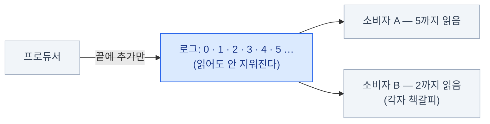

import { Card, CardGrid, LinkCard } from '@astrojs/starlight/components';
import TermIntro from '../../../components/TermIntro.astro';

> Kafka는 **한번 놓으면 서비스 전체의 신경망**이 된다 — 도입 전에 성질을 알아야 하는 이유다

<TermIntro
  terms={[
    ['이벤트 스트리밍', 'Event Streaming', '"무슨 일이 일어났다"는 기록(이벤트)을 흐름으로 쌓고, 여러 곳에서 각자 읽어 가게 하는 방식. Kafka가 이 분야의 사실상 표준이다.'],
    ['브로커', 'Broker', '데이터를 받아 저장하고 내주는 Kafka 서버 프로세스. 브로커 여러 대가 모여 클러스터가 된다.'],
    ['KRaft', 'Kafka Raft', 'Kafka가 클러스터 메타데이터를 **스스로** 합의(Raft)로 관리하는 방식. 예전에 이 일을 하던 별도 시스템 ZooKeeper는 4.0에서 완전히 제거됐다.'],
    ['Strimzi', '', '쿠버네티스에서 Kafka를 선언적으로 배포·운영하게 해 주는 오퍼레이터(CNCF 프로젝트). 온프렘 k8s 배포의 사실상 표준이다(9장).'],
    ['온프렘', 'On-premises', '클라우드 관리형 서비스가 아니라 **자체 인프라에서 직접 운영**하는 것. 관리형이면 남이 해 주는 일(브로커 관리·업그레이드·용량)이 전부 내 일이 된다.'],
  ]}
/>

## 이 덱은 누구를 위한 것인가

- 온프렘 쿠버네티스에서 서비스를 구성하며 **Kafka 도입을 결정했거나 검토하는** 사람
- 쿠버네티스는 다룰 줄 아는데 (이 사이트의 [CKA 덱](/cka/) 수준),
  **메시징 시스템 운영은 처음**인 사람
- "메시지가 유실됐어요", "같은 메시지가 두 번 처리됐어요", "컨슈머가 못 따라가요" 같은
  문의를 받았을 때 **어느 나사를 봐야 하는지** 판단하고 싶은 사람

전제하는 것: 쿠버네티스 기본기(StatefulSet·Service·PV·오퍼레이터 개념), 터미널.
전제하지 않는 것: 메시지 큐 경험, Kafka 사용 경험, 특정 언어의 클라이언트 API.

### 다루는 것과 다루지 않는 것

<CardGrid>
<Card title="다룬다" icon="approve-check">
서비스 간 직접 연동이 아픈 이유와 로그를 놓는 목적.
토픽 · 파티션 · 오프셋 — 로그라는 자료구조.
복제 · ISR · KRaft — 클러스터가 장애를 견디는 법.
프로듀서 · 컨슈머의 핵심 설정과 전달 보장(유실 · 중복 · 순서).
토픽 설계 — 파티션 수 · 보존 · 컴팩션.
Connect · 스키마 레지스트리 — 언제 무엇을 더 얹는가.
온프렘 k8s 배포(Strimzi · 스토리지 · 리스너)와 운영 · 트러블슈팅.
</Card>
<Card title="다루지 않는다" icon="close">
언어별 클라이언트 API 상세 (개념과 설정 이름까지만).
Kafka Streams · Flink 상세 (존재와 용도만).
ksqlDB.
멀티 데이터센터 재해 복구 설계 (MirrorMaker 2는 이름만).
OS · JVM 수준 성능 튜닝.
Redpanda · Pulsar 상세 비교 (자리만 잡아 준다).
쿠버네티스 기초 (→ [CKA 덱](/cka/)).
</Card>
</CardGrid>

## 미리 잡아두면 좋은 멘탈 모델

### 1. 큐가 아니라 로그다

전통적 메시지 큐는 메시지를 꺼내면 지운다. Kafka는 **추가만 되는(append-only) 로그**에
쌓아 두고 정해진 보존 기간 동안 지우지 않는다. 소비자는 로그의 **어디까지 읽었는지**(오프셋)만
움직인다 — 그래서 같은 데이터를 여러 팀이 각자 읽을 수 있고, 어제 데이터를 다시 읽을 수도 있다.

### 2. 순서는 파티션 안에서만

토픽은 병렬 처리를 위해 여러 파티션으로 쪼개지고, **순서 보장은 파티션 하나 안에서만**
성립한다. "전체 순서"는 없다 — 순서가 필요한 단위(예: 같은 주문 ID)를 **같은 키**로 묶어
같은 파티션에 보내는 것이 Kafka에서 순서를 다루는 유일한 방법이다 ([4장](/kafka/04-producer/)).

### 3. 브로커는 단순하게, 판단은 클라이언트가

브로커는 밀어주지(push) 않는다 — 컨슈머가 **당겨(pull)** 가고, 어디까지 읽었는지도
컨슈머 쪽 책임이다. 그래서 유실·중복·순서 같은 보장의 상당 부분이 **브로커 설정이 아니라
클라이언트 설정과 애플리케이션 코드**에서 결정된다. "Kafka를 쓰면 자동으로 안전하다"가
아니라 **어느 쪽 나사인지 아는 것**이 이 덱의 목표다 ([6장](/kafka/06-semantics/)).

:::tip[핵심]
이 셋 — **지워지지 않는 로그, 파티션 단위의 순서, 클라이언트 쪽 책임** — 만 잡고 있으면
나머지 장은 이 그림의 칸을 채우는 일이다.
:::

## 이 덱의 기준 시점

**2026년 8월** 기준이다. Kafka는 2024~2025년에 아키텍처가 크게 바뀌었는데(ZooKeeper 제거),
검색 결과에는 그 이전 글이 훨씬 많이 남아 있다 — 시점 확인이 특히 중요하다.

| 항목 | 지금 | 낡은 정보 (검색 결과에 많이 남아 있음) |
|---|---|---|
| Kafka | **4.3** (2026-05) — KRaft 전용 | ZooKeeper 전제 글 (3.x 이하). **ZooKeeper는 4.0(2025-03)에서 제거**됐다 |
| CLI | `kafka-topics.sh --bootstrap-server …` | `--zookeeper` 옵션 (3.0에서 제거) |
| 프로듀서 기본값 | `acks=all` · 멱등성 기본 켜짐 (3.0부터) | "기본은 acks=1이라 유실될 수 있다"는 글 |
| 컨슈머 그룹 | 새 리밸런스 프로토콜 KIP-848 (4.0에서 GA) — 브로커 주도, 멈춤 최소화 | "리밸런스 = 그룹 전체 정지" 전제의 글 |
| Strimzi | **0.51** — KRaft + KafkaNodePool이 기본 | `spec.zookeeper`가 들어간 예시 YAML |

:::caution[함정]
옛 튜토리얼의 첫 단계는 대부분 "ZooKeeper를 먼저 띄운다"이다.
지금 버전에는 ZooKeeper가 **아예 없다** — 그 글의 나머지 설정도 낡았을 가능성이 높으니
버전 표기부터 확인한다.
:::

## 0장 요약

- 대상은 **온프렘 k8s에 Kafka를 도입·운영해야 하는 쿠버네티스 관리자**다
- 멘탈 모델 셋: **지워지지 않는 로그 / 파티션 단위의 순서 / 클라이언트 쪽 책임**
- 기준 시점은 2026년 8월 (Kafka 4.3 · Strimzi 0.51). ZooKeeper가 보이면 낡은 문서다

<LinkCard
  title="1. 왜 Kafka인가"
  description="서비스끼리 직접 부르던 구조의 통증 — 가운데 로그를 놓으면 풀리는 것들."
  href="/kafka/01-why/"
/>
