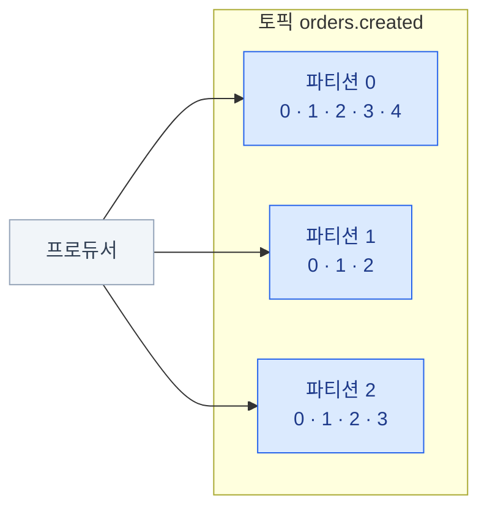
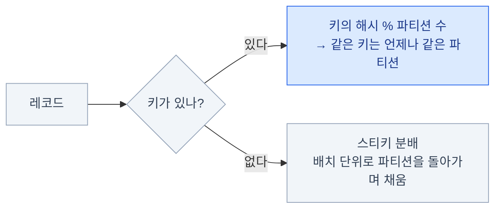

import { LinkCard } from '@astrojs/starlight/components';
import TermIntro from '../../../components/TermIntro.astro';

> Kafka의 모든 동작은 "**추가만 되는 파일에 순서대로 쓴다**"는 한 문장에서 파생된다

<TermIntro
  terms={[
    ['레코드', 'Record', 'Kafka에 쓰는 데이터 한 건. 키 · 값 · 타임스탬프 · 헤더로 이루어진다. "메시지"와 같은 말이다.'],
    ['토픽', 'Topic', '레코드가 쌓이는 논리적 이름. "orders.created"처럼 이벤트 종류 하나가 토픽 하나가 되는 것이 보통이다.'],
    ['파티션', 'Partition', '토픽을 물리적으로 쪼갠 조각. 실제 로그 파일은 파티션 단위이고, 순서 · 병렬성 · 분산이 전부 이 단위로 결정된다.'],
    ['오프셋', 'Offset', '파티션 안에서 레코드마다 붙는 순번(0, 1, 2…). 소비자는 이 번호를 책갈피 삼아 "어디까지 읽었는지"를 관리한다.'],
    ['세그먼트', 'Segment', '파티션 로그를 디스크에서 나눠 담는 파일 단위. 보존 기간이 지난 데이터는 세그먼트 파일째 지워진다.'],
  ]}
/>

## 레코드 — 쌓이는 데이터의 단위

| 필드 | 내용 | 왜 있나 |
|---|---|---|
| **key** | 바이트열 (없어도 됨) | **파티션 배정 기준** — 같은 키는 같은 파티션으로 간다 (아래) |
| **value** | 바이트열 | 본문. 직렬화 형식(JSON · Avro …)은 Kafka가 관여하지 않는다 — 클라이언트끼리의 계약이다(7장) |
| timestamp | 생성 또는 적재 시각 | 시간 기준 보존 · 시간으로 오프셋 찾기 |
| headers | 키-값 메타데이터 | 추적 ID 등, 본문을 열지 않고 볼 부가 정보 |

브로커에게 value는 **그냥 바이트열**이다 — 내용을 해석하지도, 검사하지도 않는다.
"브로커는 단순하게"([0장](/kafka/00-intro/))의 한 단면이고, 형식 계약이 왜 별도 도구
(스키마 레지스트리, [8장](/kafka/08-ecosystem/))로 필요한지의 이유다.

## 토픽과 파티션 — 이름과 실체

토픽은 이름일 뿐, **실제로 존재하는 것은 파티션**이다. 토픽 하나는 파티션 여러 개로
쪼개지고, 각 파티션이 독립된 append-only 로그다.

왜 쪼개는가 —

| 파티션이 주는 것 | 어떻게 |
|---|---|
| **병렬성** | 파티션마다 컨슈머가 하나씩 붙어 동시에 읽는다 ([5장](/kafka/05-consumer/)) |
| **분산** | 파티션들이 여러 브로커에 흩어져, 토픽 하나가 브로커 한 대의 용량을 넘을 수 있다 ([3장](/kafka/03-cluster/)) |
| **순서의 경계** | 순서는 파티션 **안에서만** 보장된다 — 파티션 사이의 순서는 정의되지 않는다 |

:::caution[함정 — 전체 순서는 없다]
파티션 0의 오프셋 3과 파티션 1의 오프셋 3 사이에 선후 관계는 **없다.**
"토픽 전체에서 시간 순으로"를 전제한 설계는 파티션이 2개가 되는 순간 깨진다.
순서가 필요하면 그 단위를 키로 묶는다(아래) — 전역 순서가 정말 필요하면
파티션 1개짜리 토픽뿐인데, 그건 병렬성을 포기하는 선택이다.
:::

## 키 — 어느 파티션으로 갈지 정하는 것

프로듀서는 레코드를 보낼 때 파티션을 이렇게 고른다 —

- **키가 있으면** — 같은 키는 항상 같은 파티션 → 그 키의 레코드끼리는 **쓴 순서대로 읽힌다.**
  "주문 ID를 키로" 하면 한 주문의 이벤트들은 순서가 지켜진다
- **키가 없으면** — 골고루 분배될 뿐 순서 개념이 없다. 순서가 무관한 데이터(로그 · 메트릭)에 쓴다

:::caution[함정 — 파티션 수를 늘리면 키 배정이 바뀐다]
배정은 `해시 % 파티션 수`라, 파티션 수를 바꾸면 **같은 키가 다른 파티션으로 가기 시작한다.**
그 시점 전후로 그 키의 순서 보장이 끊긴다. 파티션 수는 늘릴 수는 있지만 줄일 수는 없고,
늘리는 것도 이 대가가 있다 — 처음 정할 때 신중해야 하는 이유다([7장](/kafka/07-topic-design/)).
:::

## 오프셋 — 소비자의 책갈피

파티션 안에서 레코드는 오프셋(0, 1, 2…)으로 번호가 붙는다. 핵심은 **두 위치가 서로
독립**이라는 것 —

- **브로커가 지우는 위치** — 보존 정책(기간 · 용량)에 따라 오래된 쪽부터 지운다.
  누가 읽었는지는 **전혀 고려하지 않는다**
- **소비자가 읽는 위치** — 소비자(그룹)마다 따로 관리한다. 읽어도 데이터는 그대로다

이 독립성에서 Kafka다운 동작이 전부 나온다 —

| 할 수 있는 일 | 왜 가능한가 |
|---|---|
| 소비자 그룹 여러 개가 같은 토픽을 각자 읽기 | 그룹마다 오프셋이 따로다 |
| 장애 복구 후 밀린 곳부터 이어 읽기 | 마지막 커밋 오프셋이 남아 있다 |
| 버그 수정 후 어제 데이터 재처리 | 오프셋을 되감으면 된다 — 데이터가 아직 있으니까 |
| 새 소비자가 처음부터 따라잡기 | 보존된 범위의 맨 앞(earliest)부터 읽으면 된다 |

## 디스크에서는 — 왜 빠른가

"디스크에 쓰는데 왜 빠른가"는 Kafka 도입 논의에서 꼭 나오는 질문이다.

- 파티션 로그는 **세그먼트 파일**들로 나뉘어 저장된다. 쓰기는 항상 마지막(active) 세그먼트
  끝에 **순차 추가** — 디스크가 가장 잘하는 접근 패턴이다. 랜덤 I/O가 없다
- 삭제도 세그먼트 **파일째** 지운다 — 레코드 단위로 지우지 않으니 삭제 비용이 없다.
  큐가 메시지 단위 삭제를 관리하는 것과 대비되는 지점이다
- 읽기는 OS **페이지 캐시**를 그대로 타고, 네트워크 전송은 제로카피(sendfile)로 나간다.
  최근 데이터를 읽는 소비자는 사실상 메모리에서 읽는다 — 브로커 메모리 계획에서
  힙보다 페이지 캐시 몫이 중요한 이유다([9장](/kafka/09-deploy/))

:::tip[핵심]
Kafka의 성능은 영리한 자료구조가 아니라 **자료구조를 단순하게 유지한 것**에서 나온다.
순차 쓰기 · 파일째 삭제 · 페이지 캐시 — 전부 "추가만 되는 로그"라서 가능한 선택이다.
:::

## 2장 요약

- 실체는 파티션이다 — **순서 · 병렬성 · 분산의 단위**이고, 순서는 파티션 안에서만 보장된다
- 같은 키 → 같은 파티션 → 순서 보장. **순서가 필요한 단위가 곧 키다**
- 브로커가 지우는 위치(보존)와 소비자가 읽는 위치(오프셋)는 **독립** — 다중 구독 · 재처리의 근거
- 파티션 수를 늘리면 키 배정이 바뀐다 — 처음 정할 때 신중히(7장)
- 빠른 이유는 순차 쓰기 · 세그먼트째 삭제 · 페이지 캐시

<LinkCard
  title="3. 클러스터"
  description="브로커가 죽어도 데이터가 사는 이유 — 복제 · ISR · KRaft."
  href="/kafka/03-cluster/"
/>
