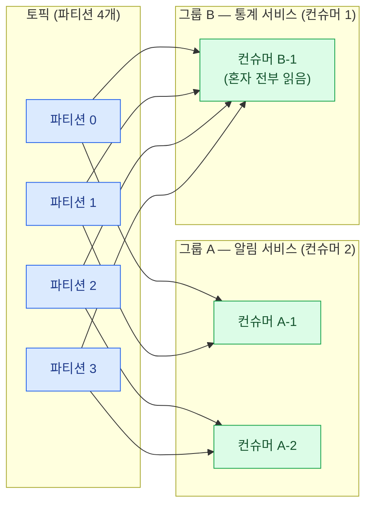

import { LinkCard } from '@astrojs/starlight/components';
import TermIntro from '../../../components/TermIntro.astro';

> 컨슈머의 사고는 대부분 **"처리했다"와 "커밋했다" 사이의 틈**에서 난다

<TermIntro
  terms={[
    ['컨슈머 그룹', 'Consumer Group', '같은 토픽을 나눠 읽는 컨슈머들의 묶음. 그룹 안에서 파티션 하나는 컨슈머 하나에만 배정된다 — 이것이 Kafka의 병렬 소비 단위다.'],
    ['리밸런스', 'Rebalance', '그룹의 구성원이 바뀔 때(추가 · 이탈 · 응답 없음) 파티션 배정을 다시 하는 것. 소비가 잠시 출렁이는 원인 1순위다.'],
    ['커밋', 'Commit', '"이 파티션을 어디까지 처리했다"는 오프셋을 Kafka에 기록하는 것. 재시작 · 리밸런스 후 어디부터 읽을지가 이 값으로 정해진다.'],
    ['랙', 'Lag', '파티션의 최신 오프셋과 그룹의 커밋 오프셋의 차이 — "얼마나 밀렸는가". 컨슈머 상태를 말해 주는 단 하나의 지표다.'],
  ]}
/>

## 풀 모델 — 컨슈머가 당겨 간다

브로커는 컨슈머에게 밀어주지 않는다. 컨슈머가 `poll()`을 반복해 배치를 당겨 가고,
처리하고, 또 당긴다 — 이 **poll 루프**가 컨슈머의 전부다.

밀어주기(push)가 아닌 이유: 소비 속도의 주도권이 컨슈머에게 있어야
느린 컨슈머가 터지지 않고([1장](/kafka/01-why/)의 완충이 성립하고), 되감기·재처리 같은
"읽는 위치의 자유"가 가능하다.

## 컨슈머 그룹 — 병렬 소비의 규칙

그룹 안에서 규칙은 하나다 — **파티션 하나는 그룹 내 컨슈머 하나에만** 배정된다.

여기서 따라 나오는 결론들 —

| 결론 | 왜 |
|---|---|
| 스케일아웃 = 컨슈머 추가 | 파티션이 재분배되어 병렬성이 늘어난다 |
| **병렬성 상한 = 파티션 수** | 파티션 4개에 컨슈머 5개면 하나는 논다 — 파티션 수를 정하는 근거([7장](/kafka/07-topic-design/)) |
| 그룹이 다르면 독립 | 그룹마다 오프셋이 따로라, 서비스마다 그룹 ID를 달리해 같은 토픽을 각자 읽는다 |
| 같은 서비스의 복제본은 같은 그룹 | Deployment 레플리카들이 같은 `group.id`를 쓰면 자동으로 일을 나눈다 |

## 리밸런스 — 배정이 다시 짜이는 순간

컨슈머가 **들어오거나, 나가거나, 응답이 없을 때** 그룹은 파티션 배정을 다시 한다.
필요한 동작이지만 비용이 있다 — 배정이 바뀌는 동안 소비가 출렁이고, 잦으면 랙이 쌓인다.

- 배포(롤링 재시작)마다 리밸런스가 나는 것은 **정상**이다
- 4.0부터 GA된 새 프로토콜(KIP-848)은 리밸런스를 브로커 주도·점진적으로 바꿔
  "전원 멈춤" 비용을 크게 줄였다 — 옛 글의 "리밸런스 = 그룹 전체 정지"는 낡은 전제다
- 문제는 **의도치 않은 리밸런스**다. 원인은 거의 둘 —

| 원인 | 무슨 일 | 나사 |
|---|---|---|
| 하트비트 끊김 | 프로세스 죽음 · 네트워크 단절로 `session.timeout.ms` 초과 | 인프라 문제 — 컨슈머 로그와 함께 본다 |
| **poll이 늦음** | 한 배치 처리가 `max.poll.interval.ms`(기본 5분)를 넘겨 "죽은 것으로 간주"됨 | `max.poll.records`를 줄이거나 처리를 빠르게 |

:::caution[함정 — 리밸런스 루프]
처리가 느려 `max.poll.interval.ms`를 넘기면 그룹에서 쫓겨나고, 리밸런스가 나고,
다른 컨슈머가 **같은 무거운 배치**를 받아 또 넘긴다 — 그룹 전체가 리밸런스만 반복하며
소비가 멈춘다. "랙은 쌓이는데 CPU는 놀고 리밸런스 로그만 찍히는" 전형적 증상이다
([11장](/kafka/11-troubleshooting/)).
:::

## 오프셋 커밋 — 어디까지 처리했다고 적을 것인가

커밋된 오프셋은 Kafka 내부 토픽(`__consumer_offsets`)에 저장되고,
재시작·리밸런스 후 **거기서부터** 읽는다. 언제 커밋하느냐가 곧 보장 수준이다 —

- **자동 커밋** (`enable.auto.commit=true`, 기본): 5초마다 "poll로 받아 간 위치"를 커밋.
  받아 갔지만 **아직 처리 못 한** 오프셋이 커밋될 수 있다 → 죽으면 그 구간이 **유실**된다
- **처리 후 수동 커밋**: 배치를 처리한 뒤 커밋. 처리 후 커밋 전에 죽으면 그 배치를
  **다시 받는다** → 유실은 없고 **중복**이 생긴다 (at-least-once, [6장](/kafka/06-semantics/))

유실이 아까운 데이터라면 답은 정해져 있다 — **처리 후 수동 커밋**, 그리고 중복은
멱등 처리로 무해하게(6장).

커밋과 별개로, 커밋이 **아예 없을 때** 어디부터 읽을지가 `auto.offset.reset`이다 —
`latest`(기본, 새 것부터)냐 `earliest`(남아 있는 처음부터)냐. 새 컨슈머 그룹을 붙였는데
"과거 데이터를 안 읽어요"의 원인이 대부분 이 기본값이다.

## 랙 — 단 하나의 컨슈머 지표

**랙 = 파티션 최신 오프셋 − 그룹 커밋 오프셋.** "지금 얼마나 밀렸는가"다.

- 랙이 **일정 범위에서 오르내림** — 정상. 폭주를 흡수하고 소화하는 중
- 랙이 **단조 증가** — 소비 처리량 < 생산 처리량. 컨슈머를 늘리거나(파티션 한도까지),
  처리를 최적화하거나, 파티션을 늘려야 한다
- 랙이 **한 파티션만 증가** — 핫 파티션([4장](/kafka/04-producer/)) 또는 그 파티션 담당
  컨슈머의 문제 (poison pill — [11장](/kafka/11-troubleshooting/))

모니터링 구성은 [10장](/kafka/10-ops/)에서 — 알람 1순위가 랙이다.

## 5장 요약

- 컨슈머가 **당겨** 간다 — 속도의 주도권과 오프셋 관리가 컨슈머 쪽에 있다
- 그룹 규칙: 파티션 1 ↔ 그룹 내 컨슈머 1. **병렬성 상한 = 파티션 수**, 그룹이 다르면 독립
- 리밸런스는 정상 동작이지만, **poll 지연으로 인한 리밸런스 루프**는 대표 장애 패턴
- 유실이 아까우면 **처리 후 수동 커밋** — 대가로 중복을 받아들이고 멱등 처리로 무해하게
- 지표는 **랙** 하나부터 — 단조 증가인지, 특정 파티션만인지가 진단의 첫 갈림길

<LinkCard
  title="6. 전달 보장"
  description="유실 · 중복 · 순서 — 어느 나사가 어느 보장을 만드는가."
  href="/kafka/06-semantics/"
/>
