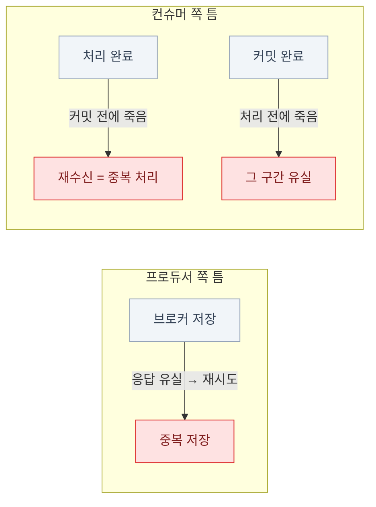

import { LinkCard } from '@astrojs/starlight/components';
import TermIntro from '../../../components/docs/TermIntro.astro';

> "정확히 한 번"을 약속하는 시스템은 없다 — "**중복이 와도 무해한 시스템**"을 만드는 것이다

<TermIntro
  terms={[
    ['at-most-once', '', '최대 한 번 — 유실될 수 있지만 중복은 없다. "놓쳐도 되는" 데이터의 태도다.'],
    ['at-least-once', '', '최소 한 번 — 유실은 없지만 중복될 수 있다. 실무의 기본값이다.'],
    ['exactly-once', '', '정확히 한 번. Kafka **안에서는** 트랜잭션으로 성립하지만, 외부 시스템까지 자동으로 이어지지는 않는다.'],
    ['멱등 소비', 'Idempotent Consumer', '같은 메시지를 두 번 처리해도 결과가 한 번과 같게 소비자를 만드는 것. at-least-once를 실질적 exactly-once로 만드는 실무 해법이다.'],
    ['트랜잭션', 'Transaction', '여러 파티션 쓰기 + 오프셋 커밋을 원자적으로 묶는 Kafka 기능. "읽고-변환하고-다시 쓰는" 파이프라인용이다.'],
  ]}
/>

## 문제 — 장애는 항상 "사이"에서 난다

유실도 중복도 근원은 같다. **두 동작이 원자적이지 않은데 그 사이에 장애가 나는 것**이다.

- 프로듀서 쪽 틈은 멱등성이 이미 막았다 ([4장](/kafka/04-producer/) — 기본 켜짐)
- 컨슈머 쪽 틈은 **커밋 시점 선택**의 문제다 ([5장](/kafka/05-consumer/)) —
  처리와 커밋 중 무엇을 먼저 하든 반대쪽 사고가 남는다. **중복이냐 유실이냐를 고르는 것**이다

## 세 가지 보장 — 무엇을 포기하는가

| 보장 | 유실 | 중복 | 만드는 조합 | 어울리는 데이터 |
|---|---|---|---|---|
| at-most-once | 있음 | 없음 | acks=0/1 · 커밋 먼저, 처리 나중 | 놓쳐도 되는 지표 · 샘플링 로그 |
| **at-least-once** | **없음** | 있음 | acks=all + [3장](/kafka/03-cluster/) 표준 조합 · **처리 후 커밋** | **대부분의 업무 데이터 — 기본값** |
| exactly-once | 없음 | 없음(범위 내) | at-least-once + 트랜잭션 **(Kafka 안)** 또는 + 멱등 소비 **(외부)** | 집계 파이프라인 · 금전 처리 |

## 유실 없음의 전체 사슬

"유실 없음"은 한 군데 설정이 아니라 **세 층이 전부 조여져야** 성립한다.
하나라도 빠지면 그 층에서 샌다 —

| 층 | 나사 | 빠지면 |
|---|---|---|
| 프로듀서 | `acks=all` + 멱등성 (기본값 유지) + **콜백 확인** | 전송 실패를 모른 채 지나간다 |
| 브로커 | RF=3 + `min.insync.replicas=2` | 성공 응답 후 브로커 장애로 유실 |
| 컨슈머 | **처리 후 수동 커밋** | 자동 커밋 틈의 미처리 구간 유실 |
| 보존 | 랙 최대치 < 보존 기간 ([7장](/kafka/07-topic-design/)) | 밀린 사이 데이터가 지워진다 |

:::caution[함정 — 마지막 줄을 잊는다]
설정을 다 조여도 컨슈머가 **보존 기간보다 오래 밀리면** 못 읽은 데이터가 지워진다.
장애로 소비가 며칠 멈추는 시나리오까지가 유실 계산이다 — "보존 7일"은
"7일 안에 복구하면 유실 없음"이라는 뜻이다.
:::

## exactly-once의 실체

"Kafka는 exactly-once를 지원한다"는 문장은 **범위를 붙여야** 참이 된다.

- **Kafka → Kafka** (읽어서 변환해 다른 토픽에 쓰는 파이프라인): 트랜잭션이
  "결과 쓰기 + 원본 오프셋 커밋"을 원자적으로 묶어 준다. Kafka Streams가 설정 하나로
  이 모드를 쓴다 — 여기서는 exactly-once가 **실제로 성립**한다
- **Kafka → 외부 시스템** (DB에 넣기, 메일 보내기, API 호출): 트랜잭션이 외부까지
  묶어 주지 못한다. "DB에 넣고 커밋하기 전에 죽음"의 틈은 그대로다 —
  **exactly-once는 성립하지 않고, at-least-once + 멱등 처리가 정답**이다

멱등 처리의 상투적 수단 —

| 수단 | 방법 |
|---|---|
| 고유 키 upsert | 이벤트 ID를 유니크 키로 `INSERT … ON CONFLICT DO NOTHING` |
| 처리 이력 테이블 | 처리한 이벤트 ID를 기록하고, 있으면 건너뜀 — 업무 처리와 **같은 DB 트랜잭션**으로 |
| 자연 멱등 | "상태를 X로 설정" 같은 연산은 원래 두 번 해도 같다 — 이벤트를 증분("+100")이 아니라 상태("잔액=1100")로 설계 |

:::tip[핵심]
실무 기본형은 **at-least-once + 멱등 소비**다. "중복이 안 오게"에 힘을 쓰는 것보다
"중복이 와도 무해하게"가 싸고 확실하다 — 이 원칙은 Kafka만이 아니라 분산 시스템 전반의 것이다.
:::

## 순서 — 보장 범위를 정확히 알기

- 보장되는 것: **한 파티션 안**, 즉 **같은 키끼리**의 순서 ([2장](/kafka/02-log/))
- 보장 안 되는 것: 파티션 사이, 즉 다른 키 사이의 순서. 토픽 사이는 말할 것도 없다
- 컨슈머가 재시도·병렬 처리를 직접 짤 때 **애플리케이션 층에서 순서를 깨기 쉽다** —
  파티션 내 레코드를 스레드 풀에 흩뿌리면 Kafka가 지켜 준 순서가 그 자리에서 사라진다.
  파티션 단위로 순차 처리하거나, 키 단위로 직렬화하는 구조를 유지한다

## 6장 요약

- 유실·중복의 근원은 **"두 동작 사이"의 장애** — 프로듀서 틈은 멱등성이(기본), 컨슈머 틈은 커밋 시점이 정한다
- 실무 기본값: **at-least-once** (acks=all + RF3/min.insync=2 + 처리 후 커밋) — 그리고 랙 < 보존 기간
- exactly-once는 **Kafka 안**(트랜잭션 · Streams)에서만 자동 — 외부로 나가면 **멱등 소비**가 답
- 순서는 같은 키까지만 — 컨슈머의 병렬 처리 코드가 순서를 깨지 않는지도 봐야 한다

<LinkCard
  title="7. 토픽 설계"
  description="파티션 수 · 보존 · 컴팩션 — 처음에 정해야 하고 바꾸기 어려운 것들."
  href="/kafka/07-topic-design/"
/>
