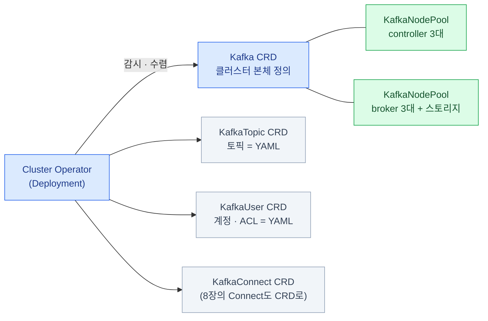
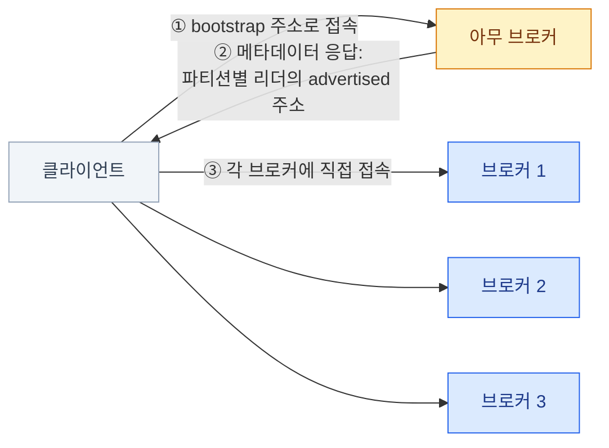

import { FileTree, LinkCard } from '@astrojs/starlight/components';
import TermIntro from '../../../components/TermIntro.astro';

> Kafka를 k8s에 올리는 문제의 절반은 **스토리지**, 나머지 절반은 "**클라이언트가 브로커에 어떻게 닿는가**"다

<TermIntro
  terms={[
    ['오퍼레이터', 'Operator', '운영 지식(순서 있는 롤링 재시작, 인증서 갱신…)을 코드로 담아 CRD로 조작하게 만든 k8s 확장. Strimzi가 Kafka의 그것이다.'],
    ['KafkaNodePool', '', 'Strimzi에서 노드 집합(역할 · 수 · 스토리지)을 선언하는 CRD. broker 풀과 controller 풀을 여기서 나눈다.'],
    ['리스너', 'Listener', '브로커가 클라이언트를 받는 접점 정의(포트 · 노출 방식 · TLS · 인증). 내부용 · 외부용을 따로 여는 것이 보통이다.'],
    ['advertised address', '', '브로커가 클라이언트에게 "나한테는 이 주소로 와"라고 알려주는 주소. 이 값이 클라이언트 관점에서 유효하지 않으면 접속이 반쯤만 된다(아래).'],
    ['JBOD', 'Just a Bunch Of Disks', 'RAID로 묶지 않은 낱개 디스크들. Kafka는 자체 복제가 있어 브로커에 디스크를 낱개로 여러 장 붙이는 구성이 통한다.'],
  ]}
/>

## 왜 오퍼레이터인가

브로커는 상태를 가진 분산 시스템이다 — 손으로 굴리면 이런 일이 전부 내 일이 된다:
설정 변경 시 **한 대씩, ISR 상태를 봐 가며** 재시작하기, 브로커·클라이언트 TLS 인증서
발급·갱신, 버전 업그레이드 순서 관리, 사용자·토픽 생성 권한 관리.

Strimzi는 이것을 CRD와 컨트롤 루프로 바꾼다 — **YAML로 선언하면 오퍼레이터가
순서와 안전을 챙기며 수렴**시킨다. 온프렘 k8s에서 Kafka를 돌리는 사실상 표준이다.

## Strimzi의 구조 — CRD 지도



토픽과 사용자까지 CRD라는 것이 핵심이다 — **토픽 생성이 Git에 남는 YAML**이 되어,
"누가 언제 왜 만든 토픽인지 모르는" 상태를 피할 수 있다 (GitOps, [10장](/kafka/10-ops/)).

최소 구성의 뼈대 —

```yaml
apiVersion: kafka.strimzi.io/v1beta2
kind: KafkaNodePool
metadata:
  name: broker
  labels:
    strimzi.io/cluster: my-cluster
spec:
  replicas: 3
  roles: [broker]
  storage:
    type: jbod
    volumes:
      - id: 0
        type: persistent-claim
        size: 500Gi
        class: local-storage        # 온프렘 — 아래 "스토리지" 절
---
apiVersion: kafka.strimzi.io/v1beta2
kind: Kafka
metadata:
  name: my-cluster
  annotations:
    strimzi.io/kraft: enabled
    strimzi.io/node-pools: enabled
spec:
  kafka:
    listeners:
      - name: internal
        port: 9092
        type: internal
        tls: true
    config:
      default.replication.factor: 3
      min.insync.replicas: 2        # 3장의 표준 조합을 기본값으로
```

(controller 3대짜리 `KafkaNodePool`을 하나 더 둔다 — `roles: [controller]`.
소규모·개발 환경은 combined 3대로 줄일 수 있다, [3장](/kafka/03-cluster/).)

## 스토리지 — 온프렘의 절반

관리형이라면 EBS를 붙이면 끝인 자리가, 온프렘에서는 설계 결정이 된다.

| 선택지 | 성질 | 판단 |
|---|---|---|
| **local PV** (노드 로컬 디스크) | 가장 빠르다(NVMe 직결). 대신 **파드가 그 노드에 고정**된다 — 노드가 죽으면 그 브로커는 노드 복구까지 못 뜬다 | Kafka 자체 복제(RF=3)가 있으므로 **보통 이것이 정답** — 브로커 하나 죽어도 클러스터는 산다(3장) |
| 네트워크 스토리지 (Ceph RBD · Longhorn …) | 파드가 아무 노드에나 다시 뜬다. 대신 느리고, **복제가 이중**이 된다 — Kafka RF=3 × 스토리지 3벌 = 실효 9벌 | 스토리지 층 복제를 줄이는 튜닝 없이는 용량·성능 낭비. 이미 성숙한 Ceph 운영이 있을 때의 차선 |

- 어느 쪽이든 **브로커 파드는 서로 다른 물리 노드에** — 안티어피니티(topology spread)를 건다.
  같은 노드에 RF 3벌이 모이면 복제가 무의미하다
- 용량은 [7장](/kafka/07-topic-design/)의 식(유입 × 보존 × RF ÷ 브로커 수)에 여유 30~40%를 얹는다 —
  디스크 만석은 Kafka의 최악 장애다 ([11장](/kafka/11-troubleshooting/))
- 메모리는 힙보다 **페이지 캐시** 몫이 크다([2장](/kafka/02-log/)) — 힙 5~8Gi에
  파드 메모리는 그 2~4배를 주고, limit로 페이지 캐시를 조르지 않는다

## 리스너 — 클라이언트가 브로커에 닿는 길

Kafka 프로토콜의 접속은 2단계다 — 이걸 모르면 온프렘 노출에서 반드시 한 번 데인다.



bootstrap은 입구일 뿐, 클라이언트는 결국 **모든 브로커에 개별 접속**해야 한다.
따라서 ②에서 받는 advertised 주소가 **클라이언트 위치 기준으로** 유효해야 한다 —
로드밸런서 하나 뒤에 숨기는 HTTP식 노출이 안 통하는 이유다.

| 클라이언트 위치 | 리스너 | 비고 |
|---|---|---|
| 같은 k8s 클러스터 | `type: internal` | 파드 DNS 기반 — 가장 단순. **가능하면 여기로 끝내는 구성이 최선**이다 |
| 클러스터 밖 (사내망) | `type: nodeport` / `loadbalancer` | Strimzi가 **브로커마다** NodePort/LB를 만들고 advertised 주소를 맞춰 준다. LB 방식은 브로커 수만큼 LB IP가 필요하다(온프렘이면 MetalLB 등) |
| 클러스터 밖 · L7 경유 | `type: ingress` (**TLS passthrough 필수**) | Kafka는 HTTP가 아니다 — 일반 Ingress 라우팅은 불가, NGINX Ingress의 SSL passthrough로 브로커별 호스트명을 판다 |

:::caution[함정 — "bootstrap은 되는데 그다음이 안 돼요"]
`nc`로 bootstrap 주소는 뚫리는데 프로듀서가 타임아웃 — 온프렘 Kafka 문의의 고전이다.
①은 성공했지만 ②로 받은 advertised 주소(예: 파드 내부 DNS)가 클라이언트 쪽에서
해석·도달이 안 되는 상태다. 진단은 `kcat -L`(메타데이터 조회)로 **클라이언트가 받는
브로커 주소 목록**을 직접 확인하는 것부터다.
:::

## 이 구성이 만드는 리소스 그림

<FileTree>

- namespace kafka/
  - kafka CRD **my-cluster** 클러스터 정의 — 여기만 고친다
  - kafkanodepool controller (3 파드) Raft 쿼럼
  - kafkanodepool broker (3 파드) 데이터 — local PV 500Gi씩
  - kafkatopic order.payment.completed 토픽도 YAML로
  - kafkauser payment-service 계정·ACL도 YAML로
  - secret my-cluster-cluster-ca-cert 클러스터 CA — 클라이언트가 신뢰할 것
  - service my-cluster-kafka-bootstrap 클라이언트의 진입점

</FileTree>

## 9장 요약

- 손 운영의 지식(순서 있는 롤링 · 인증서 · 업그레이드)을 **Strimzi CRD**로 내린다 — 토픽·계정까지 YAML
- 스토리지는 **local PV + Kafka 자체 복제**가 온프렘 기본형 — 네트워크 스토리지는 이중 복제 비용을 계산하고
- 브로커는 노드 분산(안티어피니티), 디스크는 유입 × 보존 × RF + 여유, 메모리는 페이지 캐시 몫까지
- 접속은 2단계(bootstrap → 브로커 직접) — **advertised 주소가 클라이언트 기준 유효**해야 하고, 노출은 브로커별 주소가 필요하다

<LinkCard
  title="10. 운영"
  description="랙 · URP · 디스크 세 지표, 보안(TLS · 인증 · ACL), 일상 운영 루틴."
  href="/kafka/10-ops/"
/>
