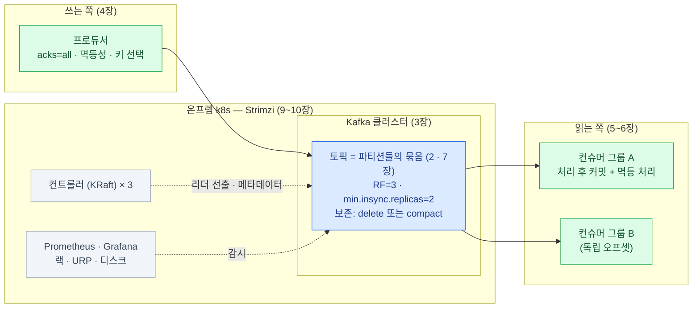

import { LinkCard } from '@astrojs/starlight/components';

> 결국 한 문장이다 — **서비스 사이에 지워지지 않는 로그를 놓고, 보장은 나사를 골라 조인다**

## 전체 그림 한 장

## 축이 되는 문장들

| 문장 | 어디서 |
|---|---|
| Kafka를 놓는 목적은 **결합을 시간 축에서 끊는 것**이다 | [1장](/kafka/01-why/) |
| 큐와의 본질 차이 — **읽어도 사라지지 않는다** | [1](/kafka/01-why/)–[2장](/kafka/02-log/) |
| **순서 · 병렬성 · 확장의 단위는 파티션** — 순서가 필요한 단위가 곧 키다 | [2](/kafka/02-log/) · [4장](/kafka/04-producer/) |
| 유실 없음은 한 설정이 아니라 **사슬**이다 — acks=all · RF3/min.insync=2 · 처리 후 커밋 · 랙 < 보존 | [3](/kafka/03-cluster/) · [6장](/kafka/06-semantics/) |
| **중복이 안 오게가 아니라, 와도 무해하게** — at-least-once + 멱등 소비 | [6장](/kafka/06-semantics/) |
| 온프렘 k8s의 절반은 스토리지(local PV + 자체 복제), 절반은 **advertised 주소** | [9장](/kafka/09-deploy/) |
| 운영의 90%는 세 숫자 — **랙 · URP · 디스크** | [10장](/kafka/10-ops/) |

## 도입 체크리스트

서비스에 처음 붙이기 전에 답해 둘 것들 — 전부 이 덱의 장으로 되돌아간다.

| # | 질문 | 장 |
|---|---|---|
| 1 | 이 연동은 정말 비동기 이벤트인가, 동기 API로 남아야 하는가 | [1](/kafka/01-why/) |
| 2 | 토픽 이름 규칙과 스키마(형식 계약 · 버전 방침)를 정했는가 | [7](/kafka/07-topic-design/) |
| 3 | 키(순서 단위)와 파티션 수(컨슈머 실측 기반)를 정했는가 | [4](/kafka/04-producer/) · [7](/kafka/07-topic-design/) |
| 4 | 보존 기간이 "최대 며칠 밀려도 되는가"에 답하는가 — 디스크 계산까지 | [7](/kafka/07-topic-design/) |
| 5 | RF=3 · min.insync=2 · acks=all — 표준 조합이 기본값인가 | [3](/kafka/03-cluster/) |
| 6 | 컨슈머는 처리 후 커밋 + 멱등 처리 + DLT인가 | [5](/kafka/05-consumer/)–[6](/kafka/06-semantics/) · [11](/kafka/11-troubleshooting/) |
| 7 | 랙 · URP · 디스크 알람이 첫 배포 전에 걸려 있는가 | [10](/kafka/10-ops/) |
| 8 | 서비스별 계정 · ACL, 토픽 자동 생성 끄기 — 초기 설정을 마쳤는가 | [10](/kafka/10-ops/) |

## 다가오는 것 — 큐 시맨틱 (share group)

"파티션 1 ↔ 컨슈머 1" 제약 없이 큐처럼 나눠 소비하는 **share group**(KIP-932)이
4.x에서 단계적으로 들어오고 있다. 성숙하면 "작업 분배는 전통 큐"라는
[1장](/kafka/01-why/)의 구분이 일부 흐려질 수 있다 — 도입 시점에 상태를 확인할 것.

## 더 읽을 것

- [Kafka 공식 문서](https://kafka.apache.org/documentation/) — 설정 레퍼런스는 결국 여기
- [Strimzi 문서](https://strimzi.io/docs/) — 배포 형상과 CRD 레퍼런스
- *Kafka: The Definitive Guide* (2판, Confluent 무료 배포) — 이 덱의 깊이 다음 단계

<LinkCard
  title="처음으로 — 개요"
  description="덱 전체 지도로 돌아가기."
  href="/kafka/"
/>
