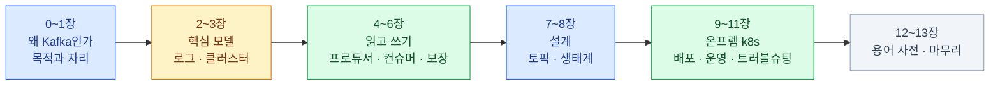

import { LinkCard, LinkButton } from '@astrojs/starlight/components';

> Kafka는 큐가 아니라 **읽어도 사라지지 않는 로그**다 — 소비자가 각자 책갈피를 들고 읽는다

온프렘 쿠버네티스에서 서비스를 구성하며 Kafka를 도입하는 환경을 전제로 한다.
"메시지 보내는 법"이 아니라 **도입하는 사람이 알아야 하는 것** —
왜 서비스 사이에 로그를 놓는지, 유실·중복·순서는 어떻게 다루는지,
온프렘 k8s 배포(Strimzi)와 운영 — 을 다룬다.

쿠버네티스 기초는 [CKA 덱](/cka/) 수준을 전제하고, 여기서 다시 설명하지 않는다.

**2026년 8월 기준**으로 쓰였다 — Kafka 4.3 (KRaft 전용) · Strimzi 0.51 · Kubernetes 1.34.

<LinkButton href="/kafka/00-intro/" icon="right-arrow">첫 장부터 읽기</LinkButton>

## 구성

| 장 | 주제 | 답하는 질문 |
|---|---|---|
| [0](/kafka/00-intro/)–[1](/kafka/01-why/) | 범위 · 왜 Kafka인가 | 서비스끼리 직접 부르면 되는데 왜 가운데 로그를 놓는가 |
| [2](/kafka/02-log/)–[3](/kafka/03-cluster/) | 토픽 · 파티션 · 복제 | 데이터는 어떤 모양으로 쌓이고, 브로커가 죽으면 어떻게 되는가 |
| [4](/kafka/04-producer/)–[6](/kafka/06-semantics/) | 프로듀서 · 컨슈머 · 전달 보장 | 유실·중복·순서는 각각 어느 나사로 조이는가 |
| [7](/kafka/07-topic-design/)–[8](/kafka/08-ecosystem/) | 토픽 설계 · 생태계 | 파티션 수·보존은 어떻게 정하고, Connect·스키마는 언제 얹는가 |
| [9](/kafka/09-deploy/)–[11](/kafka/11-troubleshooting/) | 배포 · 운영 · 트러블슈팅 | 온프렘 k8s에서 Kafka 자체를 어떻게 돌리는가 |
| [12](/kafka/12-glossary/)–[13](/kafka/13-wrapup/) | 용어 사전 · 마무리 | — |

## 전체를 관통하는 두 문장

**읽어도 사라지지 않는다.** Kafka의 데이터는 큐처럼 "꺼내면 없어지는" 것이 아니라
로그에 **정해진 기간 동안 그대로 남고**, 소비자마다 자기 위치(오프셋)를 따로 들고 읽는다.
다중 구독·재처리·장애 복구 — Kafka가 큐와 다르게 할 수 있는 일은 전부 이 성질에서 나온다
([2장](/kafka/02-log/)).

**순서·병렬성·확장의 단위는 파티션이다.** 순서는 파티션 안에서만 보장되고,
컨슈머는 파티션 수까지만 병렬로 붙는다. 키를 무엇으로 잡을지([4장](/kafka/04-producer/)),
파티션을 몇 개로 할지([7장](/kafka/07-topic-design/))가 설계의 절반인 이유다.

<LinkCard
  title="0. 시작하기 전에"
  description="이 덱의 대상과 범위, 미리 잡아두면 좋은 멘탈 모델 세 가지."
  href="/kafka/00-intro/"
/>
