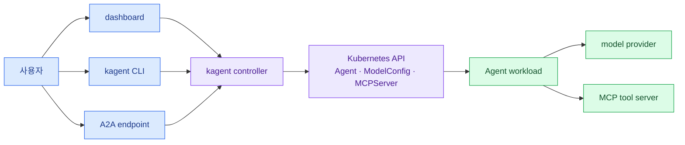

import { LinkCard } from '@astrojs/starlight/components';
import TermIntro from '../../../components/docs/TermIntro.astro';

> 첫 명령보다 먼저 정할 것은 **어느 cluster에서, 어떤 권한의 Agent를, 무엇으로 성공 판정할지**다

<TermIntro
  terms={[
    ['Agent CR', 'Agent Custom Resource', 'model·prompt·tool과 실행 방식을 Kubernetes에 선언하는 kagent resource다.'],
    ['control plane', 'Control Plane', 'Agent resource를 읽고 workload와 호출 endpoint를 조정하는 kagent controller와 API 층이다.'],
    ['MCP', 'Model Context Protocol', 'Agent가 외부 기능을 발견하고 호출하는 tool 계약이다.'],
    ['A2A', 'Agent-to-Agent Protocol', 'client나 다른 Agent가 Agent의 card를 발견하고 task를 호출하는 바깥쪽 계약이다.'],
  ]}
/>

## 이번 실습의 작은 세계



dashboard·CLI·A2A는 입구가 셋일 뿐 같은 controller와 Agent 상태를 본다. Agent가 답하려면 resource가
accepted된 뒤 workload가 ready여야 하고, model provider와 tool server에도 실제로 닿아야 한다.

## 덱 셋의 경계

| 질문 | 볼 덱 |
|---|---|
| Docker·kind·kubectl을 운영체제에서 어떻게 준비하나 | [실습 환경](/lab-environment/) |
| kagent를 설치하고 Agent를 실제로 어떻게 호출하나 | **지금 보는 kagent 실습** |
| 회사 catalog·ACL·승인·배포 계약에 어떻게 편입하나 | [Agent 배포 플랫폼](/agent-platform/) |

이 덱은 production 설치 가이드가 아니다. 단일 kind cluster, 단일 사용자, 외부 model API라는 단순한
환경에서 resource와 호출 계약을 눈으로 확인한다.

## 고정할 이름과 자원

| 항목 | 실습 값 | 이유 |
|---|---|---|
| kind cluster | `kagent-lab` | 삭제 대상을 이름으로 고정 |
| kubectl context | `kind-kagent-lab` | 다른 cluster 오적용 방지 |
| kagent namespace | `kagent` | 공식 quickstart 기본값과 일치 |
| custom Agent | `lab-reader` | sample Agent와 구분 |
| custom MCP server | `mcp-website-fetcher` | tool workload를 따로 추적 |

로컬 runtime에는 CPU 4개, 메모리 8 GiB, 디스크 여유 15 GiB 이상을 권장한다. 고정된 kagent 최소
요구량이 아니라 kind node, controller·UI·DB, sample Agent와 tool image를 함께 띄우기 위한 **학습용
출발값**이다. 부족하면 1장에서 실제 Pod request와 pending 원인을 보고 조정한다.

## 비밀과 비용 경계

모델 API key는 shell 환경 변수로만 넣고 Git 파일이나 command 예시의 literal로 남기지 않는다.
모델 호출에는 실제 비용이 들 수 있으므로 짧은 질문으로 시작하고 사용량 한도를 둔다.

```bash
read -s "OPENAI_API_KEY?OpenAI API key: "
export OPENAI_API_KEY
```

새 terminal에는 이 변수가 자동으로 전달되지 않는다. key 값을 확인하려고 출력하지 말고 존재 여부만 본다.

```bash
test -n "$OPENAI_API_KEY" && echo "OPENAI_API_KEY is set"
```

## Tool 권한 경계

첫 Agent에는 `k8s_get_available_api_resources`, `k8s_get_resources`처럼 조회 tool만 준다. `apply`, `delete`,
shell 실행 같은 tool은 연결하지 않는다. LLM의 문장이 친절해도 tool이 가진 Kubernetes 권한보다 안전해지지는 않는다.

:::caution[전용 cluster에서만 실행]
1장 이후 모든 설치·삭제 명령은 `kubectl config current-context`가 `kind-kagent-lab`일 때만 실행한다.
이 조건을 만족하지 않으면 먼저 멈추고 context를 바로잡는다.
:::

## 완료 체크

- 실습용 이름과 cleanup 대상을 말할 수 있다.
- MCP는 Agent가 tool을 부르는 안쪽 계약, A2A는 client가 Agent를 부르는 바깥쪽 계약이라고 구분한다.
- API key를 파일에 쓰지 않고 조회 tool부터 시작한다.

## 참고 자료

- [kagent architecture](https://kagent.dev/docs/kagent/concepts/architecture) — controller·UI·engine과 Kubernetes resource의 관계
- [kagent Agents](https://kagent.dev/docs/kagent/concepts/agents) — 선언형·BYO Agent, tool과 runtime
- [kagent Tools](https://kagent.dev/docs/kagent/concepts/tools) — built-in·MCP·HTTP tool과 cross-namespace reference
- [Agent 배포 플랫폼 — kagent adapter](/agent-platform/06-kagent/) — 실습 밖의 권한·격리·공급망 경계

<LinkCard
  title="1. 전용 cluster와 kagent 설치"
  description="context를 고정하고 demo profile을 설치한 뒤 controller·UI·CRD를 확인한다."
  href="/kagent-lab/01-install/"
/>

