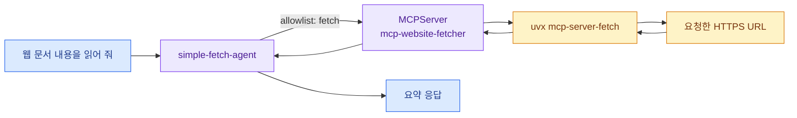

import { LinkCard, Steps } from '@astrojs/starlight/components';
import TermIntro from '../../../components/docs/TermIntro.astro';

> Agent의 능력은 model 이름만으로 생기지 않는다. **MCP server가 기능을 제공하고 Agent가 그중 일부를 허용한다**

<TermIntro
  terms={[
    ['MCPServer', 'Model Context Protocol Server Resource', 'kmcp가 container workload로 실행하고 kagent가 tool을 발견하게 하는 resource다.'],
    ['discovery', 'Tool Discovery', 'server가 제공하는 tool 이름과 입력 schema를 client가 조회하는 과정이다.'],
    ['stdio transport', 'Standard Input/Output Transport', 'tool process와 MCP proxy가 표준 입출력으로 message를 주고받는 방식이다.'],
  ]}
/>

## 이번 실습의 연결



공식 입문 예제의 fetch server는 package를 받아 code로 실행하고 외부 URL에 접근한다. **격리된 전용 cluster에서
MCP 연결을 관찰하는 용도**로만 쓴다. 운영에서는 image digest, egress allowlist, ServiceAccount, resource limit,
package 공급망을 먼저 고정한다.

## MCPServer 만들기

확인 당시 kmcp `MCPServer` API는 `kagent.dev/v1alpha1`이다. Agent의 v1alpha2와 번호가 다른 것이 오타가 아니다.

```bash
kubectl --context kind-kagent-lab apply -f - <<'EOF'
apiVersion: kagent.dev/v1alpha1
kind: MCPServer
metadata:
  name: mcp-website-fetcher
  namespace: kagent
spec:
  deployment:
    args:
      - mcp-server-fetch
    cmd: uvx
    port: 3000
  stdioTransport: {}
  transportType: stdio
EOF
```

생성된 resource와 workload를 함께 본다.

```bash
kubectl --context kind-kagent-lab -n kagent get mcpserver mcp-website-fetcher -o yaml
kubectl --context kind-kagent-lab -n kagent get pods
```

Pod가 바로 ready가 되지 않으면 MCPServer status와 새 Pod의 Events·log를 읽는다. resource 이름과 생성된
workload 이름이 완전히 같다고 가정하지 말고 creation timestamp와 owner reference로 연결한다.

## fetch Agent 만들기

```bash
kubectl --context kind-kagent-lab apply -f - <<'EOF'
apiVersion: kagent.dev/v1alpha2
kind: Agent
metadata:
  name: simple-fetch-agent
  namespace: kagent
spec:
  description: Fetch one explicitly supplied HTTPS page and summarize it.
  type: Declarative
  declarative:
    modelConfig: default-model-config
    systemMessage: |-
      You summarize a webpage only after calling the fetch tool.
      Accept only an explicit HTTPS URL from the user.
      Do not fetch localhost, link-local, cluster-local, or private-network addresses.
      State which URL was fetched and separate retrieved facts from your inference.
    tools:
      - type: McpServer
        mcpServer:
          kind: MCPServer
          name: mcp-website-fetcher
          toolNames:
            - fetch
EOF
```

```bash
kubectl --context kind-kagent-lab -n kagent wait \
  --for=condition=Ready agent/simple-fetch-agent --timeout=3m
```

## Tool 하나를 호출하기

<Steps>

1. controller port-forward가 살아 있는지 확인한다.

2. 작고 공개된 문서 URL 하나를 명시해 호출한다.

   ```bash
   kagent invoke -n kagent -a simple-fetch-agent -S \
     -t "Fetch https://example.com/ and summarize only the page title and purpose."
   ```

3. dashboard에서 같은 Agent를 열어 tool arguments와 result를 펼친다.

4. arguments의 URL이 사용자가 준 값과 같은지, 실제 tool 이름이 `fetch`인지 확인한다.

</Steps>

:::caution[fetch tool은 SSRF 경계다]
prompt에 private address를 금지했다고 network 보안이 생기는 것은 아니다. 운영에서는 egress proxy·NetworkPolicy·
DNS·URL allowlist 같은 서버 측 통제가 필요하다. 이 실습에서는 전용 kind cluster와 공개 테스트 URL만 쓴다.
:::

## Tool을 붙였다는 네 단계 증거

1. `MCPServer` resource가 accepted되었다.
2. MCP workload가 ready이고 tool discovery에 `fetch`가 보인다.
3. Agent spec의 `toolNames`가 `fetch`만 허용한다.
4. 실제 호출 event에 `fetch` arguments와 result가 남는다.

답변만 보고 4번부터 확인하면 tool이 실패했는데 model이 추측으로 답한 경우를 놓칠 수 있다.

## 완료 체크

- `MCPServer`와 생성된 workload를 연결해 봤다.
- Agent가 server 전체가 아니라 `fetch` 하나만 allowlist로 참조한다.
- tool arguments·result와 최종 요약을 구분해 확인했다.
- resource는 6장의 관찰 실습까지 남겨 둔다.

## 참고 자료

- [첫 MCP tool](https://kagent.dev/docs/kagent/getting-started/first-mcp-tool) — kmcp `MCPServer`와 fetch Agent 공식 예제
- [kagent Tools](https://kagent.dev/docs/kagent/concepts/tools) — built-in·MCP·HTTP tool과 보안 주의
- [kagent tools ecosystem](https://kagent.dev/docs/kagent/resources/tools-ecosystem) — 기본 server와 tool catalog

<LinkCard
  title="5. 같은 Agent를 CLI와 A2A로 호출하기"
  description="호출 UI를 벗어나 Agent card와 protocol endpoint를 직접 확인한다."
  href="/kagent-lab/05-a2a-invoke/"
/>

