import { LinkCard, LinkButton } from '@astrojs/starlight/components';
import DeckMap from '../../../components/docs/DeckMap.astro';

> kagent를 설치했다는 데서 멈추지 않고 **Agent 하나의 선언·실행·도구 호출·실패·정리를 끝까지 관찰한다**

kagent는 Agent와 model·tool 연결을 Kubernetes resource로 다룬다. 이 덱은 전용 kind 클러스터를 작은
실험실로 삼아 `Agent`를 만들고, MCP tool을 붙이고, dashboard·CLI·A2A endpoint 셋으로 같은 runtime을
호출한다. 마지막에는 일부러 잘못된 resource를 만들어 condition과 controller log로 원인을 찾는다.

Docker·kind·kubectl의 일반 준비는 [실습 환경 덱](/lab-environment/)이 맡는다. kagent를 사내 포털과
권한 체계에 편입하는 설계는 [Agent 배포 플랫폼 덱](/agent-platform/)이 맡는다. 여기서는 두 덱 사이의
**직접 실행해 보는 층**에 집중한다.

<LinkButton href="/kagent-lab/00-lab-map/" icon="right-arrow">실습 지도부터 보기</LinkButton>

## 한 번 도는 흐름

```mermaid
flowchart LR
    HOST["로컬 runtime<br/>Docker · kind"] --> INSTALL["kagent 설치<br/>demo profile"]
    INSTALL --> AGENT["선언형 Agent<br/>model · prompt"]
    AGENT --> MCP["MCP tool<br/>조회 · fetch"]
    MCP --> CALL["호출<br/>dashboard · CLI · A2A"]
    CALL --> DEBUG["관찰과 실패 진단<br/>condition · log"]
    DEBUG --> BYO["BYO 경계<br/>init · build · run"]
    BYO --> CLEAN["정리<br/>resource 또는 cluster"]

    classDef key fill:#dbeafe,stroke:#2563eb,color:#1e3a8a
    classDef ok fill:#dcfce7,stroke:#16a34a,color:#14532d
    classDef warn fill:#fef3c7,stroke:#d97706,color:#78350f
    classDef bad fill:#fee2e2,stroke:#dc2626,color:#7f1d1d
    class HOST,INSTALL key
    class AGENT,MCP,CALL ok
    class DEBUG warn
    class BYO,CLEAN bad
```

## 구성

<DeckMap
  steps={[
    { label: '0~1장', href: '/kagent-lab/00-lab-map/', title: '경계 고정과 설치', tone: 'key',
      desc: 'Helm·kagent CLI · 전용 context · API key · demo profile · dashboard',
      note: '다른 cluster를 건드리지 않고 재현 가능한 시작점을 어떻게 만드나' },
    { label: '2~3장', href: '/kagent-lab/02-first-agent/', title: '첫 호출과 선언형 Agent', tone: 'ok',
      desc: 'sample Agent 관찰 · 조회 전용 custom Agent · model·prompt·tool의 연결',
      note: '응답 뒤에서 어떤 Kubernetes resource가 실제 상태를 만드는가' },
    { label: '4~5장', href: '/kagent-lab/04-mcp-tool/', title: 'MCP와 A2A', tone: 'zone',
      desc: 'tool server 배포 · allowlist · dashboard·CLI·protocol endpoint 호출',
      note: 'Agent 안쪽의 tool 계약과 바깥쪽의 호출 계약은 어떻게 다른가' },
    { label: '6장', href: '/kagent-lab/06-observe-debug/', title: '관찰과 실패 진단', tone: 'warn',
      desc: 'Accepted·Ready condition · workload · controller log · 의도적 실패',
      note: '화면에 안 보이는 Agent를 어디서부터 추적하나' },
    { label: '7~8장', href: '/kagent-lab/07-byo-agent/', title: 'BYO 경계와 정리', tone: 'bad',
      desc: 'code형 Agent의 local loop · A2A image 계약 · resource와 cluster cleanup',
      note: '선언형 설정을 넘어갈 때 책임이 어떻게 달라지고 무엇을 지워야 하나' },
  ]}
/>

## 완료 기준

- `kind-kagent-lab` context에만 kagent가 설치되어 있다.
- `Agent`의 `Accepted=True`, `Ready=True`를 dashboard 밖에서도 확인한다.
- 조회 전용 Agent가 실제 cluster resource를 MCP tool로 읽는다.
- 같은 Agent의 card를 A2A endpoint에서 읽고 CLI로 호출한다.
- 잘못된 `modelConfig`를 condition과 controller log로 설명한다.
- 선언형 Agent와 BYO Agent의 책임 경계를 설명하고 전용 cluster를 삭제한다.

<LinkCard
  title="0. 실습 지도와 안전 경계"
  description="클러스터·context·비밀·tool 권한을 먼저 고정하고 시작한다."
  href="/kagent-lab/00-lab-map/"
/>
