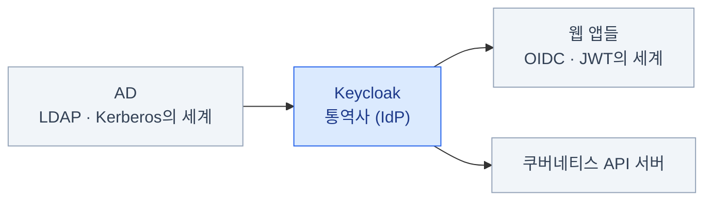

import { Card, CardGrid, LinkCard } from '@astrojs/starlight/components';
import TermIntro from '../../../components/docs/TermIntro.astro';

> 인증 시스템은 **평소엔 안 보이다가, 깨지면 회사 전체가 멈추는** 인프라다

<TermIntro
  terms={[
    ['SSO', 'Single Sign-On', '한 번 로그인하면 여러 앱을 다시 로그인 없이 쓰는 것. "여러 앱이 로그인 상태를 공유한다"가 아니라 "**로그인이라는 일을 한 곳(IdP)에 몰아줬다**"가 정확한 그림이다.'],
    ['IdP', 'Identity Provider', '신원 제공자. "누가 로그인했는가"를 책임지는 서버. 이 덱에서는 Keycloak이 IdP다.'],
    ['AD', 'Active Directory', '윈도우 도메인의 사용자·그룹 디렉터리. 사내 계정의 **원본 저장소**이고, Keycloak은 이걸 빌려 쓴다.'],
    ['온프렘', 'On-premises', '클라우드 관리형 서비스가 아니라 **자체 인프라에서 직접 운영**하는 것. 관리형이면 남이 해 주는 일(배포·백업·업그레이드)이 전부 내 일이 된다.'],
  ]}
/>

## 이 덱은 누구를 위한 것인가

- 사내 AD 인증이 Keycloak을 거쳐 돌아가는 환경에서, **그 구조를 설명할 수 있어야 하는** 관리자
- 쿠버네티스는 다룰 줄 아는데 (이 사이트의 [CKA 덱](/cka/) 수준),
  **IdP 운영은 처음**인 사람
- "토큰에 그룹이 안 나와요", "kubectl 로그인이 안 돼요" 같은 문의를 받았을 때
  **어느 층을 봐야 하는지** 판단하고 싶은 사람

전제하는 것: 쿠버네티스 기본기(Deployment·Service·Ingress·RBAC), 터미널.
전제하지 않는 것: OAuth/OIDC 지식, LDAP 지식, Keycloak 사용 경험.

### 다루는 것과 다루지 않는 것

<CardGrid>
<Card title="다룬다" icon="approve-check">
왜 AD만으로는 안 되고 IdP가 필요한가.
OAuth 2.0 · OIDC와 토큰 세 종류.
realm · client · 매퍼로 이루어진 Keycloak의 구조.
AD 연동(User Federation)의 설정과 급소.
쿠버네티스 API 서버 OIDC 연동과 kubectl 로그인.
앱을 SSO에 붙이는 패턴(OIDC 네이티브 · oauth2-proxy).
온프렘 k8s 배포(Operator·HA·DB)와 운영(백업·업그레이드·키 관리).
</Card>
<Card title="다루지 않는다" icon="close">
Keycloak 확장 개발 (SPI · 커스텀 프로바이더 — 자바 코드).
로그인 화면 테마 커스터마이징.
SAML 상세 (존재와 용도만 언급).
Authorization Services (UMA · fine-grained authorization).
Token Exchange.
소셜 로그인 (Google · GitHub 연동).
AD 도메인 컨트롤러 자체의 운영.
쿠버네티스 기초 (→ [CKA 덱](/cka/)).
</Card>
</CardGrid>

## 미리 잡아두면 좋은 멘탈 모델

### 1. Keycloak은 두 세계 사이의 통역사다

AD는 LDAP·Kerberos라는 **사내망의 언어**를 쓰고, 웹 앱과 쿠버네티스는
OIDC·JWT라는 **웹의 언어**를 쓴다. 두 세계는 서로 직접 대화하지 못한다 —
그 사이에서 통역하는 것이 Keycloak의 자리다.

### 2. 매핑은 두 번 일어난다

AD의 속성이 Keycloak 사용자 모델로 들어오는 매핑(경계 ①)과,
Keycloak 사용자 모델이 토큰의 claim으로 실리는 매핑(경계 ②)은 **별개 설정**이다.
문제가 생기면 항상 "어느 경계에서 끊겼나"부터 가른다 — 이 덱 전체의 디버깅 프레임이고,
[1장](/keycloak/01-why/)에서 그림으로, [10장](/keycloak/10-troubleshooting/)에서 진단 순서로 다시 만난다.

### 3. 신뢰는 서명으로 흐른다

SSO 구조에서 비밀번호는 **Keycloak과 AD 사이에서만** 오간다.
앱과 쿠버네티스가 받는 것은 Keycloak이 개인키로 서명한 토큰(JWT)이고,
각자는 공개키(JWKS)로 서명만 검증한다. "Keycloak에 물어보러 가는" 것이 아니라
**수학으로 확인**하는 것이라, 검증하는 쪽이 늘어나도 Keycloak에 부하가 쌓이지 않는다.

:::tip[핵심]
이 셋 — **통역사, 두 번의 매핑, 서명으로 흐르는 신뢰** — 만 잡고 있으면
나머지 장은 이 그림의 칸을 채우는 일이다.
:::

## 이 덱의 기준 시점

**2026년 8월** 기준이다. Keycloak은 분기마다 마이너 버전이 나오고 옛 정보가 오래 남는 생태계라,
검색 결과를 볼 때 시점 확인이 특히 중요하다.

| 항목 | 지금 | 낡은 정보 (검색 결과에 많이 남아 있음) |
|---|---|---|
| Keycloak | **26.7** (2026-07) — Quarkus 기반 | WildFly 기반(16 이하), `standalone.xml` 설정 |
| URL 경로 | `https://호스트/realms/…` | `/auth/realms/…` — **`/auth` 접두사는 17에서 제거**됐다 |
| 관리자 계정 | `KC_BOOTSTRAP_ADMIN_USERNAME` | `KEYCLOAK_USER` / `KEYCLOAK_ADMIN` 환경 변수 |
| 세션 저장 | **DB 저장이 기본** (26.0의 persistent sessions) | "재시작하면 전부 로그아웃된다"는 전제의 글 |
| k8s 쪽 연동 | **AuthenticationConfiguration 파일** (1.34에서 GA) | `--oidc-*` 플래그만 다루는 글 |

:::caution[함정]
옛 블로그의 예시 URL에는 `/auth`가 끼어 있다 (`…/auth/realms/corp/…`).
지금 버전에 그대로 복사하면 404가 난다 — issuer URL을 옮겨 적을 때 가장 먼저 걸리는 차이다.
:::

## 0장 요약

- 대상은 **AD + Keycloak 환경을 설명·운영해야 하는 쿠버네티스 관리자**다
- 멘탈 모델 셋: **통역사 / 두 번의 매핑 / 서명으로 흐르는 신뢰**
- 기준 시점은 2026년 8월 (Keycloak 26.7 · k8s 1.34). `/auth` 접두사가 보이면 낡은 문서다

<LinkCard
  title="1. 왜 SSO인가"
  description="앱마다 AD에 직접 붙던 시절의 통증 — IdP가 등장한 이유."
  href="/keycloak/01-why/"
/>
