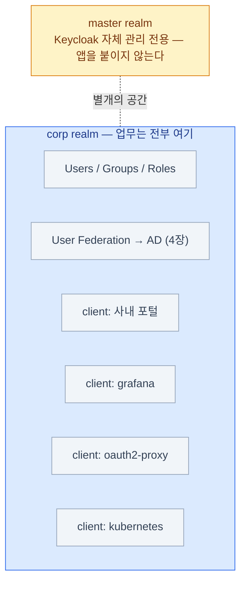

import { Tabs, TabItem, LinkCard } from '@astrojs/starlight/components';
import TermIntro from '../../../components/docs/TermIntro.astro';

> 콘솔 메뉴가 많아 보여도 뼈대는 셋이다 — **realm 안에 client가 있고, 매퍼가 토큰을 채운다**

<TermIntro
  terms={[
    ['realm', '', '사용자·그룹·롤·client·연동 설정이 전부 들어 있는 **격리된 보안 공간**. 멀티테넌시의 테넌트에 해당한다.'],
    ['client', '', 'Keycloak에 등록된 **앱 하나**. "이 앱을 어떻게 로그인시키고 토큰에 뭘 담아줄지"의 설정 단위다.'],
    ['client scope', '', 'protocol mapper와 롤을 **묶어 재사용하는 단위**. OAuth의 scope 문자열과 토큰 내용을 잇는 다리다.'],
    ['protocol mapper', '', 'Keycloak이 아는 사용자 정보 중 **무엇을 어떤 claim 이름으로 토큰에 넣을지** 정하는 규칙. 경계 ②의 실체.'],
    ['service account', '', '사람 없이 **앱 자체가 토큰을 받는** client 기능. 서버 간 호출(M2M)용 — Client Credentials 흐름(2장)의 Keycloak식 이름.'],
  ]}
/>

## Realm — 격리된 보안 공간

realm 하나가 사용자 풀 하나, SSO 영역 하나다. **같은 realm의 앱들끼리만**
로그인이 공유된다. 토큰의 발급자(`iss`)가 realm URL이라는 것을 [2장](/keycloak/02-oauth-oidc/)에서
봤다 — realm을 나누면 발급자가 달라지고, 신뢰 관계도 갈라진다.

| 개념 | 내용 |
|---|---|
| **master realm** | Keycloak **자기 자신**(관리자·관리 콘솔)을 관리하는 특별한 realm |
| **업무용 realm** (예: `corp`) | AD 연동 + 모든 앱 client + 사용자·그룹·롤. 보통 조직당 하나 |
| realm 간 격리 | A realm의 사용자는 B realm에서 안 보이고, `iss`도 다르다 |

:::caution[함정]
**master realm에 업무 앱을 붙이지 않는다.** master의 계정은 Keycloak 전체의
관리 권한과 얽혀 있어, 여기에 일반 사용자·앱이 섞이면 권한 경계가 무너진다.
설치 직후 가장 먼저 할 일이 업무용 realm을 따로 만드는 것이다. 관리 권한을
쪼개 주는 방법은 [9장](/keycloak/09-ops/)에서 다룬다.
:::

## Client — 앱 하나의 등록 정보

앱이 SSO를 타려면 realm에 client로 등록돼야 한다. 핵심 설정은 이 다섯이다.

| 설정 | 의미 | 판단 기준 |
|---|---|---|
| **Client ID** | 앱 식별자 — 토큰의 `azp`·`aud`에 등장 | 앱 하나당 client 하나. 공유하지 않는다 (아래 함정) |
| **Client type** | `confidential`(시크릿 보유) vs `public`(시크릿 없음) | 서버가 있으면 confidential, SPA·CLI는 public + PKCE |
| **Valid redirect URIs** | 로그인 후 돌아갈 수 있는 URL **화이트리스트** | 정확하게, 좁게. 와일드카드는 경로 끝에만 ([10장](/keycloak/10-troubleshooting/) 단골) |
| **Client scopes** | 이 앱의 토큰에 얹을 claim 묶음 | 아래 절 |
| **Service account** | 사람 없이 앱 자체가 토큰 발급 | 배치·서버 간 호출만. 쓰지 않으면 끈다 |

:::caution[함정 — client를 앱끼리 돌려 쓰지 않는다]
"이미 있는 client의 시크릿을 복사해 새 앱에 넣는" 지름길은 나중에 전부 빚이 된다.
redirect URI 목록이 뒤섞이고, 감사 로그에서 앱이 구분되지 않고,
한 앱을 폐기할 때 시크릿을 못 돌린다. **앱 하나 = client 하나**가 원칙이다 ([7장](/keycloak/07-apps/)의 체크리스트).
:::

## 토큰에 무엇이 실리나 — mapper와 scope

경계 ② — Keycloak이 아는 것과 앱이 받는 것 사이의 매핑이다.
콘솔에서 그룹이 보이는 것과 토큰에 `groups` claim이 실리는 것은 **별개**라는 점이
이 절의 전부다.

### Protocol Mapper — claim을 만드는 규칙

| Mapper 종류 | 하는 일 | 결과 claim |
|---|---|---|
| **User Attribute** | 사용자 속성 1개를 claim으로 | `email`, `department` … |
| **Group Membership** | 소속 그룹 목록을 claim으로 | `groups: ["/dev-team"]` |
| **User Realm Role** | realm 롤 목록을 claim으로 | `realm_access.roles` |
| **User Client Role** | 특정 client의 롤을 claim으로 | `resource_access.<client>.roles` |
| **Audience** | `aud`에 대상을 추가 | API·쿠버네티스가 검증할 때 필요 ([6장](/keycloak/06-k8s-oidc/)) |

매퍼마다 결과를 **ID token / access token / userinfo 어디에 넣을지** 따로 켤 수 있다.
"access token에 사용자 정보가 다 들어 있다"는 건 기본값일 뿐, 조정 대상이다.

:::caution[함정]
**앱이 기대하는 claim 이름·형식과 정확히 일치해야 한다.** 앱은 `groups`를 읽는데
매퍼가 `group`(단수)으로 내보내면 인가가 통째로 빈다. 이름, 배열 여부,
full path 여부(`/dev-team` vs `dev-team`)까지 맞춘다.
:::

:::tip[운영 팁 — Evaluate]
콘솔의 **Clients → (client) → Client scopes → Evaluate** 에서 특정 사용자를 골라
**실제 발급될 토큰을 미리** 볼 수 있다. "앱에 claim이 안 와요" 문의의 첫 확인 지점 —
여기 보이면 Keycloak 쪽은 정상이고, 안 보이면 매퍼·scope 문제다.
:::

### Scope — 앱이 요청하는 범위

scope는 로그인 요청에 실리는 **"이 정도 정보·권한이 필요하다"는 라벨**이다.
앱이 `scope=openid profile email groups`처럼 공백으로 이어 보낸다.

| 표준 scope | 주는 것 |
|---|---|
| **`openid`** | (필수) OIDC 표시 — 이게 있어야 ID token이 나온다 |
| `profile` | `name`·`preferred_username` 등 프로필 claim |
| `email` | `email`·`email_verified` |
| `offline_access` | 장기 refresh token ([5장](/keycloak/05-sessions/)) |

Keycloak의 **client scope**는 protocol mapper와 롤을 묶은 재사용 단위이고,
scope 문자열이 요청되면 그 묶음의 매퍼가 발동한다 — OAuth의 scope 개념과
토큰 내용이 이렇게 이어진다.

| 종류 | 동작 |
|---|---|
| **Default** | 앱이 요청하지 않아도 항상 적용 (`profile`·`email`·`roles` 등) |
| **Optional** | 앱이 `scope=`에 적어야 적용 |

**scope와 role은 AND다** — 사용자에게 롤이 있어도 앱이 해당 scope를 요청하지 않으면
토큰에 실리지 않을 수 있다. scope는 "앱이 무엇까지 요청하나"(거친 범위),
role은 "사용자가 무엇을 할 수 있나"(세밀한 권한)로 결이 다르다.

## Group과 Role — 인가를 어디에 둘까

| | Group | Role |
|---|---|---|
| 성격 | 사용자 **묶음** — 계층 가능 (`/eng/backend`) | 권한 **라벨** (`app-admin`) |
| AD 연동 | AD `memberOf`와 직접 대응시키기 좋다 | 보통 그룹에 롤을 부여해 간접 매핑 |
| 토큰 claim | `groups` | `realm_access.roles` / `resource_access` |
| 담는 것 | "누구인가" (조직 소속) | "무엇을 할 수 있나" (앱 권한) |

흔한 조합: **AD 그룹 `Dev-Team` → Keycloak 그룹 `/dev-team` → 그룹에 `app-admin` 롤 부여 →
토큰에 `roles: ["app-admin"]`.** 앱은 AD를 몰라도 롤 하나만 검사하면 된다.

또 하나의 실전 판단 — "부서명"처럼 인가에도 표시에도 쓰일 법한 값은 어디에 두나:

| 필요한 것 | 맞는 도구 |
|---|---|
| "영업팀인가?"로 **권한 판단**(인가) | 부서별 group/role — 앱은 `groups` claim(또는 헤더, [7장](/keycloak/07-apps/))만 본다 |
| 부서명 **문자열 자체**(표시·저장·로직) | `department` **claim** — User Attribute 매퍼로 싣고 앱이 토큰에서 읽는다 |

한 줄로: **인가는 role/group, 데이터는 claim.** 둘 다 미리 만드는 것은 중복이다.

## 콘솔에서 길 찾기 — 메뉴와 개념의 대응

| 개념 | 콘솔 위치 |
|---|---|
| realm 만들기·전환 | 왼쪽 위 realm 선택 드롭다운 |
| client 등록 | **Clients** |
| protocol mapper | **Clients → (client) → Client scopes → `(client)-dedicated`** — client 전용 매퍼 |
| 공용 client scope | **Client scopes** — 여러 client가 공유 |
| 사용자·그룹·롤 | **Users / Groups / Realm roles** |
| AD 연동 | **User federation** ([4장](/keycloak/04-ad-federation/)) |
| 세션·토큰 수명 | **Realm settings → Sessions / Tokens** ([5장](/keycloak/05-sessions/)) |

콘솔 클릭은 탐색과 학습에는 좋지만 **재현이 안 된다** — 같은 설정을 코드로 관리하는
방법(kcadm.sh·Terraform·Operator)은 [4장](/keycloak/04-ad-federation/)과 [9장](/keycloak/09-ops/)에서 다룬다.

## 3장 요약

- **realm = 격리된 SSO 영역.** master에는 앱을 붙이지 않고, 업무용 realm을 따로 만든다
- **client = 앱 하나.** confidential/public 구분과 redirect URI 화이트리스트가 보안의 골격
- 토큰 내용은 **protocol mapper**가 정한다 — 콘솔에 보이는 것과 토큰에 실리는 것은 별개
- **client scope**가 OAuth scope 문자열과 매퍼 묶음을 잇는다. scope와 role은 AND
- **인가는 role/group, 데이터는 claim.** AD 그룹 → Keycloak 그룹 → 롤 부여가 흔한 조합
- 토큰이 이상하면 콘솔의 **Evaluate**로 "실제 나갈 토큰"부터 본다

<LinkCard
  title="4. AD 연동 — User Federation"
  description="경계 ①의 실체 — LDAP 프로바이더, 매퍼, 동기화, 그리고 kcadm 자동화."
  href="/keycloak/04-ad-federation/"
/>
