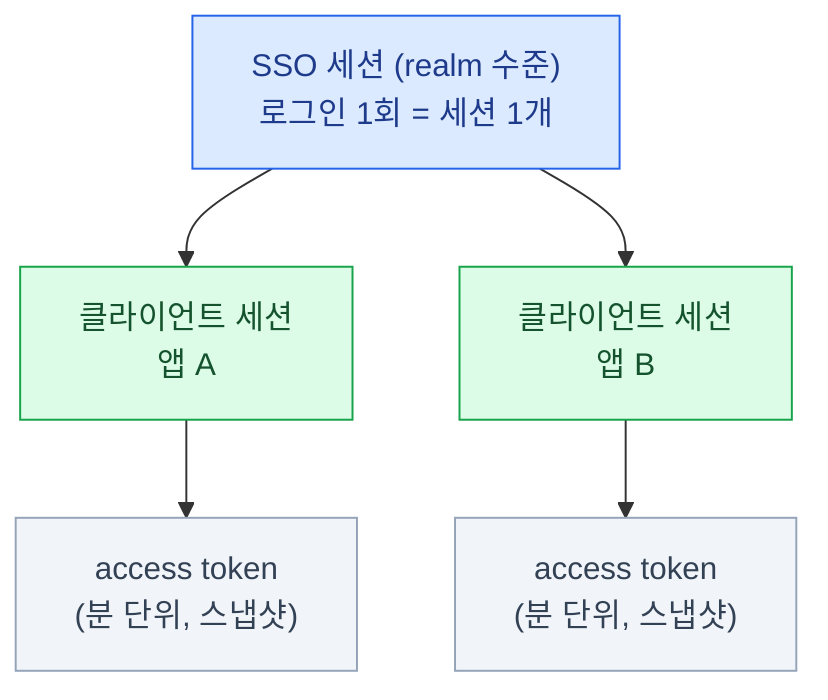
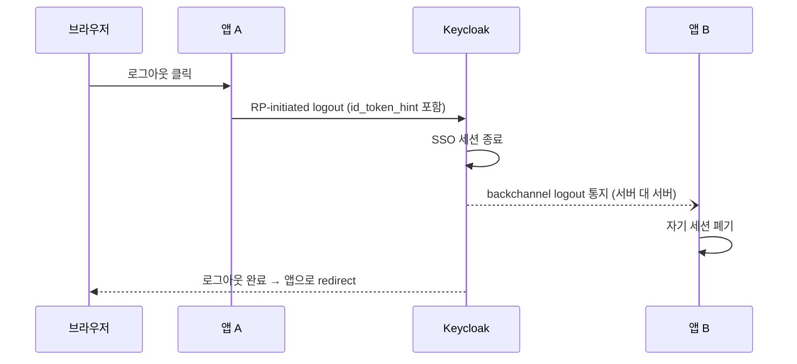

import { LinkCard } from '@astrojs/starlight/components';
import TermIntro from '../../../components/docs/TermIntro.astro';

> "왜 자꾸 로그아웃돼요"와 "퇴사자가 아직 접속돼요"는 **같은 다이얼의 양 끝**이다

<TermIntro
  terms={[
    ['SSO 세션', 'SSO Session', '사용자가 Keycloak에 로그인해 생기는 **realm 수준의 세션**. 같은 realm의 모든 앱이 이 세션을 타고 재로그인 없이 통과한다.'],
    ['offline token', '', 'SSO 세션과 **분리되어 오래 사는** refresh token. 사용자가 로그아웃해도 살아 있어 배치·백그라운드 작업에 쓴다.'],
    ['RP-initiated logout', 'Relying Party-initiated logout', '앱(RP)이 사용자를 Keycloak의 로그아웃 엔드포인트로 보내 SSO 세션을 끝내는 표준 방식.'],
    ['backchannel logout', '', 'Keycloak이 브라우저를 거치지 않고 **서버 대 서버로** 각 앱에 "이 세션 끝났다"고 통지하는 방식.'],
  ]}
/>

## 문제 — 수명은 트레이드오프 다이얼이다

토큰과 세션의 수명 설정은 전부 하나의 저울 위에 있다.

- **길게 주면**: 사용자는 편하다. 대신 토큰·세션이 탈취됐을 때 **유효한 시간도 길다**.
  퇴사·권한 회수가 다음 갱신 때까지 반영되지 않는다
- **짧게 주면**: 안전하다. 대신 갱신이 잦아지고, 설정이 어긋나면
  "작업하다 튕겼어요"가 접수된다

Keycloak의 기본 전략은 **"access token은 아주 짧게, 갱신은 세션으로"** 다.
이 구조를 이해하면 각 다이얼이 무엇을 조절하는지 보인다.

## 구조 — 세션과 토큰은 층이 다르다

| 층 | 무엇 | 수명의 의미 |
|---|---|---|
| **SSO 세션** | "이 사람이 realm에 로그인해 있다" | 이게 살아 있는 동안 **다른 앱도 재로그인 없이** 통과 |
| **클라이언트 세션** | 앱 하나와의 로그인 관계 | refresh token의 유효성이 여기 묶인다 |
| **access token** | 발급 순간의 **스냅샷** | 만료가 아주 짧다 — 회수 불가능해도 피해가 분 단위 |

**access token은 발급 후 회수할 수 없다** — 서명만 검증하지 Keycloak에 물어보지 않기
때문이다 ([0장의 멘탈 모델](/keycloak/00-intro/)). 그래서 짧게 주고, 갱신 시점(refresh)마다
세션이 살아 있는지·권한이 그대로인지 Keycloak이 다시 판단한다.
**"회수"는 access token이 아니라 세션에 거는 것**이라는 감각이 운영의 축이다.

## 다이얼 목록 — Realm settings의 Sessions와 Tokens

콘솔 **Realm settings → Sessions / Tokens** 탭. 대표 다이얼과 기본값 —

| 설정 | 기본값 | 뜻 |
|---|---|---|
| SSO Session Idle | 30분 | 이 시간 동안 **아무 앱도 활동이 없으면** 세션 종료 |
| SSO Session Max | 10시간 | 활동과 무관하게 **로그인 후 이 시간이 지나면** 세션 종료 |
| **Access Token Lifespan** | **5분** | access token의 수명. 짧은 게 정상이다 |
| Offline Session Idle | 30일 | offline token이 이 기간 사용되지 않으면 만료 |
| Client session 값들 | (세션 따름) | 특정 client만 다르게 — client 단위로 오버라이드 가능 |

읽는 법: 사용자가 아침에 로그인하면 SSO 세션이 열리고, 앱들은 5분짜리 access token을
받아 쓰다가 만료되면 refresh token으로 조용히 갱신한다. 갱신은 **idle 타이머를 리셋**하므로,
계속 일하는 사용자는 Max(10시간)까지 안 끊긴다. 30분 자리를 비우면 idle로 끊긴다.

:::tip[튜닝의 감각]
Access Token Lifespan을 **늘려서 UX를 개선하려는 유혹을 경계**한다 — UX는 refresh가
이미 해결하고 있고, 늘어나는 것은 탈취 시 유효 시간과 권한 회수 지연뿐이다.
UX 불만은 대부분 **SSO Session Idle/Max** 쪽 다이얼의 일이다.
:::

### Refresh token — 세션에 묶인 재발급권

- refresh token의 유효성은 **클라이언트 세션에 묶인다** — 세션이 끊기면 refresh도 죽는다.
  이게 "회수는 세션에 건다"의 실체다
- **Revoke Refresh Token** 옵션을 켜면 refresh token이 1회용이 된다 (쓸 때마다 교체).
  탈취 대응은 좋아지지만, 앱이 재시도 로직 없이 병렬 갱신을 하면 오작동하니 앱 특성을 보고 켠다

### Offline token — 로그아웃 후에도 살아야 하는 작업

`offline_access` scope로 요청하면 SSO 세션과 분리된 **offline session**이 생긴다.
사용자가 로그아웃해도, Keycloak이 재시작해도 살아 있다 — 야간 배치가 사용자 대신
API를 호출하는 시나리오용이다.

:::caution[함정]
offline token은 **퇴사 처리의 사각지대**다. AD 비활성화·세션 종료로도 안 죽는다.
콘솔의 사용자 → **Consents/Offline sessions** 에서 별도로 회수해야 한다.
offline_access scope를 **꼭 필요한 client에만** 열어 주는 것이 예방책이다.
:::

## 로그아웃 — 한 번에 다 끊기는 어렵다

로그인은 한 곳(Keycloak)에서 일어나지만, **각 앱은 자기 세션을 따로 갖고 있다**
(토큰 검증 후 자체 쿠키·세션 발급). 그래서 로그아웃은 전파 문제가 된다.

| 방식 | 동작 | 조건 |
|---|---|---|
| **RP-initiated logout** | 앱이 사용자를 `…/protocol/openid-connect/logout`으로 보냄 | 앱의 로그아웃 버튼이 이걸 호출해야 한다 |
| **Backchannel logout** | Keycloak이 각 앱의 등록된 URL로 서버 간 통지 | client에 **Backchannel logout URL** 등록 필요 |
| Front-channel logout | 브라우저의 숨은 iframe으로 각 앱에 통지 | 서드파티 쿠키 차단 등으로 신뢰성이 낮다 — backchannel 권장 |

:::caution[함정 — "로그아웃했는데 앱에 들어가져요"]
앱이 자기 쿠키만 지우고 Keycloak 로그아웃을 호출하지 않으면 SSO 세션이 살아 있어
**다음 방문에 자동 재로그인**된다. 반대로 Keycloak 세션만 끊으면 앱의 자체 세션이
남는다 (backchannel 미등록 시). oauth2-proxy 구성이라면 oauth2-proxy의 쿠키까지
세 층을 다 봐야 한다 ([7장](/keycloak/07-apps/)).
:::

### 관리자의 강제 종료

| 작업 | 콘솔 위치 | 효과 |
|---|---|---|
| 특정 사용자 세션 종료 | Users → (사용자) → **Sessions → Sign out** | 그 사람의 SSO 세션·refresh 즉시 무효 |
| realm 전체 세션 무효화 | Sessions → **Revocation → Set to now** (not-before 정책) | 그 시각 이전 발급 토큰·세션 전부 거부 |
| client 시크릿 교체 | Clients → Credentials → Regenerate | 해당 앱의 토큰 교환 차단 |

퇴사·계정 탈취 대응 절차에 **"AD 비활성화 + 세션 강제 종료 + offline token 회수"**
세 줄을 함께 넣는다 — 하나만 하면 구멍이 남는다 ([4장의 함정 3](/keycloak/04-ad-federation/)).

## 세션은 어디에 저장되나 — 26의 변화

Keycloak 26.0부터 **persistent user sessions가 기본**이다 — 세션이 DB에 저장되고,
메모리(Infinispan 캐시)는 성능용 캐시로 물러났다. 관리자에게 의미는 둘 —

- **재시작·롤링 업그레이드에도 로그인이 유지된다.** "배포하면 전사 로그아웃"이라는
  옛 상식은 낡은 정보다
- 대신 **세션이 DB 부하·용량에 잡힌다** — 세션 수명을 무한정 늘리면 DB가 그만큼 짊어진다

HA 구성에서 이 변화가 갖는 의미는 [8장](/keycloak/08-deploy/)에서 이어진다.

## 5장 요약

- 수명 설정은 전부 **탈취 위험 vs UX의 다이얼**이다 — 기본 전략은 "access token 짧게, 갱신은 세션으로"
- 층이 셋: **SSO 세션(realm) → 클라이언트 세션(앱) → access token(스냅샷)**
- access token은 회수 불가 — **회수는 세션에 건다.** 그래서 짧은 수명이 안전장치다
- offline token은 로그아웃·재시작에도 살아남는다 — **퇴사 처리 시 별도 회수** 대상
- 로그아웃 전파는 **RP-initiated + backchannel 등록**이 정석. 앱 자체 세션까지 세 층을 본다
- 26부터 세션은 DB에 저장된다 — 재시작해도 로그인 유지, 대신 DB가 짊어진다

<LinkCard
  title="6. 쿠버네티스 API 서버와 OIDC"
  description="kubectl을 SSO로 — 인증서 kubeconfig의 한계와 OIDC 연동의 전체 그림."
  href="/keycloak/06-k8s-oidc/"
/>
