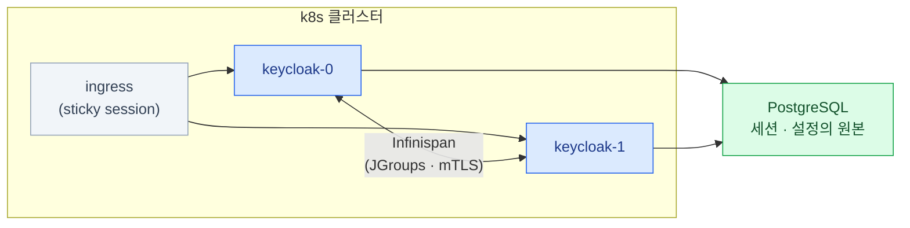

import { Tabs, TabItem, LinkCard } from '@astrojs/starlight/components';
import TermIntro from '../../../components/docs/TermIntro.astro';

> 데모는 `start-dev` 한 줄이면 뜬다 — 프로덕션은 **DB · hostname · TLS · HA** 네 가지 답을 요구한다

<TermIntro
  terms={[
    ['Operator', '', '특정 앱의 운영 지식을 코드로 담은 컨트롤러. CR(Custom Resource)에 "이런 Keycloak을 원한다"고 선언하면 Deployment·Service·설정을 대신 만든다.'],
    ['Infinispan', '', 'Keycloak에 내장된 분산 캐시. 여러 replica가 세션·무효화 정보를 **서로 공유**하는 통로다.'],
    ['JGroups', '', 'Infinispan이 클러스터 멤버를 찾고 통신하는 하부 라이브러리. 26의 기본 `jdbc-ping` 스택은 DB 테이블로 멤버를 발견한다.'],
    ['hostname', '', 'Keycloak이 "내 공식 주소"로 아는 값. **토큰의 `iss`가 여기서 나온다** — 배포 설정이면서 동시에 프로토콜 설정이다.'],
  ]}
/>

## 문제 — dev 모드와 프로덕션의 거리

문서·블로그의 Keycloak은 대부분 `start-dev`로 떠 있다. 파일 DB(H2)에, HTTP에,
캐시는 로컬 — **데모 전용**이다. 프로덕션 모드(`start`)가 모든 항목을 기동 조건으로
강제하는 것은 아니지만, 실제 운영 설계는 아래 네 질문에 답하지 않으면 완성되지 않는다.

| 질문 | dev 모드 | 프로덕션에서 채울 답 |
|---|---|---|
| 데이터는 어디에 | 파일 DB (H2) | **외부 PostgreSQL** |
| 공식 주소는 | 아무거나 | **`KC_HOSTNAME` 고정** — `iss`의 원천 |
| TLS는 | HTTP 허용 | ingress 종료 + proxy 헤더 신뢰 설정 |
| 여러 대면 | (한 대 전제) | Infinispan 클러스터링 + 세션 전략 |

## 무엇으로 배포하나

| 수단 | 내용 | 판단 |
|---|---|---|
| **Keycloak Operator (공식)** | CR로 선언하면 Deployment·캐시 구성·업그레이드를 관리. 새 realm용 일회성 import CR도 있다 | **기본 선택.** 운영 지식이 컨트롤러에 들어 있다 |
| Helm 차트 | codecentric의 keycloakx 등 커뮤니티 차트 | 차트 커스터마이징에 익숙하면. 공식 차트는 없다 |
| 직접 매니페스트 | Deployment + Service를 손으로 | 학습에는 좋다. 운영에서는 아래 설정을 전부 스스로 챙겨야 한다 |

:::caution[함정 — Bitnami 차트를 검색해서 그대로 쓰지 않는다]
오랫동안 표준처럼 쓰이던 Bitnami Keycloak 차트는 2025년 8월 Broadcom의 카탈로그
정책 변경으로 **무료 이미지 제공이 크게 축소**됐다 (기존 태그는 `bitnamilegacy`로 이동,
갱신 중단). 옛 글의 `helm install bitnami/keycloak`을 그대로 따라 하면 낡은 이미지를
쓰게 되거나 pull 자체가 막힌다.
:::

Operator 기준의 선언은 이런 뼈대다 —

```yaml
apiVersion: k8s.keycloak.org/v2beta1
kind: Keycloak
metadata:
  name: keycloak
spec:
  instances: 2                      # HA — 아래 절
  db:
    vendor: postgres
    host: keycloak-db-rw            # 외부 Postgres (예: CloudNativePG의 rw Service)
    usernameSecret: { name: kc-db, key: username }
    passwordSecret: { name: kc-db, key: password }
  hostname:
    hostname: https://keycloak.corp.com
  http:
    httpEnabled: true               # TLS는 ingress에서 종료 (아래)
  proxy:
    headers: xforwarded
```

## 프로덕션 필수 설정 — 네 가지 답

### ① DB — 원본은 PostgreSQL이다

realm·client·사용자(import분)·세션까지 **전부 DB에 있다.** Keycloak Pod는
갈아 끼워도 되는 무상태에 가깝고, **지켜야 할 것은 DB다** — 백업 이야기가
[9장](/keycloak/09-ops/)에서 DB로 시작하는 이유다.

- 외부 PostgreSQL을 쓴다. 온프렘 k8s라면 CloudNativePG 같은 검증된 Postgres
  Operator로 DB부터 HA를 갖추는 것이 순서다
- dev의 H2 파일 DB는 Pod와 운명을 같이한다 — 재스케줄 한 번에 전체 설정이 증발한다

### ② hostname — 배포 설정이 아니라 프로토콜 설정이다

`KC_HOSTNAME`(CR의 `hostname.hostname`)이 토큰의 `iss`, discovery 문서의 모든 URL을
결정한다. 이 값이 흔들리면 **모든 검증자(앱·API 서버)의 issuer 검증이 깨진다** —
[6장의 운영 함정](/keycloak/06-k8s-oidc/)과 [10장의 단골 증상](/keycloak/10-troubleshooting/)이 여기서 나온다.

- 처음부터 **전용 도메인을 고정**한다 (`keycloak.corp.com`). 나중에 바꾸면 모든 연동의 issuer를 같이 바꿔야 한다
- 사내·클러스터 내부에서도 **같은 도메인으로 접근되게** 한다 — 안팎 주소가 다르면 issuer 불일치가 상시화된다

### ③ TLS — 종료 지점과 신뢰 선언

흔한 구성은 **ingress에서 TLS 종료**, ingress → Keycloak 구간은 HTTP다. 그러면 Keycloak에 두 가지를 알려야 한다 —

| 설정 | 왜 |
|---|---|
| `KC_HTTP_ENABLED=true` | 자기 앞 구간이 HTTP임을 허용 |
| `KC_PROXY_HEADERS=xforwarded` | "클라이언트 정보는 `X-Forwarded-*` 헤더를 믿어라" — 이게 없으면 redirect URL·`iss`가 http로 생성되는 등 미묘하게 깨진다 |

:::caution[함정]
`KC_PROXY_HEADERS`를 켠다는 것은 **그 헤더를 위조할 수 없는 위치에 Keycloak을 뒀다**는
선언이다. ingress를 우회해 Pod에 직접 닿는 경로가 있으면 헤더 위조가 가능해진다 —
[7장의 헤더 신뢰 문제](/keycloak/07-apps/)와 같은 원리다. NetworkPolicy로 인입을 ingress로 제한한다.
옛 문서의 `KC_PROXY=edge`는 제거된 옵션이다 — 지금은 `KC_PROXY_HEADERS`.
:::

관리용 엔드포인트는 서비스 포트와 분리돼 있다 — `KC_HEALTH_ENABLED` ·
`KC_METRICS_ENABLED`를 켜면 **9000번(관리 포트)** 에 `/health/ready` · `/metrics`가 열린다.
프로브는 여기 걸고, **이 포트는 외부에 노출하지 않는다.**

### ④ HA — 여러 대가 하나처럼

`instances: 2` 이상이면 세 가지가 맞물린다 —



| 부품 | 역할 | 설정 포인트 |
|---|---|---|
| **Infinispan 클러스터** | replica 간 캐시·무효화 공유 | 26 기본 `jdbc-ping` — JGroups가 공용 DB로 멤버를 발견. Operator가 통신 mTLS도 구성 |
| **persistent sessions (26 기본)** | 세션의 원본을 DB에 | replica가 죽거나 롤링돼도 **로그인 유지** ([5장](/keycloak/05-sessions/)) |
| **sticky session** | 로그인 진행 중 상태를 같은 Pod로 | ingress affinity 쿠키. 필수는 아니지만 캐시 적중률·안정성에 유리 |

멀티 클러스터(사이트 간) HA는 26.7 기준 아직 preview 기능이다 — 단일 클러스터
HA와는 난이도가 다른 문제이니 필요해질 때 그 시점의 문서로 판단한다.

:::caution[낡은 캐시 예시]
`--cache-stack=kubernetes`와 `jgroups.dns.query=<headless-service>`를 쓰는 글이 많이 남아
있지만, 26.7에서는 `kubernetes` 스택이 deprecated이고 기본은 `jdbc-ping`이다. 기존 환경을
그대로 운영할 수는 있어도 신규 구성의 출발점으로 삼지 않는다.
:::

## 이미지와 기동 최적화

Keycloak은 설정의 절반을 **빌드 타임**(기능·DB 종류·캐시 스택), 절반을
**런타임**(URL·시크릿)에 받는다. 프로덕션 권장은 빌드 타임 옵션을 이미지에 굽고
(`kc.sh build`), 기동은 `start --optimized`로 빌드 단계를 건너뛰는 것 —
재시작·스케일 아웃이 수십 초 빨라진다. Operator를 쓰면 이 구분도 관리 범위에 들어온다.

JVM 앱이라는 것도 기억해 둔다 — 힙은 컨테이너 메모리의 비율로 자동 설정되므로
**requests/limits를 실제 사용량 기준으로** 주고, 기동 직후 CPU를 몰아 쓰는 특성상
CPU limit을 너무 조이면 기동이 수 분으로 늘어진다.

## 참고 자료

- [Keycloak Operator 기본 배포](https://www.keycloak.org/operator/basic-deployment) — 26.7의 `v2beta1` CR, DB·hostname·TLS·proxy 필드
- [Keycloak Operator 고급 설정](https://www.keycloak.org/operator/advanced-configuration) — Deployment, resource, truststore와 NetworkPolicy 동작
- [Keycloak distributed cache](https://www.keycloak.org/server/caching) — 기본 `jdbc-ping`, deprecated `kubernetes` stack과 embedded cache 통신
- [Keycloak hostname v2](https://www.keycloak.org/server/hostname) — issuer·frontend·backchannel URL이 hostname 설정에서 결정되는 방식
- [Bitnami catalog 변경 공지](https://github.com/bitnami/containers/issues/83267) — 2025년 free catalog 축소와 `bitnamilegacy`의 업데이트 중단 범위

## 8장 요약

- 프로덕션 모드는 네 가지 답을 요구한다 — **DB · hostname · TLS · HA**
- 배포는 **공식 Operator가 기본 선택.** Bitnami 차트 관성은 2025년 정책 변경 이후 재검토 대상
- **지켜야 할 것은 DB다** — realm·client·세션의 원본. 외부 Postgres + 검증된 Operator로
- **hostname은 `iss`의 원천** — 전용 도메인을 처음부터 고정하고, 안팎 주소를 일치시킨다
- TLS는 ingress 종료 + `KC_HTTP_ENABLED` + `KC_PROXY_HEADERS=xforwarded`, 그리고 **우회 경로 차단**
- HA는 **Infinispan(`jdbc-ping`) + DB 세션 + sticky** 세 부품 — 26부터는 재시작에도 로그인이 유지된다
- 관리 포트 9000(health·metrics)은 프로브 전용 — 외부 노출 금지

<LinkCard
  title="9. 운영 — 백업 · 업그레이드 · 키 관리"
  description="원본은 DB라는 감각으로 — 운영 루틴과 권한 위임, 가시성."
  href="/keycloak/09-ops/"
/>
