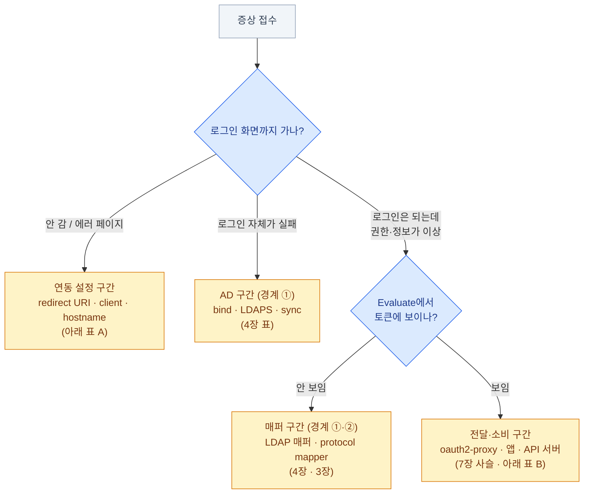

import { LinkCard } from '@astrojs/starlight/components';
import TermIntro from '../../../components/TermIntro.astro';

> 인증 문제의 90%는 새로운 문제가 아니다 — **어느 경계인지 가리는 속도**가 실력이다

<TermIntro
  terms={[
    ['clock skew', '', '서버 간 시계 차이. 토큰의 발급·만료 시각(`iat`·`exp`) 검증이 시계에 기대므로, 몇 분만 어긋나도 "방금 발급된 토큰이 만료됨"이 된다.'],
    ['kid', 'Key ID', 'JWT 헤더에 적힌 서명 키 식별자. 검증자가 JWKS에서 맞는 공개키를 고르는 열쇠 — "unknown kid"는 키 목록이 어긋났다는 뜻이다.'],
  ]}
/>

## 진단의 축 — 사슬의 어디가 끊겼나

이 덱이 반복해 온 그림이 그대로 진단 지도다. 증상을 듣고 **어느 구간의 문제인지**부터
가른 뒤 해당 장의 표로 간다.

## 도구 상자 — 다섯 개면 대부분 열린다

| 도구 | 용도 |
|---|---|
| **discovery 문서 curl** | `curl https://…/realms/corp/.well-known/openid-configuration` — 열리나, `issuer`가 기대값인가. 연동 문제의 1번 확인 |
| **Evaluate** | Clients → client → Client scopes → Evaluate — 그 사용자의 **실제 토큰 미리보기.** 매퍼 문제와 전달 문제를 가르는 칼 ([3장](/keycloak/03-structure/)) |
| **로그인 이벤트** | 실패 이벤트에 원인 코드가 남는다 (`invalid_user_credentials`, `user_disabled` …). 켜 뒀다면 ([9장](/keycloak/09-ops/)) |
| **jwt 디코드** | 받은 토큰을 base64 디코드해 `iss`·`aud`·`exp`·claim을 직접 본다 — 추측 대신 관찰 |
| **로그 레벨 상향** | `KC_LOG_LEVEL=info,org.keycloak.storage.ldap:debug` 처럼 카테고리만 올린다 |

## 표 A — 로그인 진입·리다이렉트 구간

| 증상 | 흔한 원인 | 해결 |
|---|---|---|
| `Invalid parameter: redirect_uri` | client의 Valid redirect URIs와 불일치 — **한 글자, 슬래시 하나도** | 앱이 보내는 값을 그대로 등록. 와일드카드는 경로 끝에만 |
| 로그인 후 무한 리다이렉트 루프 | 앱·프록시의 쿠키가 안 잡힘 (https↔http 혼용, 쿠키 도메인, SameSite) | 전 구간 https 통일, 프록시 헤더 설정 ([8장](/keycloak/08-deploy/)) |
| `iss` 불일치 / "issuer did not match" | `KC_HOSTNAME`과 실제 접속 주소가 다름, 안팎 주소 불일치 | hostname 고정 + 내외부 동일 도메인 ([8장](/keycloak/08-deploy/)) |
| 404에 URL에 `/auth/`가 보임 | 낡은 문서의 경로를 복사 | `/auth` 접두사 제거 ([0장](/keycloak/00-intro/)) |
| 처음 뜨는 화면이 영어·이상한 realm | **master realm URL로 접속**했거나 realm 이름 오타 | URL의 `/realms/<이름>` 확인 |

## 표 B — 토큰 검증·전달 구간

| 증상 | 흔한 원인 | 해결 |
|---|---|---|
| "token is expired" (방금 받았는데) | **clock skew** — 검증하는 쪽 서버의 시계가 어긋남 | 전 노드 NTP 동기화 확인. 온프렘의 고전 |
| "invalid audience" / aud 불일치 | 토큰의 `aud`에 검증자가 없음 | ID/access token 혼용 확인 ([2장](/keycloak/02-oauth-oidc/)), audience 매퍼 ([3장](/keycloak/03-structure/)) |
| "unknown kid" / 서명 검증 실패 | 키 롤오버 직후 + 검증자의 JWKS 캐시·고정 | 검증자 JWKS 갱신. 파일로 박아 둔 연동 색출 ([9장](/keycloak/09-ops/)) |
| claim이 앱에 안 옴 | 다섯 고리 중 어딘가 | **Evaluate로 이분 탐색** ([7장](/keycloak/07-apps/)) |
| 400/502 — 요청 헤더가 너무 큼 | 그룹·롤 폭증으로 **토큰 비대화** → nginx 버퍼(기본 8k) 초과 | 그룹 필터링 ([4장](/keycloak/04-ad-federation/)), scope 축소. 임시로 `large_client_header_buffers` 증설 |
| 간헐적으로 로그인 상태가 사라짐 | HA에서 캐시 클러스터링 실패 (JGroups 멤버 발견 안 됨) | Pod 로그에서 클러스터 뷰 확인 (`Received new cluster view`), headless Service 점검 ([8장](/keycloak/08-deploy/)) |

## 표 C — kubectl · API 서버 구간

kubectl 쪽 401은 **API 서버 로그**(`kube-apiserver` Pod)에 원인이 문장으로 남는다 —
클라이언트에는 401만 오므로 로그를 보는 쪽이 빠르다.

| API 서버 로그의 문구 | 뜻 | 해결 |
|---|---|---|
| `oidc: verify token: … expired` | 토큰 만료 — kubelogin 캐시가 낡음 | 보통 자동 갱신된다. 안 되면 캐시 삭제: `rm -rf ~/.kube/cache/oidc-login` |
| `oidc: verify token: … audience` | `aud` ≠ 설정된 client ID | AuthenticationConfiguration의 `audiences`와 client ID 대조 ([6장](/keycloak/06-k8s-oidc/)) |
| `oidc: fetch keys` / issuer 접속 실패 | API 서버에서 Keycloak 도달 불가 · CA 불신뢰 | 컨트롤플레인 노드에서 issuer curl, `certificateAuthority` 확인 ([6장](/keycloak/06-k8s-oidc/)) |
| 인증은 되는데 `Forbidden` (403) | **인증은 성공, 인가 실패** — 401과 다른 문제다 | `kubectl auth can-i` + 그룹 prefix 확인. [CKA 덱 14장](/cka/14-rbac/)의 영역 |

:::tip[403 진단 한 줄]
바인딩의 그룹 이름은 **prefix까지 포함한 문자열**이다 — 토큰의 `groups`가
`platform-admin`이고 prefix가 `oidc:`면 바인딩 대상은 `oidc:platform-admin`.
prefix를 빼먹은 바인딩이 403의 단골 원인이다.
:::

## 그래도 못 찾겠으면 — 층을 내려간다

이 장의 표는 Keycloak 층의 문제를 다룬다. 증상이 어느 표에도 안 걸리면
**한 층 아래**가 원인일 수 있다 — Service의 EndpointSlice가 비었거나, DNS가 안 풀리거나,
NetworkPolicy가 막고 있거나. 그 진단은 [CKA 덱 18장](/cka/18-troubleshooting/)의 영역이고,
경계를 넘나드는 감각 자체가 온프렘 관리자의 몫이다.

## 10장 요약

- 진단은 항상 **"어느 경계인가"**부터 — 로그인 진입 / AD / 매퍼 / 전달·소비로 가른다
- 도구 다섯: **discovery curl · Evaluate · 로그인 이벤트 · 토큰 디코드 · 로그 레벨 상향**
- redirect URI는 한 글자 단위로, issuer는 hostname 설정과, 시계는 NTP와 대조한다
- kubectl 401의 진실은 **API 서버 로그**에 있다. 403은 인가 문제 — RBAC과 prefix를 본다
- Keycloak 층에서 안 나오면 **한 층 아래(네트워크·DNS)로** 내려간다

<LinkCard
  title="11. 용어 사전"
  description="이 덱에 나온 용어 전부 — 약어를 만나면 여기로."
  href="/keycloak/11-glossary/"
/>
