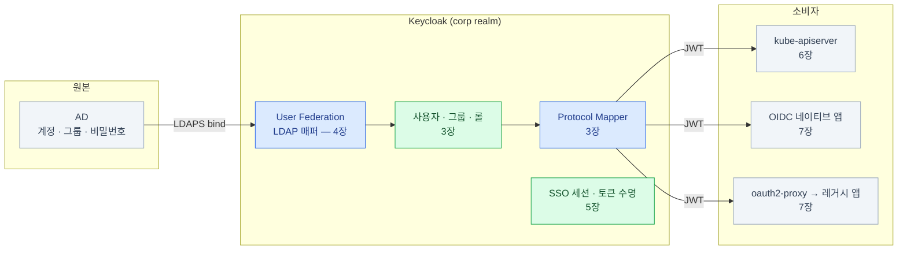

import { Steps, LinkCard } from '@astrojs/starlight/components';

> 덱 전체를 한 장으로 접으면 — **비밀번호는 한 길로, 신뢰는 서명으로, 매핑은 두 번**

## 전체 지도

그리고 이 상자 전체가 온프렘 k8s 위에서 돈다 — Operator·Postgres·HA가 [8장](/keycloak/08-deploy/),
백업·업그레이드·키가 [9장](/keycloak/09-ops/), 고장 났을 때가 [10장](/keycloak/10-troubleshooting/)이다.

## 장별 핵심 한 문장

| 장 | 한 문장 |
|---|---|
| [1. 왜 SSO인가](/keycloak/01-why/) | 앱마다 AD 직접 연동은 비밀번호가 모든 앱을 지나가는 구조다 — IdP는 그 길을 하나로 줄인다 |
| [2. OAuth · OIDC](/keycloak/02-oauth-oidc/) | 토큰은 세트다 — ID(신분증) · Access(출입증) · Refresh(재발급권), 소비자가 다 다르다 |
| [3. 구조](/keycloak/03-structure/) | 콘솔에 보이는 것과 토큰에 실리는 것은 별개 — protocol mapper가 잇는다 |
| [4. AD 연동](/keycloak/04-ad-federation/) | 비밀번호는 가져오지 않는다 — 검증을 AD에 위임할 뿐. 매핑은 세 관문을 통과해야 한다 |
| [5. 세션·토큰](/keycloak/05-sessions/) | access token은 회수가 안 된다 — 그래서 짧게 주고, 회수는 세션에 건다 |
| [6. k8s OIDC](/keycloak/06-k8s-oidc/) | 인증서 kubeconfig는 회수 불가 — OIDC + 그룹 바인딩이면 AD 작업만으로 권한이 따라온다 |
| [7. 앱 연동](/keycloak/07-apps/) | 첫 질문은 "앱이 OIDC를 아는가" — 모르면 oauth2-proxy, 이때 client는 프록시다 |
| [8. 배포](/keycloak/08-deploy/) | 지켜야 할 것은 DB, 흔들리면 안 되는 것은 hostname(`iss`) |
| [9. 운영](/keycloak/09-ops/) | 복원 연습까지가 백업이고, 겹침 구간까지가 키 교체다 |
| [10. 트러블슈팅](/keycloak/10-troubleshooting/) | 진단은 "어느 경계인가"부터 — Evaluate가 가운데를 자른다 |

## 구축 체크리스트 — 처음 세울 때

<Steps>

1. **기반** — 전용 도메인 확정(`KC_HOSTNAME`), 외부 Postgres(Operator), TLS 종료 지점과
   `KC_PROXY_HEADERS`, NetworkPolicy로 우회 인입 차단 ([8장](/keycloak/08-deploy/))

2. **realm** — master에는 아무것도 붙이지 않고 업무용 realm 생성.
   User events · Admin events **즉시 켜기** ([3장](/keycloak/03-structure/) · [9장](/keycloak/09-ops/))

3. **AD 연동** — LDAPS + 읽기 전용 bind 계정, `objectGUID`를 UUID로,
   `READ_ONLY` + import + 주기 sync, MSAD account-control 매퍼 확인 ([4장](/keycloak/04-ad-federation/))

4. **그룹 사슬 검증** — AD 그룹 → Keycloak 그룹 → protocol mapper → **Evaluate에서 `groups` 확인** ([3장](/keycloak/03-structure/))

5. **첫 소비자 연동** — kubectl(OIDC + RBAC 그룹 바인딩 + **break-glass kubeconfig 보관**),
   앱 하나 (client 체크리스트) ([6장](/keycloak/06-k8s-oidc/) · [7장](/keycloak/07-apps/))

6. **운영 장치** — DB 백업 일정 + 복원 연습, 메트릭 수집, 인증서 만료 알림,
   구성의 코드화(kcadm/Terraform) ([9장](/keycloak/09-ops/))

</Steps>

## 사고 대응 카드 — 급할 때 이 순서

| 상황 | 즉시 할 일 |
|---|---|
| 계정 탈취 의심 | AD 비활성화 → 세션 강제 종료 → offline token 회수 ([5장](/keycloak/05-sessions/)) |
| client 시크릿 유출 | 시크릿 Regenerate → 배포 반영 ([9장](/keycloak/09-ops/)) |
| 범위 불명의 유출 | not-before 정책으로 전체 무효화 — 전사 재로그인을 감수한다 ([9장](/keycloak/09-ops/)) |
| Keycloak 전면 장애 | break-glass kubeconfig로 클러스터 진입 → DB·Pod 순으로 진단 ([6장](/keycloak/06-k8s-oidc/) · [10장](/keycloak/10-troubleshooting/)) |

## 여기서 더 파려면

이 덱이 이름만 남기고 지나간 것들 — 필요해질 때 그 시점의 공식 문서로 본다.

| 주제 | 언제 필요해지나 |
|---|---|
| Authorization Services (UMA) | 인가 판단 자체를 Keycloak에 중앙화하고 싶을 때 |
| Token Exchange | 받은 토큰을 다른 대상용 토큰으로 바꿔야 할 때 (서비스 체인) |
| Terraform keycloak 프로바이더 | kcadm 스크립트의 멱등 관리가 한계에 왔을 때 |
| WebAuthn / Passkey | 비밀번호 없는 인증으로 갈 때 |
| 멀티 클러스터 HA · SCIM 프로비저닝 | 26.7 기준 preview — 사이트 이중화·계정 자동 프로비저닝이 필요할 때 |

## 마지막 한 장

관리자의 일은 결국 세 문장으로 접힌다 —

- **비밀번호는 한 길로만** 흐르게 한다 (Keycloak ↔ AD)
- **신뢰는 서명으로** 흐르게 한다 (JWKS — 그래서 hostname과 키 관리가 무겁다)
- **매핑은 두 번** 일어난다 (끊기면 어느 경계인지부터 — 진단의 전부)

<LinkCard
  title="처음으로 — 0. 시작하기 전에"
  description="이 덱의 대상과 범위, 멘탈 모델 세 가지."
  href="/keycloak/00-intro/"
/>
