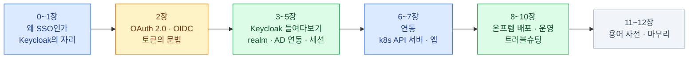

import { LinkCard, LinkButton } from '@astrojs/starlight/components';

> 앱은 AD를 모르고, AD는 앱을 모른다 — 가운데서 **통역**하는 것이 Keycloak이다

사내에 AD(Active Directory)가 있고, 그 앞에 Keycloak을 세워 SSO(Single Sign-On)를
운영하는 환경을 전제로 한다. "로그인이 되게 하는 법"이 아니라
**관리자로서 알아야 하는 것** — 구조, AD 연동의 급소, 쿠버네티스 API 서버 연동,
온프렘 배포와 운영 — 을 다룬다.

쿠버네티스 기초는 [CKA 덱](/cka/) 수준을 전제하고, 여기서 다시 설명하지 않는다.

**2026년 8월 기준**으로 쓰였다 — Keycloak 26.7 · Kubernetes 1.34 · oauth2-proxy v7.

<LinkButton href="/keycloak/00-intro/" icon="right-arrow">첫 장부터 읽기</LinkButton>

## 구성

| 장 | 주제 | 답하는 질문 |
|---|---|---|
| [0](/keycloak/00-intro/)–[1](/keycloak/01-why/) | 범위 · 왜 SSO인가 | AD가 이미 있는데 Keycloak은 왜 필요한가 |
| [2](/keycloak/02-oauth-oidc/) | OAuth 2.0 · OIDC | 토큰 세 종류는 각각 무엇이고 누가 검증하는가 |
| [3](/keycloak/03-structure/)–[5](/keycloak/05-sessions/) | realm · client · AD 연동 · 세션 | AD 그룹이 앱의 토큰까지 어떻게 오는가 |
| [6](/keycloak/06-k8s-oidc/)–[7](/keycloak/07-apps/) | k8s API 서버 · 앱 연동 | kubectl과 사내 앱이 어떻게 SSO를 타는가 |
| [8](/keycloak/08-deploy/)–[10](/keycloak/10-troubleshooting/) | 배포 · 운영 · 트러블슈팅 | 온프렘 k8s에서 Keycloak 자체를 어떻게 돌리는가 |
| [11](/keycloak/11-glossary/)–[12](/keycloak/12-wrapup/) | 용어 사전 · 마무리 | — |

## 전체를 관통하는 두 문장

**매핑은 두 번 일어난다.** AD의 속성·그룹이 Keycloak으로 들어오는 매핑(경계 ①, [4장](/keycloak/04-ad-federation/))과,
Keycloak의 사용자 모델이 토큰의 claim으로 실리는 매핑(경계 ②, [3장](/keycloak/03-structure/))은
**별개의 설정**이다. "앱에 그룹이 안 보인다"는 문제의 진단은 언제나
이 둘 중 어디서 끊겼는지 가르는 데서 시작한다.

**신뢰는 서명으로 흐른다.** 앱도, 쿠버네티스 API 서버도 Keycloak에 비밀번호를 물어보지 않는다.
Keycloak이 개인키로 서명한 토큰을, 각자가 공개키(JWKS)로 검증할 뿐이다.
그래서 인증은 한 곳에 모이고, 검증은 어디서나 일어난다.

<LinkCard
  title="0. 시작하기 전에"
  description="이 덱의 대상과 범위, 미리 잡아두면 좋은 멘탈 모델 세 가지."
  href="/keycloak/00-intro/"
/>
