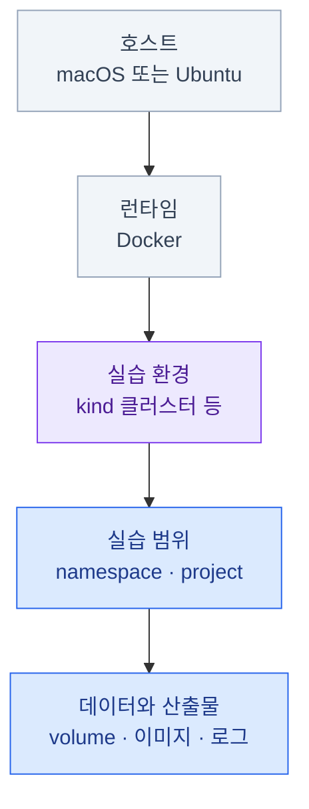

import { Card, CardGrid, LinkCard, Steps } from '@astrojs/starlight/components';
import TermIntro from '../../../components/docs/TermIntro.astro';

> 설치 명령보다 먼저 정할 것은 **이 환경의 이름, 경계, 마지막 명령**이다

<TermIntro
  terms={[
    ['수명주기', 'Lifecycle', '환경을 **준비하고, 확인하고, 사용하고, 멈추거나 폐기하는** 한 바퀴. 생성만 자동화하면 절반만 자동화한 것이다.'],
    ['격리 단위', 'Isolation boundary', '실습 하나가 소유하는 가장 큰 경계. kind 클러스터, Kubernetes namespace, Docker Compose project처럼 **한 번에 식별하고 정리할 단위**다.'],
    ['멱등성', 'Idempotency', '같은 준비나 정리 명령을 다시 실행해도 원하는 최종 상태가 유지되는 성질. 중간에 실패한 실습을 다시 시작하기 쉽게 만든다.'],
  ]}
/>

실습 환경은 작은 운영 환경이다. 자원은 여러 층에 생기고, CLI는 마지막으로 선택한 대상을 기억한다.
따라서 “일단 띄우고 나중에 지운다”보다 **어디에 무엇이 생기는지 먼저 지도화하는 것**이 안전하다.



## 만들기 전에 적을 다섯 가지

<Steps>

1. **격리 단위를 고른다**

   환경 전체를 함께 버릴 실습이면 전용 kind 클러스터나 Compose project를 쓴다. 여러 실습이 한
   클러스터를 공유한다면 전용 namespace처럼 더 작은 경계를 쓴다.

2. **고유한 이름을 정한다**

   `test`나 기본 이름 대신 `observability-lab`처럼 목적이 드러나는 이름을 쓴다. 준비·조회·정리
   명령에서 같은 이름을 반복해야 엉뚱한 환경을 건드릴 가능성이 줄어든다.

3. **자원과 버전을 적는다**

   CPU·메모리·디스크의 최소값, 이미지 태그와 도구 버전을 적는다. “내 컴퓨터에서는 된다”를
   다른 환경에서도 재현할 수 있는 조건으로 바꾸는 단계다.

4. **준비 완료 조건을 정한다**

   명령이 종료됐다는 것만으로 준비가 끝난 것은 아니다. 노드가 `Ready`인지, Pod가 준비됐는지,
   실제 endpoint가 응답하는지처럼 실습을 시작해도 되는 조건을 둔다.

5. **마지막 명령과 삭제 범위를 먼저 쓴다**

   cleanup이 클러스터·데이터·이미지 중 무엇을 지우는지, 복구할 수 있는지, 무엇은 남기는지 적는다.
   실습 문서의 마지막에 두더라도 **설계는 준비 명령과 동시에** 한다.

</Steps>

## 명령을 세 종류로 구분한다

환경을 “끄는 것”과 “지우는 것”을 섞지 않는다.

| 의도 | 결과 | 다시 쓸 때 |
|---|---|---|
| 상태 확인 | 아무것도 바꾸지 않는다 | 그대로 계속 사용 |
| 일시 중단 | CPU·메모리를 회수하고 데이터는 보존 | 다시 시작하고 준비 상태 확인 |
| 폐기 · 초기화 | 환경과 그 안의 데이터를 삭제 | 처음부터 다시 생성 |

:::caution[정리는 삭제 범위가 작은 쪽부터]
실습이 namespace 하나만 소유하면 namespace만 지운다. 클러스터 전체가 실습 전용일 때만 클러스터를
지운다. 런타임 전체를 청소하는 명령은 다른 프로젝트의 컨테이너·이미지·볼륨까지 지울 수 있으므로
일반적인 cleanup에 넣지 않는다.
:::

## 현재 대상을 명령에 드러낸다

CLI가 기억하는 “현재 대상”은 편리하지만 여러 실습을 오갈 때 가장 위험한 숨은 상태다.

```bash
# 나쁜 예: 현재 context가 무엇인지 명령만 보고 알 수 없다
kubectl delete namespace observability-lab

# 좋은 예: 이 명령이 어느 클러스터를 바꾸는지 보인다
kubectl --context kind-observability-lab delete namespace observability-lab
```

삭제 전에는 항상 목록에서 이름을 다시 확인하고, 삭제 후에는 같은 목록에서 사라졌는지 확인한다.
스크립트나 Makefile도 같은 규칙을 지킨다.

## 다른 덱이 이 덱을 참조하는 방법

<CardGrid>
<Card title="이 덱으로 넘긴다" icon="open-book">
Docker·kind·kubectl 설치.
macOS와 Ubuntu의 런타임 차이.
클러스터 생성·확인·일시 중단·폐기.
context를 명시하는 안전 규칙.
</Card>
<Card title="개별 덱에 남긴다" icon="pencil">
실습 전용 클러스터와 namespace 이름.
CPU·메모리·디스크 요구량.
고정한 Kubernetes·이미지 버전.
전용 매니페스트와 시나리오.
cleanup이 실제로 지우는 데이터.
</Card>
</CardGrid>

이 경계를 지키면 공통 설치법은 한곳에서 갱신하고, 개별 실습은 자기 차이만 설명할 수 있다.

## 0장 요약

- 이름·격리 단위·자원·완료 조건·cleanup을 **생성 전에** 정한다
- 상태 확인, 일시 중단, 폐기는 서로 다른 명령이다
- current context에 기대지 않고 바꿀 대상을 명령에 드러낸다
- 삭제 범위는 실습이 실제로 소유한 경계보다 넓어지지 않게 한다
- 개별 덱은 실습 고유 조건만 남기고 공통 준비는 이 덱을 링크한다

<LinkCard
  title="1. kind — 로컬 Kubernetes"
  description="macOS와 Ubuntu에서 Docker·kind·kubectl을 준비하고, 전용 클러스터를 만들고 안전하게 정리한다."
  href="/lab-environment/01-kind/"
/>
