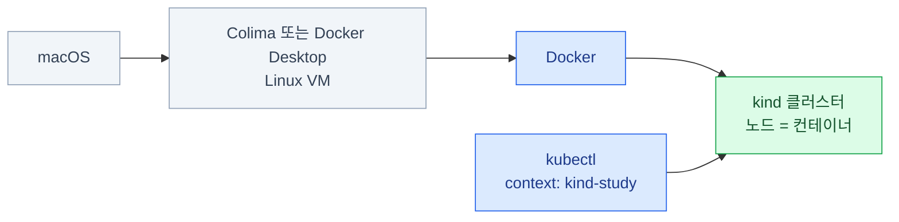

import { LinkCard, Steps } from '@astrojs/starlight/components';
import TermIntro from '../../../components/docs/TermIntro.astro';

> macOS에서는 먼저 Linux VM 안에 Docker를 띄우고, 그 위에 `study` kind 클러스터를 만든다

<TermIntro
  terms={[
    ['kind', 'Kubernetes IN Docker', 'Docker 컨테이너를 Kubernetes 노드로 쓰는 로컬 클러스터 도구. 클러스터를 빠르게 만들고 통째로 다시 만들기 좋다.'],
    ['Colima', 'Containers on Lima', 'macOS에서 Linux VM과 Docker runtime을 제공하는 가벼운 도구. 이 장의 기본 경로다.'],
    ['context', 'kubectl context', '`kubectl`이 접속할 클러스터·사용자·기본 namespace의 묶음. `study` 클러스터를 만들면 `kind-study`가 생긴다.'],
  ]}
/>

macOS는 Linux 컨테이너를 직접 실행하지 못하므로 Colima나 Docker Desktop이 Linux VM을 하나 둔다.
kind는 그 VM의 Docker 안에 노드 컨테이너를 만든다.



kind는 워크로드·스케줄링·서비스·RBAC 실습에 알맞다. 노드가 컨테이너이므로 `kubeadm` 설치나
노드 OS 업그레이드는 [CKA 0장](/cka/00-intro/#실습-환경은-따로-준비하자)의 다른 환경을 쓴다.

## 런타임 고르기

둘 중 하나만 선택한다. 동시에 실행하면 Docker context가 어느 runtime을 가리키는지 헷갈릴 수 있다.

| 선택 | 이런 경우에 맞다 | 자원 설정 |
|---|---|---|
| **Colima** | 가볍고 무료인 CLI 환경을 원한다 | 시작할 때 CPU·메모리·디스크 지정 |
| Docker Desktop | GUI 설정과 Docker 제품 통합이 편하다 | Settings → Resources |

단일 노드 기본 실습은 CPU 2개·메모리 4 GiB로도 시작할 수 있다. 멀티노드나 관측 스택처럼
Pod가 많은 실습은 **CPU 4개·메모리 8 GiB**를 권장한다. 디스크 여유는 최소 10 GiB를 남긴다.

## 공식 문서에서 설치하기

설치 명령은 이 문서에 복제하지 않는다. 아래 공식 문서의 해당 절을 열고, 현재 표시되는 명령을
확인한 뒤 실행한다.

### Colima를 쓸 때

1. Homebrew가 없다면 [Homebrew 공식 설치](https://brew.sh/)를 따른다.
2. [Colima — Installation](https://github.com/abiosoft/colima#installation)에서 Colima를 설치한다.
3. 같은 문서의 [Colima — Docker runtime](https://github.com/abiosoft/colima#docker)에서 Docker client를 준비한다.
4. [kind — Installing With A Package Manager](https://kind.sigs.k8s.io/docs/user/quick-start/#installing-with-a-package-manager)의 macOS 절에서 kind를 설치한다.
5. [kubectl — Install with Homebrew on macOS](https://kubernetes.io/docs/tasks/tools/install-kubectl-macos/#install-with-homebrew-on-macos)에서 kubectl을 설치한다.

### Docker Desktop을 쓸 때

1. [Docker Desktop — Install and run on Mac](https://docs.docker.com/desktop/setup/install/mac-install/#install-and-run-docker-desktop-on-mac)을 따라 설치하고 앱을 실행한다.
2. Homebrew가 없다면 [Homebrew 공식 설치](https://brew.sh/)를 따른다.
3. [kind — Installing With A Package Manager](https://kind.sigs.k8s.io/docs/user/quick-start/#installing-with-a-package-manager)의 macOS 절에서 kind를 설치한다.
4. [kubectl — Install with Homebrew on macOS](https://kubernetes.io/docs/tasks/tools/install-kubectl-macos/#install-with-homebrew-on-macos)에서 kubectl을 설치한다.

설치가 끝나면 세 명령이 모두 성공하는지 확인한다.

```bash
docker info
kind version
kubectl version --client
```

Apple Silicon은 `arm64`다. kind 노드 이미지는 이를 지원하지만, 실습 애플리케이션 이미지가
`linux/arm64`를 제공하지 않으면 느린 에뮬레이션을 쓰거나 실행에 실패할 수 있다.

## Docker runtime 시작하기

### Colima

처음 VM을 만들 때 실습에 쓸 자원을 지정하고, Colima 내장 Kubernetes는 끈다. 이 덱에서는 kind만 쓴다.

```bash
colima start --cpu 4 --memory 8 --disk 60 --kubernetes=false
docker info --format 'CPUs={{.NCPU}} Memory={{.MemTotal}}'
```

이미 VM이 있다면 `colima list`로 현재 자원을 먼저 확인한다. 자원을 바꿀 때는 `colima stop` 후
원하는 값으로 다시 시작한다. 디스크는 늘릴 수 있지만 줄일 수 없다.

### Docker Desktop

앱을 실행하고 **Settings → Resources**에서 실습에 필요한 CPU와 메모리를 배정한다. 설정을 적용한 뒤
`docker info`가 성공하는지 확인한다.

## 클러스터 만들고 확인하기

이 장은 클러스터 이름을 `study`, kubectl context를 `kind-study`로 고정한다.

<Steps>

1. **단일 노드 클러스터를 만든다**

   ```bash
   kind create cluster --name study --wait 5m
   ```

2. **생성된 클러스터와 context를 확인한다**

   ```bash
   kind get clusters
   kubectl config get-contexts
   kubectl --context kind-study get nodes -o wide
   kubectl --context kind-study cluster-info
   ```

   노드가 `Ready`이고 cluster-info가 control plane 주소를 보여 주면 준비가 끝났다.

3. **노드가 실제 컨테이너인지 본다**

   ```bash
   docker ps --filter label=io.x-k8s.kind.cluster=study
   ```

</Steps>

## 여러 노드가 필요할 때

스케줄링·노드 선택·장애 실습은 control plane 1대와 worker 2대를 만든다. 아래 설정을
`kind-study.yaml`로 저장한다.

```yaml
kind: Cluster
apiVersion: kind.x-k8s.io/v1alpha4
nodes:
  - role: control-plane
  - role: worker
  - role: worker
```

기존 클러스터의 노드 수는 제자리에서 바꿀 수 없다. 데이터가 필요 없는지 확인한 뒤 다시 만든다.

```bash
kind get clusters
kind delete cluster --name study
kind create cluster --name study --config kind-study.yaml --wait 5m
kubectl --context kind-study get nodes
```

특정 Kubernetes 버전이 필요하면 [kind 릴리스](https://github.com/kubernetes-sigs/kind/releases)에
나온 `kindest/node` 이미지와 SHA256을 함께 고정한다.

## 멈추기와 완전히 정리하기

### 다음에 다시 쓸 때

Colima는 VM을 멈추면 CPU·메모리를 회수하면서 kind 클러스터와 데이터를 보존한다.

```bash
colima stop

# 다음 실습 때
colima start
kubectl --context kind-study get nodes
```

Docker Desktop은 앱을 종료하고, 다음 실습 때 다시 실행한 뒤 노드 상태를 확인한다.

### 클러스터를 다 썼을 때

Pod·Secret·PVC 데이터가 모두 사라져도 되는지 확인한다. 목록에서 이름을 확인한 뒤 그 클러스터만 삭제한다.

```bash
kind get clusters
kind delete cluster --name study
kind get clusters
kubectl config get-contexts
```

`kind delete clusters --all`, `docker system prune`, Colima VM 삭제는 다른 실습까지 영향을 줄 수 있으므로
일반적인 cleanup에 사용하지 않는다.

## 안 될 때 어디를 보나

| 증상 | 먼저 확인 | 흔한 원인과 다음 행동 |
|---|---|---|
| Docker daemon에 연결할 수 없음 | `docker context show` · `docker info` | 선택한 runtime이 꺼졌거나 Docker context가 다른 runtime을 가리킴 |
| 클러스터 생성 timeout | `docker info`의 CPU·메모리 | VM 자원 부족, 이미지 다운로드 실패, 프록시 |
| `kubectl`이 엉뚱한 클러스터를 봄 | `kubectl config current-context` | 명령에 `--context kind-study`를 붙여 다시 확인 |
| Pod가 `ImagePullBackOff` | Pod Events와 이미지 아키텍처 | 네트워크·인증 문제 또는 amd64 전용 이미지 |

클러스터 생성 문제는 `kind export logs --name study ./kind-logs`로 노드 로그를 모아 확인한다.

<LinkCard
  title="2. kind — Ubuntu"
  description="Ubuntu의 Docker Engine 위에 같은 kind 실습 환경을 만들고 정리한다."
  href="/lab-environment/02-kind-ubuntu/"
/>
