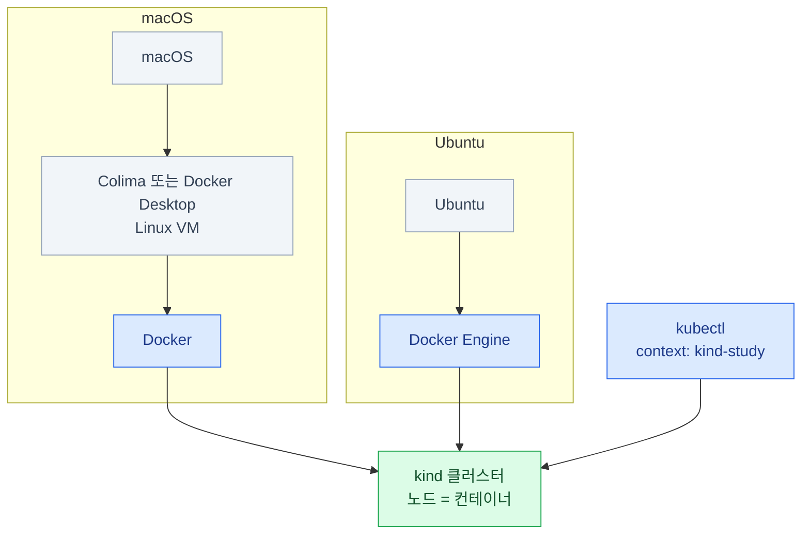

import { LinkCard, Steps, Tabs, TabItem } from '@astrojs/starlight/components';
import TermIntro from '../../../components/docs/TermIntro.astro';

> 목표는 `study`라는 **전용 로컬 클러스터 하나를 만들고, 확인하고, 보존하거나 완전히 지우는 것**이다

<TermIntro
  terms={[
    ['kind', 'Kubernetes IN Docker', 'Docker 컨테이너를 Kubernetes 노드로 쓰는 로컬 클러스터 도구. 환경을 빨리 만들고 **클러스터째 다시 만들기** 좋다.'],
    ['컨테이너 런타임', 'Container runtime', 'kind 노드 컨테이너를 실행하는 바닥. 이 장은 Docker를 사용하며 macOS에서는 Linux VM 안에서, Ubuntu에서는 호스트에서 직접 돈다.'],
    ['context', 'kubectl context', '`kubectl`이 접속할 클러스터·사용자·기본 namespace의 묶음. kind가 만든 context 이름은 `kind-<클러스터 이름>`이다.'],
  ]}
/>

kind는 Kubernetes 워크로드·스케줄링·서비스·RBAC 같은 실습에 알맞다. 노드 자체가 컨테이너라
`kubeadm` 설치·OS 업그레이드처럼 실제 노드 운영을 연습하는 환경은 아니다. 그 차이는
[CKA 0장](/cka/00-intro/#실습-환경은-따로-준비하자)에서 용도별로 나눈다.



## 준비할 자원과 도구

단일 노드 기본 실습은 CPU 2개·메모리 4 GiB로도 시작할 수 있다. 멀티노드나 관측 스택처럼
Pod가 많은 실습은 **CPU 4개·메모리 8 GiB**를 권장한다. 이미지와 볼륨을 위해 디스크 여유도
최소 10 GiB는 남긴다. 개별 덱이 더 큰 값을 요구하면 그 값을 따른다.

필요한 도구는 세 가지다.

| 도구 | 역할 | 준비 확인 |
|---|---|---|
| Docker | kind 노드 컨테이너 실행 | `docker info` |
| kind | 로컬 Kubernetes 생성·삭제 | `kind version` |
| kubectl | 생성된 클러스터 조작 | `kubectl version --client` |

## macOS 준비

Colima와 Docker Desktop 중 **하나만** 런타임으로 선택한다. 둘을 동시에 켜면 Docker context가
어느 런타임을 가리키는지 헷갈리기 쉽다.

<Tabs>
<TabItem label="Colima — 기본 경로">

가볍고 무료인 Colima가 Linux VM과 Docker 런타임을 제공한다.

```bash
brew install colima docker kind kubectl
colima start --cpu 4 --memory 8 --disk 60 --kubernetes=false
docker info
```

`--kubernetes=false`는 Colima의 내장 Kubernetes를 끄고 kind만 쓰겠다는 뜻이다. 이미 Colima VM을
만들었다면 `colima list`로 자원을 확인한다. 자원을 바꿀 때는 `colima stop` 후 원하는 값으로 다시
시작한다. 디스크 크기는 늘릴 수 있지만 줄일 수는 없다.

</TabItem>
<TabItem label="Docker Desktop — 대안">

```bash
brew install --cask docker
brew install kind kubectl
```

Docker Desktop 앱을 실행한 뒤 **Settings → Resources**에서 실습에 필요한 CPU와 메모리를 배정하고
`docker info`가 성공하는지 확인한다.

</TabItem>
</Tabs>

Apple Silicon은 `arm64`다. kind 노드 이미지는 이를 지원하지만, 실습에서 쓰는 애플리케이션 이미지가
`linux/arm64`를 제공하지 않으면 느린 에뮬레이션을 쓰거나 실행에 실패할 수 있다.

## Ubuntu 준비

Ubuntu에는 Docker Engine을 공식 apt 저장소에서 설치하고, kind와 kubectl은 공식 릴리스 바이너리를
설치한다. 아래 명령은 Ubuntu 22.04·24.04·26.04의 64비트 환경을 대상으로 한다.

### Docker Engine

```bash
sudo apt update
sudo apt install -y ca-certificates curl
sudo install -m 0755 -d /etc/apt/keyrings
sudo curl -fsSL https://download.docker.com/linux/ubuntu/gpg \
  -o /etc/apt/keyrings/docker.asc
sudo chmod a+r /etc/apt/keyrings/docker.asc

echo "deb [arch=$(dpkg --print-architecture) signed-by=/etc/apt/keyrings/docker.asc] https://download.docker.com/linux/ubuntu $(. /etc/os-release && echo \"$VERSION_CODENAME\") stable" \
  | sudo tee /etc/apt/sources.list.d/docker.list > /dev/null

sudo apt update
sudo apt install -y docker-ce docker-ce-cli containerd.io docker-buildx-plugin docker-compose-plugin
sudo docker run --rm hello-world
```

매번 `sudo` 없이 Docker를 쓰려면 현재 사용자를 `docker` 그룹에 추가하고 다시 로그인한다.

```bash
sudo usermod -aG docker "$USER"
```

:::caution[권한]
`docker` 그룹 사용자는 사실상 root 수준으로 호스트를 제어할 수 있다. 여러 사용자가 함께 쓰는 서버라면
무조건 그룹에 추가하지 말고, 전용 실습 계정·rootless 모드·`sudo docker` 중 운영 정책에 맞는 방식을 고른다.
:::

### kind와 kubectl

2026-08-19에 확인한 kind 안정 릴리스는 `v0.32.0`이다. 다른 버전을 써야 한다면
[kind 릴리스](https://github.com/kubernetes-sigs/kind/releases)에서 버전과 체크섬을 확인한다.

```bash
KIND_VERSION=v0.32.0
case "$(uname -m)" in
  x86_64) KIND_ARCH=amd64 ;;
  aarch64|arm64) KIND_ARCH=arm64 ;;
  *) echo "지원하지 않는 아키텍처: $(uname -m)"; exit 1 ;;
esac

curl -Lo kind "https://kind.sigs.k8s.io/dl/${KIND_VERSION}/kind-linux-${KIND_ARCH}"
chmod +x kind
sudo install -m 0755 kind /usr/local/bin/kind
kind version
```

kubectl은 현재 안정 릴리스를 받고 공식 체크섬으로 검증한다.

```bash
KUBECTL_VERSION="$(curl -L -s https://dl.k8s.io/release/stable.txt)"
case "$(uname -m)" in
  x86_64) KUBECTL_ARCH=amd64 ;;
  aarch64|arm64) KUBECTL_ARCH=arm64 ;;
  *) echo "지원하지 않는 아키텍처: $(uname -m)"; exit 1 ;;
esac

curl -LO "https://dl.k8s.io/release/${KUBECTL_VERSION}/bin/linux/${KUBECTL_ARCH}/kubectl"
curl -LO "https://dl.k8s.io/release/${KUBECTL_VERSION}/bin/linux/${KUBECTL_ARCH}/kubectl.sha256"
echo "$(cat kubectl.sha256)  kubectl" | sha256sum --check
sudo install -m 0755 kubectl /usr/local/bin/kubectl
kubectl version --client
```

## 첫 클러스터 만들기

이 장은 클러스터 이름을 `study`, kubectl context를 `kind-study`로 고정한다. 다른 실습이 이름을
지정하면 두 값을 그 이름에 맞춰 바꾼다.

<Steps>

1. **런타임과 도구를 확인한다**

   ```bash
   docker info
   kind version
   kubectl version --client
   ```

2. **클러스터를 만들고 준비를 기다린다**

   ```bash
   kind create cluster --name study --wait 5m
   ```

   kind는 kubeconfig에 `kind-study` context를 추가한다. 이름을 생략하면 기본 클러스터 `kind`가
   만들어지므로, 여러 실습을 구분하려면 항상 이름을 준다.

3. **정확한 context로 상태를 확인한다**

   ```bash
   kind get clusters
   kubectl config get-contexts
   kubectl --context kind-study get nodes -o wide
   kubectl --context kind-study cluster-info
   ```

   노드가 `Ready`이고 cluster-info가 control plane 주소를 보여 주면 준비가 끝났다.

</Steps>

🔎 **관찰 포인트**: `docker ps --filter label=io.x-k8s.kind.cluster=study`를 실행하면 Kubernetes
노드가 실제로 Docker 컨테이너라는 것을 확인할 수 있다.

## 여러 노드가 필요할 때

스케줄링·노드 선택·장애 실습은 control plane 1대와 worker 2대를 만든다. 아래 설정을
`kind-study.yaml`로 저장한다.

```yaml
kind: Cluster
apiVersion: kind.x-k8s.io/v1alpha4
nodes:
  - role: control-plane
  - role: worker
  - role: worker
```

기존 `study` 클러스터의 노드 수를 제자리에서 바꿀 수는 없다. 필요한 데이터가 없는지 확인하고
폐기한 뒤 같은 이름으로 다시 만든다.

```bash
kind get clusters
kind delete cluster --name study
kind create cluster --name study --config kind-study.yaml --wait 5m
kubectl --context kind-study get nodes
```

특정 Kubernetes 버전이 필요한 실습은 개별 덱이 kind 릴리스 노트에 나온 `kindest/node` 이미지와
SHA256을 고정한다. 태그만 추측해서 조합하지 않는다.

## 실습을 멈출까, 지울까

### 다시 쓸 환경 — 상태 보존

<Tabs>
<TabItem label="macOS · Colima">

```bash
colima stop

# 다음 실습 때
colima start
kubectl --context kind-study get nodes
```

Colima VM을 멈추면 CPU·메모리를 회수하면서 그 안의 kind 노드와 데이터는 보존한다. 다시 시작한 뒤
control plane이 `Ready`가 될 때까지 잠시 기다린다.

</TabItem>
<TabItem label="macOS · Docker Desktop">

Docker Desktop 앱을 종료한다. 다음에 앱을 실행한 뒤 확인한다.

```bash
kubectl --context kind-study get nodes
```

</TabItem>
<TabItem label="Ubuntu">

전용 실습 머신이라 Docker의 다른 작업도 함께 멈춰도 된다면 엔진을 중단할 수 있다.

```bash
sudo systemctl stop docker.service docker.socket

# 다음 실습 때
sudo systemctl start docker
kubectl --context kind-study get nodes
```

공유 머신에서는 Docker 서비스 중단이 다른 컨테이너도 멈춘다. 그 경우 클러스터를 실행한 채 두거나,
실습을 마쳤다면 아래처럼 클러스터만 폐기한다.

</TabItem>
</Tabs>

### 다 쓴 환경 — 클러스터 폐기

클러스터 안의 Pod·Secret·PVC 데이터가 모두 사라져도 되는지 확인한다. 그다음 **목록에서 정확한
이름을 보고**, 같은 이름 하나만 삭제한다.

```bash
kind get clusters
kind delete cluster --name study
kind get clusters
kubectl config get-contexts
```

두 번째 `kind get clusters`에서 `study`가 없어야 한다. kind는 해당 클러스터의 노드 컨테이너와
kubeconfig 항목을 정리하지만, 실습에서 따로 만든 Docker 이미지나 호스트 파일은 지우지 않는다.

:::caution[실습 cleanup에서 피할 명령]
`kind delete clusters --all`은 다른 실습 클러스터까지 지운다. `docker system prune`과
Colima VM 삭제는 다른 프로젝트의 이미지·컨테이너·볼륨까지 영향을 줄 수 있다. 이 장의 일반적인
정리 절차에는 필요하지 않다.
:::

## 안 될 때 어디를 보나

| 증상 | 먼저 확인 | 흔한 원인과 다음 행동 |
|---|---|---|
| `Cannot connect to the Docker daemon` | `docker context show` · `docker info` | macOS 런타임 미기동, Ubuntu Docker 서비스 미기동 또는 소켓 권한 |
| 클러스터 생성 timeout | `docker info`의 CPU·메모리, `kind export logs --name study ./kind-logs` | 런타임 자원 부족, 이미지 다운로드 실패, 프록시 |
| `kubectl`이 엉뚱한 클러스터를 봄 | `kubectl config current-context` | 명령에 `--context kind-study`를 붙이고 이름 재확인 |
| 노드가 `NotReady` | `kubectl --context kind-study describe node` | 런타임 재시작 직후 복구 중이거나 CNI 문제 |
| Pod가 `ImagePullBackOff` | Pod Events와 이미지 아키텍처 | 네트워크·레지스트리 인증·Apple Silicon에서 amd64 전용 이미지 |
| 호스트 포트에 접근할 수 없음 | Service 유형과 kind 설정 | `port-forward`를 쓰거나 생성 전에 `extraPortMappings` 구성 |

`kind export logs`로 만든 `kind-logs/`에는 Docker와 각 노드의 kubelet·컨테이너 로그가 들어간다.
문제가 끝나면 필요 여부를 확인하고 실습 산출물과 함께 정리한다.

## 1장 요약

- macOS는 Colima 또는 Docker Desktop, Ubuntu는 Docker Engine 위에 kind를 둔다
- 클러스터 이름과 kubectl context를 명령마다 드러낸다
- `Ready`까지 확인해야 환경 준비가 끝난다
- 다시 쓸 때는 런타임만 멈춰 상태를 보존하고, 다 썼을 때만 이름을 지정해 클러스터를 폐기한다
- 일반 cleanup에 전체 kind 클러스터·Docker·Colima를 청소하는 명령을 넣지 않는다

## 참고 자료

- [kind Quick Start](https://kind.sigs.k8s.io/docs/user/quick-start/) — 설치, 생성, context, 삭제, 멀티노드 설정, 로그 내보내기
- [Docker Engine on Ubuntu](https://docs.docker.com/engine/install/ubuntu/) — 지원 Ubuntu와 공식 apt 저장소 설치
- [Docker Linux post-installation](https://docs.docker.com/engine/install/linux-postinstall/) — `docker` 그룹의 권한과 비-root 사용
- [kubectl Linux 설치](https://kubernetes.io/docs/tasks/tools/install-kubectl-linux/) — 아키텍처별 바이너리와 체크섬 검증
- [kubectl macOS 설치](https://kubernetes.io/docs/tasks/tools/install-kubectl-macos/) — Homebrew와 공식 바이너리 설치
- [Colima](https://github.com/abiosoft/colima) — 런타임 선택과 VM 자원 설정

<LinkCard
  title="처음으로 — 덱 개요"
  description="환경 수명주기와 다른 덱이 남겨야 할 실습 계약을 다시 본다."
  href="/lab-environment/"
/>
