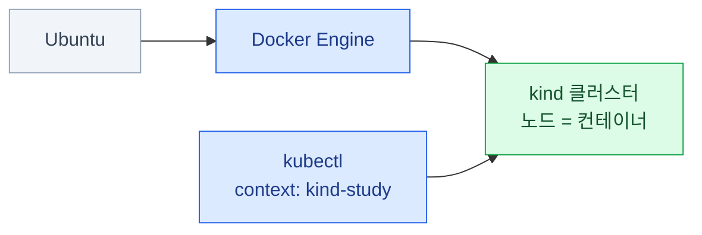

import { LinkCard, Steps } from '@astrojs/starlight/components';
import TermIntro from '../../../components/docs/TermIntro.astro';

> Ubuntu에서는 Docker Engine이 호스트에서 직접 돌고, 그 위에 `study` kind 클러스터를 만든다

<TermIntro
  terms={[
    ['kind', 'Kubernetes IN Docker', 'Docker 컨테이너를 Kubernetes 노드로 쓰는 로컬 클러스터 도구. 클러스터를 빠르게 만들고 통째로 다시 만들기 좋다.'],
    ['Docker Engine', '', 'Ubuntu 호스트에서 컨테이너를 실행하는 daemon과 CLI. macOS와 달리 중간 Linux VM이 필요 없다.'],
    ['context', 'kubectl context', '`kubectl`이 접속할 클러스터·사용자·기본 namespace의 묶음. `study` 클러스터를 만들면 `kind-study`가 생긴다.'],
  ]}
/>

Ubuntu에서는 Docker Engine이 호스트 자원을 직접 쓰고, kind 노드 컨테이너를 실행한다.



kind는 워크로드·스케줄링·서비스·RBAC 실습에 알맞다. 노드가 컨테이너이므로 `kubeadm` 설치나
노드 OS 업그레이드는 [CKA 0장](/cka/00-intro/#실습-환경은-따로-준비하자)의 다른 환경을 쓴다.

## 준비할 자원

단일 노드 기본 실습은 CPU 2개·메모리 4 GiB로도 시작할 수 있다. 멀티노드나 관측 스택처럼
Pod가 많은 실습은 **CPU 4개·메모리 8 GiB**를 권장한다. 디스크 여유는 최소 10 GiB를 남긴다.
Ubuntu Docker Engine은 별도 VM 할당량이 아니라 호스트의 자원을 사용한다.

## 공식 문서에서 설치하기

설치 명령은 이 문서에 복제하지 않는다. 아래 공식 문서의 해당 절을 열고, 지원 Ubuntu 버전과
현재 표시되는 명령을 확인한 뒤 실행한다.

1. [Docker Engine — Install using the apt repository](https://docs.docker.com/engine/install/ubuntu/#install-using-the-apt-repository)를 따라 Docker Engine을 설치한다. 기존 `docker.io`나 `containerd`가 있다면 같은 페이지의 충돌 패키지 안내를 먼저 확인한다.
2. `sudo` 없이 Docker를 쓸 필요가 있으면 [Docker — Manage Docker as a non-root user](https://docs.docker.com/engine/install/linux-postinstall/#manage-docker-as-a-non-root-user)를 따른다.
3. [kind — Installing From Release Binaries](https://kind.sigs.k8s.io/docs/user/quick-start/#installing-from-release-binaries)의 Linux 절에서 CPU 아키텍처에 맞는 kind를 설치한다.
4. [kubectl — Install binary with curl on Linux](https://kubernetes.io/docs/tasks/tools/install-kubectl-linux/#install-kubectl-binary-with-curl-on-linux)에서 아키텍처에 맞는 kubectl과 checksum을 받아 검증한 뒤 설치한다.

:::caution[Docker 권한]
Docker 공식 문서가 경고하듯 `docker` 그룹은 사용자에게 root 수준 권한을 준다. 여러 사용자가 함께 쓰는
서버라면 자동으로 그룹에 추가하지 말고 전용 실습 계정·rootless mode·`sudo docker` 중 정책에 맞는
방식을 고른다.
:::

설치가 끝나면 세 명령이 모두 성공하는지 확인한다.

```bash
docker info
kind version
kubectl version --client
```

## 클러스터 만들고 확인하기

이 장은 클러스터 이름을 `study`, kubectl context를 `kind-study`로 고정한다.

<Steps>

1. **단일 노드 클러스터를 만든다**

   ```bash
   kind create cluster --name study --wait 5m
   ```

2. **생성된 클러스터와 context를 확인한다**

   ```bash
   kind get clusters
   kubectl config get-contexts
   kubectl --context kind-study get nodes -o wide
   kubectl --context kind-study cluster-info
   ```

   노드가 `Ready`이고 cluster-info가 control plane 주소를 보여 주면 준비가 끝났다.

3. **노드가 실제 컨테이너인지 본다**

   ```bash
   docker ps --filter label=io.x-k8s.kind.cluster=study
   ```

</Steps>

## 여러 노드가 필요할 때

스케줄링·노드 선택·장애 실습은 control plane 1대와 worker 2대를 만든다. 아래 설정을
`kind-study.yaml`로 저장한다.

```yaml
kind: Cluster
apiVersion: kind.x-k8s.io/v1alpha4
nodes:
  - role: control-plane
  - role: worker
  - role: worker
```

기존 클러스터의 노드 수는 제자리에서 바꿀 수 없다. 데이터가 필요 없는지 확인한 뒤 다시 만든다.

```bash
kind get clusters
kind delete cluster --name study
kind create cluster --name study --config kind-study.yaml --wait 5m
kubectl --context kind-study get nodes
```

특정 Kubernetes 버전이 필요하면 [kind 릴리스](https://github.com/kubernetes-sigs/kind/releases)에
나온 `kindest/node` 이미지와 SHA256을 함께 고정한다.

## 멈추기와 완전히 정리하기

### 다음에 다시 쓸 때

전용 실습 머신에서 Docker의 다른 작업도 함께 멈춰도 된다면 Docker Engine을 중단할 수 있다.

```bash
sudo systemctl stop docker.service docker.socket

# 다음 실습 때
sudo systemctl start docker
kubectl --context kind-study get nodes
```

공유 머신에서는 Docker 서비스 중단이 다른 컨테이너도 멈춘다. 그 경우 클러스터를 실행한 채 두거나,
실습을 마쳤다면 클러스터만 삭제한다.

### 클러스터를 다 썼을 때

Pod·Secret·PVC 데이터가 모두 사라져도 되는지 확인한다. 목록에서 이름을 확인한 뒤 그 클러스터만 삭제한다.

```bash
kind get clusters
kind delete cluster --name study
kind get clusters
kubectl config get-contexts
```

`kind delete clusters --all`과 `docker system prune`은 다른 실습까지 영향을 줄 수 있으므로 일반적인
cleanup에 사용하지 않는다. kind 클러스터를 삭제해도 별도로 만든 Docker 이미지와 호스트 파일은 남는다.

## 안 될 때 어디를 보나

| 증상 | 먼저 확인 | 흔한 원인과 다음 행동 |
|---|---|---|
| Docker daemon에 연결할 수 없음 | `systemctl status docker` · `docker info` | 서비스 미기동 또는 Docker socket 권한 |
| `permission denied`와 `docker.sock`이 함께 나옴 | 현재 그룹과 Docker post-install 절 | 그룹 변경 후 재로그인이 안 됐거나 권한 정책이 다름 |
| 클러스터 생성 timeout | 호스트 메모리·디스크, Docker 상태 | 자원 부족, 이미지 다운로드 실패, 프록시 |
| `kubectl`이 엉뚱한 클러스터를 봄 | `kubectl config current-context` | 명령에 `--context kind-study`를 붙여 다시 확인 |
| 노드가 `NotReady` | `kubectl --context kind-study describe node` | Docker 재시작 직후 복구 중이거나 CNI 문제 |

클러스터 생성 문제는 `kind export logs --name study ./kind-logs`로 노드 로그를 모아 확인한다.

<LinkCard
  title="처음으로 — 덱 개요"
  description="운영체제별 Kubernetes 실습 환경 목록으로 돌아간다."
  href="/lab-environment/"
/>
