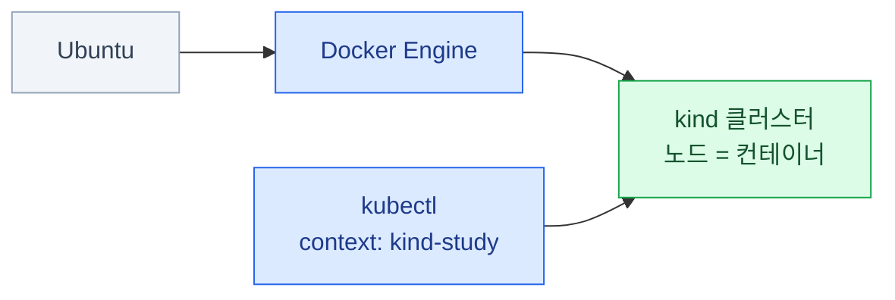

import { LinkCard } from '@astrojs/starlight/components';
import ExternalLink from '../../../components/docs/ExternalLink.astro';
import TermIntro from '../../../components/docs/TermIntro.astro';

> Ubuntu에서는 Docker Engine이 호스트에서 직접 돌고, 그 위에 `study` kind 클러스터를 만든다

<TermIntro
  terms={[
    ['kind', 'Kubernetes IN Docker', 'Docker 컨테이너를 Kubernetes 노드로 쓰는 로컬 클러스터 도구. 클러스터를 빠르게 만들고 통째로 다시 만들기 좋다.'],
    ['Docker Engine', '', 'Ubuntu 호스트에서 컨테이너를 실행하는 daemon과 CLI. macOS와 달리 중간 Linux VM이 필요 없다.'],
    ['context', 'kubectl context', '`kubectl`이 접속할 클러스터·사용자·기본 namespace의 묶음. `study` 클러스터를 만들면 `kind-study`가 생긴다.'],
  ]}
/>

Ubuntu에서는 Docker Engine이 호스트 자원을 직접 쓰고, kind 노드 컨테이너를 실행한다.



이 장에서는 Ubuntu에 runtime과 CLI를 준비한다. 준비가 끝나면 [2. kind — 공통](/lab-environment/03-kind-common/)에서
클러스터를 만들고 확인하고 정리한다.

## 준비할 자원

단일 노드 기본 실습은 CPU 2개·메모리 4 GiB로도 시작할 수 있다. 멀티노드나 관측 스택처럼
Pod가 많은 실습은 **CPU 4개·메모리 8 GiB**를 권장한다. 디스크 여유는 최소 10 GiB를 남긴다.
Ubuntu Docker Engine은 별도 VM 할당량이 아니라 호스트의 자원을 사용한다.

## 설치하기

설치 명령은 이 문서에 복제하지 않는다. 각 도구의 공식 문서를 새 창으로 열어 지원 Ubuntu 버전과
현재 표시되는 명령을 확인한 뒤 실행한다.

### Docker 설치

<ExternalLink href="https://docs.docker.com/engine/install/ubuntu/#install-using-the-apt-repository">Docker Engine — Install using the apt repository</ExternalLink>를
따라 Docker Engine을 설치한다. 기존 `docker.io`나 `containerd`가 있다면 같은 페이지의 충돌 패키지
안내를 먼저 확인한다.

`sudo` 없이 Docker를 쓸 필요가 있으면 <ExternalLink href="https://docs.docker.com/engine/install/linux-postinstall/#manage-docker-as-a-non-root-user">Docker — Manage Docker as a non-root user</ExternalLink>를 따른다.

:::caution[Docker 권한]
Docker 공식 문서가 경고하듯 `docker` 그룹은 사용자에게 root 수준 권한을 준다. 여러 사용자가 함께 쓰는
서버라면 자동으로 그룹에 추가하지 말고 전용 실습 계정·rootless mode·`sudo docker` 중 정책에 맞는
방식을 고른다.
:::

### kind 설치

<ExternalLink href="https://kind.sigs.k8s.io/docs/user/quick-start/#installing-from-release-binaries">kind — Installing From Release Binaries</ExternalLink>의
Linux 절에서 CPU 아키텍처에 맞는 kind를 설치한다.

### kubectl 설치

<ExternalLink href="https://kubernetes.io/docs/tasks/tools/install-kubectl-linux/#install-kubectl-binary-with-curl-on-linux">kubectl — Install binary with curl on Linux</ExternalLink>에서
아키텍처에 맞는 kubectl과 checksum을 받아 검증한 뒤 설치한다.

## 준비 확인

설치가 끝나면 세 명령이 모두 성공하는지 확인한다.

```bash
docker info
kind version
kubectl version --client
```

## 다음에 다시 쓸 때

전용 실습 머신에서 Docker의 다른 작업도 함께 멈춰도 된다면 Docker Engine을 중단할 수 있다.

```bash
sudo systemctl stop docker.service docker.socket

# 다음 실습 때
sudo systemctl start docker
kubectl --context kind-study get nodes
```

공유 머신에서는 Docker 서비스 중단이 다른 컨테이너도 멈춘다. 그 경우 클러스터를 실행한 채 두거나,
실습을 마쳤다면 클러스터만 삭제한다.

## Docker Engine이 시작되지 않을 때

| 증상 | 먼저 확인 | 흔한 원인과 다음 행동 |
|---|---|---|
| Docker daemon에 연결할 수 없음 | `systemctl status docker` · `docker info` | 서비스 미기동 또는 Docker socket 권한 |
| `permission denied`와 `docker.sock`이 함께 나옴 | 현재 그룹과 Docker post-install 절 | 그룹 변경 후 재로그인이 안 됐거나 권한 정책이 다름 |

<LinkCard
  title="2. kind — 공통"
  description="준비한 Docker Engine 위에 kind 클러스터를 만들고 확인하고 정리한다."
  href="/lab-environment/03-kind-common/"
/>
