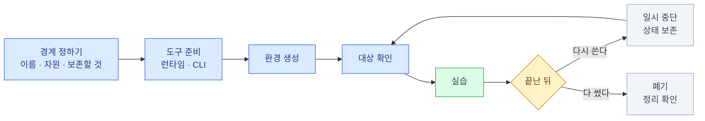

import { LinkCard, LinkButton } from '@astrojs/starlight/components';
import DeckMap from '../../../components/docs/DeckMap.astro';

> 좋은 실습 환경은 잘 뜨는 환경이 아니라, **무엇을 만들었고 어떻게 지울지 설명할 수 있는 환경**이다

실습마다 설치법을 다시 적으면 명령과 버전이 서로 달라지고, 정리 절차는 가장 먼저 빠진다.
이 덱은 여러 기술 덱이 공유할 **환경의 입구와 출구**를 한곳에 모은다. 개별 덱은 자기 실습에만
필요한 애플리케이션과 시나리오를 설명하고, 런타임·도구·격리·정리의 공통 원칙은 이곳을 가리킨다.

현재는 첫 환경으로 **kind를 이용한 로컬 Kubernetes 실습**을 다룬다. 덱 이름을 Kubernetes에
가두지 않은 이유는 앞으로 데이터베이스, 메시징, AI처럼 다른 종류의 실습 환경도 같은 자리에서
준비와 정리 계약을 공유하게 하기 위해서다.

<LinkButton href="/lab-environment/00-lifecycle/" icon="right-arrow">첫 장부터 읽기</LinkButton>

## 구성

<DeckMap
  steps={[
    { label: '0장', href: '/lab-environment/00-lifecycle/', title: '실습 환경의 수명주기', tone: 'key',
      desc: '격리 단위 · 이름 · 대상 확인 · 보존과 폐기 · 다른 덱이 지킬 계약',
      note: '환경을 만들기 전에 무엇부터 정해야 하나' },
    { label: '1장', href: '/lab-environment/01-kind/', title: 'kind — 로컬 Kubernetes', tone: 'ok',
      desc: 'macOS와 Ubuntu 준비 · 클러스터 생성 · 확인 · 일시 중단 · 완전 정리',
      note: '로컬 클러스터를 안전하게 만들고 지우는 한 바퀴는' },
  ]}
/>

## 다른 덱과의 경계

이 덱은 **재사용할 환경 절차**만 맡는다. 예를 들어 관측 실습은 여기서 kind를 준비한 뒤,
[관측 8장](/observability/08-lab-setup/)에서 LGTM 스택과 계측 앱을 올린다. CKA에서 kind로
연습할 수 있는 범위와 시험용 환경의 차이는 [CKA 0장](/cka/00-intro/)이 판단한다.

새 실습을 쓰는 덱은 다음 다섯 가지를 자기 문서에 남긴다.

| 항목 | 개별 덱이 적을 것 |
|---|---|
| 이름 | 클러스터·프로젝트·namespace처럼 다른 환경과 구분되는 이름 |
| 요구 자원 | CPU·메모리·디스크의 최소값과 권장값 |
| 버전 | 재현에 필요한 런타임·이미지·도구의 고정값 |
| 진입점 | `make up`처럼 준비를 한 번에 실행하는 명령과 상태 확인 명령 |
| 출구 | 무엇을 삭제하고 무엇을 남기는지 명시한 cleanup과 완료 확인 |

<LinkCard
  title="0. 실습 환경의 수명주기"
  description="실습별 경계를 먼저 정하고, 보존과 폐기를 구분해 안전하게 닫는 공통 원칙."
  href="/lab-environment/00-lifecycle/"
/>
