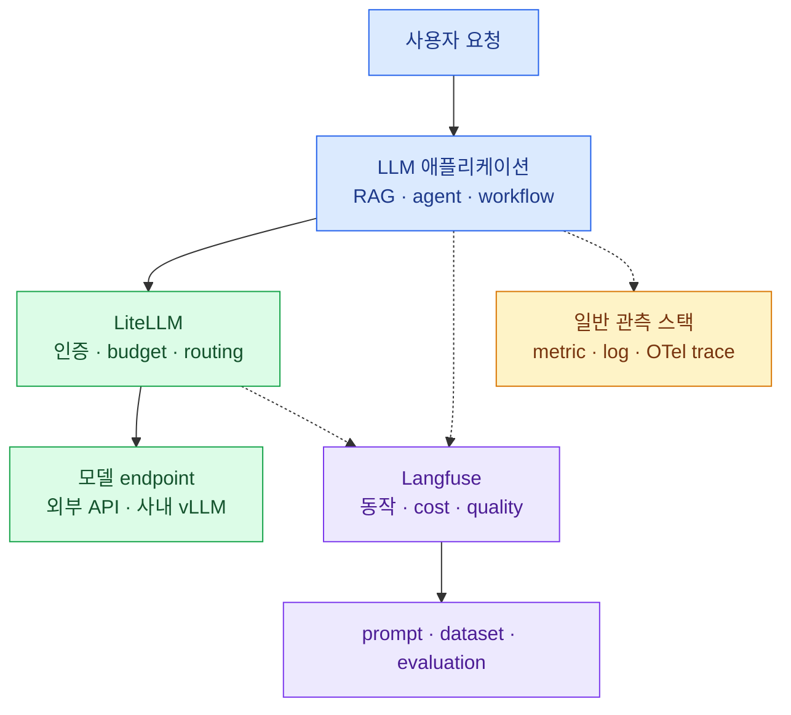

import { Card, CardGrid, LinkCard } from '@astrojs/starlight/components';
import TermIntro from '../../../components/docs/TermIntro.astro';

> Langfuse를 이해하는 가장 빠른 방법은 **LLM 앱의 실행 기록과 품질 판정을 만나는 곳**으로 보는 것이다

<TermIntro
  terms={[
    ['LLM observability', '', 'LLM 호출의 prompt·응답·token·cost와 그 앞뒤 단계를 같은 실행 문맥에서 추적하는 일이다.'],
    ['LLM engineering platform', '', '관측뿐 아니라 prompt 관리·평가·dataset 실험까지 개선 과정을 잇는 도구다.'],
    ['instrumentation', '', '애플리케이션 코드가 수행한 일을 observation으로 기록하도록 계측하는 과정이다.'],
    ['evaluation', '', '출력이 원하는 기준을 얼마나 만족하는지 score로 남기는 과정이다.'],
  ]}
/>

## 먼저 없으면 생기는 문제

일반 API는 status code와 latency만으로도 상당수 장애를 설명할 수 있다. LLM 앱은 그렇지 않다. 응답은 200이어도
틀릴 수 있고, 맞아도 지나치게 비싸거나 느릴 수 있다. agent가 tool을 잘못 골랐는지, 검색 문서가 나빴는지,
prompt version이 바뀌었는지 보려면 실행 내부의 의미가 필요하다.

| 질문 | HTTP/APM만 있을 때 | Langfuse에 문맥을 남겼을 때 |
|---|---|---|
| 왜 틀린 답이 나왔나 | 200이라 정상으로 보임 | retrieval·generation input/output과 score를 함께 봄 |
| 비용이 왜 늘었나 | endpoint latency만 있음 | model·usage·cost를 observation별로 집계 |
| prompt 변경 효과는 | 배포 전후 감상 | prompt version과 score를 release별 비교 |
| agent가 어디서 헤맸나 | 하나의 긴 요청 | agent·tool·generation tree로 단계별 확인 |
| 재발을 어떻게 막나 | incident 문서에 사례 복사 | production trace를 dataset item으로 승격 |

## 주변 도구와의 경계

Langfuse가 OpenTelemetry를 사용해도 Tempo 전체를 대체하지 않는다. DB query·HTTP client·CPU 포화는 일반 APM이
더 잘 답한다. 반대로 일반 span에는 prompt version, token usage, judge score가 없을 수 있다. 두 시스템은 trace id나
request id를 correlation contract로 연결한다.

## 무엇을 하는 제품인가

<CardGrid>
<Card title="Observability" icon="search">
Observation tree와 table에서 generation·tool·retrieval을 검색하고 latency·usage·cost를 비교한다.
</Card>
<Card title="Prompt Management" icon="pencil">
Prompt를 immutable version으로 저장하고 label로 production 배포와 rollback을 관리한다.
</Card>
<Card title="Evaluation" icon="approve-check">
사람·코드·LLM judge·사용자 feedback의 결과를 공통 score로 붙인다.
</Card>
<Card title="Datasets & Experiments" icon="list-format">
고정된 사례 집합에 앱을 반복 실행해 prompt·model·코드 변경을 production 전에 비교한다.
</Card>
</CardGrid>

네 기능은 따로 사는 메뉴가 아니다. trace에서 실패 사례를 고르고 dataset에 넣은 뒤 새 prompt version을 실험하고,
통과한 version을 production으로 보내 다시 trace와 score를 모으는 한 loop다.

## 무엇을 하지 않는가

- 모델 요청을 허용하거나 provider를 선택하지 않는다. 그것은 LiteLLM 같은 AI Gateway의 일이다.
- 모델을 실행하거나 GPU를 scheduling하지 않는다.
- score를 붙였다는 이유만으로 그 score가 실제 사용자 품질을 대표한다고 보장하지 않는다.
- SDK가 자동 계측한 tree를 저절로 좋은 분석 모델로 바꾸지 않는다. trace 범위와 안정된 이름은 앱이 설계해야 한다.
- self-hosting이 자동으로 보안을 완성하지 않는다. prompt 전문이 저장되는 네 저장소와 backup까지 데이터 경계에 들어온다.

## Cloud와 self-hosting을 고르는 기준

| 선택 | 얻는 것 | 직접 맡는 것 |
|---|---|---|
| Langfuse Cloud | application과 저장소 운영을 줄임 | region·plan·외부 전송 정책 검토 |
| Self-hosted | 사내 network와 storage boundary 통제 | Web·Worker와 Postgres·ClickHouse·Redis·S3의 가용성·backup·upgrade |

“데이터가 민감하다”만으로 self-hosting을 끝내지 않는다. 운영할 저장소가 네 종류이고 trace는 빠르게 커진다.
사내 반출 금지와 private connectivity가 실제 요구인지, masking한 metadata만 Cloud로 보내도 되는지부터 정한다.

## 도입 전에 답할 질문

| 질문 | 결정 예시 |
|---|---|
| trace 한 개의 범위는 | chatbot 한 turn, agent run 한 번 |
| 어떤 내용을 저장하는가 | production은 metadata 기본, 승인된 workload만 prompt 전문 |
| 품질을 무엇으로 재는가 | 사용자 feedback + sampled judge + 주간 human review |
| 어떤 변경을 비교하는가 | prompt version, model, application release |
| trace를 얼마 동안 보관하는가 | hot 30일, 승인된 export 1년 |
| gateway와 어떻게 잇는가 | application trace id + LiteLLM call id metadata |

## 참고 자료

- [Langfuse Core Concepts](https://langfuse.com/docs/observability/data-model) — observation·trace·session과 OpenTelemetry 기반 수집.
- [Langfuse Platform Architecture](https://langfuse.com/handbook/product-engineering/architecture) — Web·Worker와 네 저장소의 역할.
- [Langfuse Evaluation Concepts](https://langfuse.com/docs/evaluation/core-concepts) — offline/online 평가 loop와 score.

<LinkCard
  title="1. Observation-first 데이터 모델"
  description="trace, observation, generation, session과 score가 어떤 관계인지 한 실행을 펼쳐서 본다."
  href="/langfuse/01-data-model/"
/>
