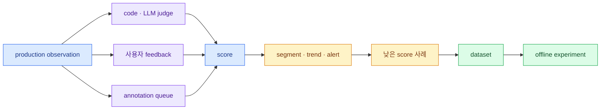

import { Card, CardGrid, LinkCard } from '@astrojs/starlight/components';
import TermIntro from '../../../components/docs/TermIntro.astro';

> Score는 품질 그 자체가 아니다 — **누가 어떤 rubric으로 어느 대상을 판정했는지 남긴 측정값**이다

<TermIntro
  terms={[
    ['rubric', '', '어떤 출력이 어떤 score를 받아야 하는지 예시와 경계를 포함해 정의한 채점 기준이다.'],
    ['LLM-as-a-Judge', '', '다른 LLM에게 input·output·기준을 주고 품질 score와 이유를 받는 평가 방식이다.'],
    ['annotation queue', '', '선별한 trace·observation·session을 사람이 일정한 score config로 검토하는 작업 목록이다.'],
    ['online evaluation', '', 'production에서 들어오는 observation 일부를 지속적으로 자동 또는 사람에게 평가하는 방식이다.'],
    ['calibration', '', '자동 evaluator 결과를 사람의 판단과 비교해 bias·threshold·불일치를 조정하는 과정이다.'],
  ]}
/>

## 평가 loop

online 평가는 production drift를 찾고, offline experiment는 변경을 배포 전에 비교한다. 둘은 경쟁하지 않는다.
production edge case가 dataset으로 돌아올 때 loop가 닫힌다.

## 네 평가 방식

<CardGrid>
<Card title="사용자 feedback" icon="comment">
thumbs up/down, 재질문, 해결 여부처럼 실제 사용자의 결과다. 가치가 높지만 선택 bias와 희소성이 있다.
</Card>
<Card title="Human annotation" icon="pencil">
도메인 전문가가 rubric으로 채점한다. ground truth와 judge calibration에 좋지만 느리고 비싸다.
</Card>
<Card title="Code evaluator" icon="code">
JSON schema, 금칙어, citation 존재, exact match처럼 결정적 검사를 싸고 반복 가능하게 수행한다.
</Card>
<Card title="LLM-as-a-Judge" icon="setting">
helpfulness·faithfulness·tone처럼 규칙만으로 어려운 기준을 scale한다. model bias와 비용을 관리해야 한다.
</Card>
</CardGrid>

가능하면 code evaluator로 판정 가능한 것을 먼저 처리한다. JSON parse 실패를 더 비싼 LLM judge에게 묻지 않는다.

## Score contract

| 항목 | 예시 |
|---|---|
| name | `answer-groundedness` |
| target | `generation: final-answer` |
| data type | numeric 0~1 |
| rubric version | `groundedness-v3` |
| source | `judge:gpt-5-mini` 또는 `human:policy-team` |
| sampling | production 5%, error cohort 100% |
| threshold | release gate 평균뿐 아니라 하위 구간 |

Langfuse score는 numeric·categorical·boolean·text를 지원한다. 숫자가 필요 없는 `pass/fail`을 억지로 0.0/1.0으로
바꾸면 dashboard는 쉽지만 의미를 잃을 수 있다. 반대로 1~5 rubric의 각 단계가 설명되지 않으면 annotator 사이의
차이가 커진다.

## LLM-as-a-Judge 설계

Judge prompt에는 최소한 평가 기준, application input, 평가할 output, 필요하면 reference answer나 retrieved context를
넣는다. judge model은 구조화 output을 지원해야 score parsing이 안정적이다.

좋은 judge 운영은 다음을 포함한다.

- 평가 대상 observation name/type을 고정한다.
- rubric과 judge prompt도 version 관리한다.
- reasoning은 debug에 쓰되 민감정보와 비용을 검토한다.
- production 전체가 아니라 segment별 sample을 선택한다.
- 사람 label set으로 precision·recall 또는 agreement를 정기 확인한다.
- 평가 자체의 trace와 cost를 application traffic과 별도 environment로 구분한다.

:::caution[함정]
Judge score가 오른 것은 application이 좋아진 결과일 수도 있고 judge model·rubric·input mapping이 바뀐 결과일 수도
있다. application release와 evaluator version을 같은 chart에서 분리해 본다.
:::

## Human annotation을 ground truth로 만든다

Annotation queue는 어려운 사례를 domain expert에게 배정하고 같은 score config로 검토하게 한다. 단순 thumbs up보다
좋은 ground truth가 되려면 다음이 필요하다.

1. rubric 단계마다 positive·negative·boundary example을 준다.
2. 일부 항목은 두 사람에게 중복 배정해 agreement를 잰다.
3. 불일치가 큰 기준은 사람을 탓하기 전에 rubric을 수정한다.
4. corrected output과 comment를 dataset expected output으로 승격할 기준을 둔다.

## Online 평가의 sampling

전량 judge는 비용과 queue를 키우고 같은 쉬운 요청을 반복 평가한다. 계층 sampling이 낫다.

| cohort | 비율 예시 | 목적 |
|---|---:|---|
| 전체 정상 traffic | 1~5% | baseline trend |
| 새 release·prompt version | 초기 20% | regression 조기 발견 |
| error·fallback·고비용 | 100% | 위험 구간 분석 |
| 낮은 user feedback | 100% | 불만 원인 분류 |
| 이미 많이 본 반복 input | 낮춤 | 평가 중복 절감 |

표본 비율은 dashboard와 함께 기록한다. 5% sample의 score count가 줄었는데 평균만 같으면 품질이 안정적이라고 단정할
수 없다.

## Release gate로 쓸 때

평균 하나보다 여러 조건을 둔다.

- 핵심 dataset의 task success가 기준 이하로 떨어지지 않는다.
- 안전성 boolean은 한 건도 실패하지 않는다.
- high-value tenant segment의 하위 10%가 악화되지 않는다.
- cost와 p95 latency가 허용 범위를 넘지 않는다.
- 새 version과 baseline의 표본 수가 충분하다.

자동 gate가 실패하면 trace sample을 먼저 열어 evaluator 오류인지 application regression인지 가른다.

## 참고 자료

- [Evaluation Core Concepts](https://langfuse.com/docs/evaluation/core-concepts) — score·평가 방법·offline/online loop.
- [Scores via API/SDK](https://langfuse.com/docs/evaluation/evaluation-methods/scores-via-sdk) — target과 score data type.
- [LLM-as-a-Judge](https://langfuse.com/docs/evaluation/evaluation-methods/llm-as-a-judge) — observation-level judge와 rubric 구성.
- [Annotation Queues](https://langfuse.com/docs/evaluation/evaluation-methods/annotation-queues) — 사람 검토 workflow.

<LinkCard
  title="6. Dataset과 experiment"
  description="Production 실패 사례를 고정된 test case로 만들고 새 prompt·model·코드를 같은 기준에서 비교한다."
  href="/langfuse/06-datasets-experiments/"
/>
