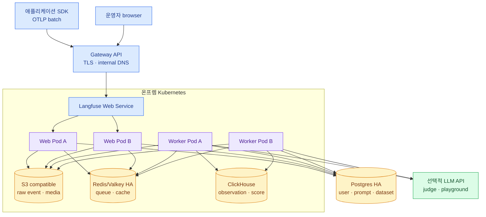

import { Card, CardGrid, LinkCard } from '@astrojs/starlight/components';
import TermIntro from '../../../components/docs/TermIntro.astro';

> Langfuse 고가용성은 Web Pod 수가 아니라 **수집 queue와 네 저장소의 복구 경계**에서 결정된다

<TermIntro
  terms={[
    ['Langfuse Web', '', 'UI, public ingestion API, prompt fetch와 관리 API를 제공하는 application container다.'],
    ['Langfuse Worker', '', 'Redis queue의 job을 가져와 raw event를 처리하고 ClickHouse에 적재하는 container다.'],
    ['OLTP', 'Online Transaction Processing', '사용자·project·prompt처럼 작은 변경과 관계를 정확히 처리하는 workload다.'],
    ['OLAP', 'Online Analytical Processing', '많은 observation을 기간·model·score로 집계하는 분석 workload다.'],
    ['BullMQ', '', 'Redis를 사용하는 background job queue로 Web과 Worker의 event 처리를 분리한다.'],
  ]}
/>

## Production 기준 구조



Web replica는 ingest와 UI를 받고 Worker replica는 queue를 소비한다. 둘은 독립적으로 scale하지만 같은 Postgres,
Redis, object storage, ClickHouse를 본다.

## 네 저장소의 역할

<CardGrid>
<Card title="Postgres — transaction" icon="seti:db">
사용자·organization·project·API key·prompt·dataset·evaluator 설정을 저장한다. tracing 대량 분석의 주 저장소가 아니다.
</Card>
<Card title="ClickHouse — analytics" icon="analytics">
Observation과 score를 높은 write throughput으로 받고 기간·model·name별 table·dashboard query를 처리한다.
</Card>
<Card title="Redis/Valkey — coordination" icon="random">
Web이 만든 background job queue와 API key·prompt cache를 맡는다. 단순 optional cache로만 보면 안 된다.
</Card>
<Card title="S3 — durable payload" icon="document">
Raw ingestion event와 image·audio 같은 media를 저장한다. Redis queue에는 큰 body 대신 S3 reference를 전달한다.
</Card>
</CardGrid>

저장소 하나를 잃었을 때의 손실이 다르다. Postgres restore만으로 trace가 돌아오지 않고, ClickHouse restore만으로
prompt와 project identity가 돌아오지 않는다.

## 수집과 조회의 경로

| 경로 | 흐름 | 병목 |
|---|---|---|
| ingest | SDK → Gateway → Web → S3 + Redis | Web CPU/network, object storage, Redis queue |
| processing | Worker → Redis/S3 → ClickHouse | Worker CPU, S3 read, ClickHouse insert/merge |
| trace query | Browser/API → Web → ClickHouse | query range, ClickHouse CPU/disk |
| prompt fetch | App → Web → Redis/Postgres | cache hit, Postgres latency |
| admin/eval | Browser/Worker → Postgres·LLM | DB connection, external model quota |

Ingest 2xx와 ClickHouse query freshness 사이에 queue가 있다. 이 decoupling이 burst를 흡수하지만 backlog가 계속
늘면 결국 S3·Redis·retention 비용과 관측 지연으로 돌아온다.

## Web과 Worker를 따로 scale한다

- Web: request rate, CPU, p95 ingest latency와 UI/API latency로 scale한다.
- Worker: CPU와 ingestion queue depth·oldest job age로 scale한다.
- ClickHouse: insert throughput보다 query와 merge, disk headroom을 함께 본다.
- Postgres: Web+Worker 최대 replica의 connection 합을 계산한다.
- Redis: memory뿐 아니라 queue durability·latency·failover 시간을 본다.

공식 scaling 문서는 2 CPU Worker에서 CPU 50% 이상을 saturation 신호의 하나로 제시하고 queue depth metric도
제공한다. 숫자를 그대로 threshold로 복사하지 말고 실제 event size와 masking/evaluator workload로 load test한다.

## ClickHouse는 한 shard다

공식 self-host 문서 기준 Langfuse는 multi-shard ClickHouse를 지원하지 않는다. 한 shard 안에서 production은 최소
3 replica를 권장한다. replica는 redundancy이지 write shard 증가가 아니다.

```text
지원하는 확장 축: shard 1개 × replica 여러 개
지원하지 않는 축: shard 여러 개로 project/row 분산
```

단일 shard의 disk·merge·query 한계에 가까워지면 무작정 shard 수를 늘리지 말고 retention, payload 크기, ClickHouse
Cloud/BYOC 또는 공식 지원 경로를 검토한다.

## Network 경계

| 방향 | allowlist |
|---|---|
| northbound SDK | application namespace → Gateway/Web OTLP·API |
| northbound UI | 사내 사용자/SSO → Web UI |
| state | Web·Worker → Postgres·Redis·S3·ClickHouse |
| evaluation | Worker/Web → 승인된 LLM API 또는 LiteLLM |
| telemetry | Web·Worker → 사내 OTLP collector, scraper |

Worker에 목적지 제한 없는 internet egress를 주면 judge나 playground는 편하지만 prompt가 외부로 나갈 새 경로가 된다.
LLM connection은 data classification에 맞춰 LiteLLM의 internal-only model contract를 쓰는 편이 통제하기 쉽다.

## 가용성 checklist

- Web과 Worker가 각각 node·zone에 분산되고 PDB가 있는가
- Redis queue failover 중 job loss·duplicate를 어떻게 검증했는가
- S3 event bucket이 versioning·lifecycle 정책과 Langfuse 동작에 맞는가
- ClickHouse replica·Keeper와 backup의 failure domain이 분리되는가
- Postgres·Redis·ClickHouse connection 상한이 max replica를 견디는가
- queue backlog 중에도 ingest를 어디까지 받을지 용량과 alert가 있는가
- prompt fetch cache miss 때 Postgres 장애가 application traffic에 미치는 영향이 시험됐는가

## 참고 자료

- [Langfuse Platform Architecture](https://langfuse.com/handbook/product-engineering/architecture) — Web·Worker, S3 reference queue와 저장소 역할.
- [Kubernetes Helm Deployment](https://langfuse.com/self-hosting/deployment/kubernetes-helm) — chart와 외부 storage 연결.
- [Scaling Langfuse](https://langfuse.com/self-hosting/configuration/scaling) — Worker scaling·queue depth와 대량 ingest 최적화.
- [ClickHouse Self-hosting](https://langfuse.com/self-hosting/deployment/infrastructure/clickhouse) — 단일 shard와 production replica 기준.

<LinkCard
  title="8. 배포와 v4 업그레이드"
  description="Helm value·Secret·probe·migration을 고정하고 새 설치와 v3→v4 전환을 구분한다."
  href="/langfuse/08-deploy-upgrade/"
/>
