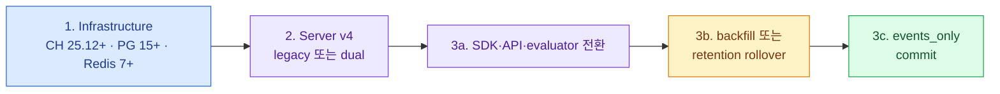

import { Steps, LinkCard } from '@astrojs/starlight/components';
import TermIntro from '../../../components/docs/TermIntro.astro';

> 새 설치는 v4로 곧장 가고, 기존 v3는 **write mode와 historic data를 분리해 단계적으로 옮긴다**

<TermIntro
  terms={[
    ['Helm chart', '', 'Kubernetes resource와 기본 dependency를 value로 조합해 release로 배포하는 package다.'],
    ['write mode', '', 'v4 전환 중 새 event를 legacy table, 새 events table 또는 둘 다에 쓸지 정하는 모드다.'],
    ['dual write', '', 'rollback 여지를 위해 전환 기간에 old/new table 모두에 event를 기록하는 방식이다.'],
    ['historic backfill', '', 'v3 table의 과거 trace·observation을 v4 events table로 background 복사하는 작업이다.'],
    ['point of commitment', '', '`events_only` 전환 뒤 새 data가 old table에 없어서 v3 read path로 완전히 돌아가기 어려워지는 지점이다.'],
  ]}
/>

## 새 설치의 결정 순서

<Steps>
1. **호환성 묶음을 고정한다**

   Langfuse server v4, Python SDK v4, JS/TS SDK v5, Helm chart와 Postgres·ClickHouse·Redis 최소 version을 함께 검증한다.
   image tag뿐 아니라 digest와 chart lock을 release record에 남긴다.

2. **외부 저장소를 먼저 만든다**

   Production은 Postgres·Redis/Valkey·ClickHouse·S3 호환 storage를 application Pod와 독립된 backup·HA 경계로 둔다.

3. **Secret과 URL을 정한다**

   Database credential, S3 key, `NEXTAUTH_SECRET`, `SALT`, `ENCRYPTION_KEY`, project/API 초기화 값과 public URL을
   Secret manager에서 주입한다.

4. **Web과 Worker를 배포한다**

   공식 chart의 Web/Worker replica, resource, PDB, topology spread와 connection 설정을 조직 overlay로 관리한다.

5. **UI보다 수집 한 바퀴를 검증한다**

   Project를 만들고 synthetic SDK trace가 Web ingest → S3 → Redis → Worker → ClickHouse → UI까지 도착하는지 본다.
</Steps>

공식 chart는 dependency를 함께 배포할 수도 있고 기존 Postgres·ClickHouse·Redis를 연결할 수도 있다. Local 실습의
all-in-one value를 production reference로 그대로 사용하지 않는다.

## Secret의 수명

| Secret | 잃으면 | 운영 원칙 |
|---|---|---|
| project secret key | 해당 producer 인증 실패 | workload/project별 분리·rotation |
| `NEXTAUTH_SECRET` | console session 검증 영향 | 고정·backup·rotation 절차 |
| `SALT` | API key hash 검증 영향 | DB backup과 함께 복구 |
| `ENCRYPTION_KEY` | 저장된 LLM/integration credential 복호화 불가 | 장기 보관·break-glass 복구 |
| DB/S3/Redis/CH credential | service 연결 실패 | short-lived 또는 주기 rotation |

값을 바꾸는 것은 단순 Pod restart가 아니다. 암호화 key와 DB data를 다른 backup 정책으로 두면 restore한 data를 읽지
못할 수 있다.

## Probe를 역할별로 둔다

| container | endpoint | 질문 |
|---|---|---|
| Web | `/api/public/health` | process/API가 살아 있는가 |
| Web | `/api/public/ready` | 종료 signal 없이 traffic을 받을 준비인가 |
| Worker | `/api/health` | worker process가 살아 있는가 |
| Worker | `/api/health?failIfQueueConsumptionStuck=true` | 설정 시간 동안 queue 소비가 멎었는가 |

Web health는 기본적으로 DB 연결까지 보장하지 않는다. liveness에 모든 저장소 query를 넣으면 dependency 장애가 Pod
재시작 폭풍으로 번진다. 별도의 synthetic/blackbox check로 end-to-end readiness를 보완한다.

## 새 release 검증

- migration log에 실패나 lock 경쟁이 없는가
- Web/Worker image가 같은 호환 release인가
- health/readiness와 graceful SIGTERM이 동작하는가
- prompt fetch와 cache가 정상인가
- v4 SDK trace가 즉시 observation table에 보이는가
- score, media, dataset experiment를 각각 한 번 썼는가
- queue depth가 steady state로 돌아오는가
- rollback할 chart·image·DB/CH backup point가 기록됐는가

## v3에서 v4로 옮기는 세 단계

공식 v4 migration guide의 최소 infrastructure는 ClickHouse 25.12, Postgres 15, Redis 7.0이며 권장 version은 더 높다.
기존 v3에서 ClickHouse를 먼저 호환 version으로 올린 뒤 server를 전환한다.

## Write mode 선택

| mode | 쓰는 곳 | 쓸 때 |
|---|---|---|
| `events_only` | v4 events table만 | 새 설치 또는 producer/API가 모두 v4-ready |
| `dual` | old + new | 점진 전환과 rollback safety |
| `legacy` | old 중심 | 짧은 호환 단계, 최종 상태로 두지 않음 |

Dual 기간에는 Python SDK 4.7.0+, JS/TS 5.4.0+ 또는 v4 header가 있는 OTel producer가 새 table에 실시간으로
들어간다. 더 오래된 producer는 지연될 수 있으므로 producer inventory와 freshness를 함께 본다.

## Historic data 두 선택

| 선택 | 장점 | 비용·조건 |
|---|---|---|
| automated backfill | 전체 과거 data를 v4 UI에서 유지 | ClickHouse 약 3배 disk headroom 계획 |
| retention rollover | 큰 backfill 없이 자연 소멸 대기 | dual write를 retention 한 주기 유지, 오래된 data 포기 |

:::caution[함정]
`events_only`로 cutover한 뒤 old table을 비우면 되돌릴 data source가 사라진다. producer·read API·observation-level
evaluator·export와 historic data를 모두 검증하기 전에는 old table을 truncate하지 않는다.
:::

## Helm과 ClickHouse upgrade 함정

공식 v3→v4 문서 기준 built-in ClickHouse를 쓰는 기존 Helm 배포는 v4 호환 ClickHouse로 가는 자동 upgrade path가
제한될 수 있다. 새 production은 external ClickHouse 또는 공식 operator 경로를 검토하고, bundled dependency를
선택했다면 다음 major upgrade rehearsal을 도입 전에 한다.

## 참고 자료

- [Kubernetes Helm](https://langfuse.com/self-hosting/deployment/kubernetes-helm) — 공식 chart 설치와 외부 storage.
- [Health and Readiness Endpoints](https://langfuse.com/self-hosting/configuration/health-readiness-endpoints) — Web·Worker probe 의미.
- [Migrate Langfuse v3 to v4](https://langfuse.com/self-hosting/upgrade/upgrade-guides/upgrade-v3-to-v4) — infrastructure, write mode, backfill과 cutover.
- [Versions & Compatibility](https://langfuse.com/docs/compatibility) — server·SDK·API의 GA와 제거 일정.

<LinkCard
  title="9. 저장소·backup·retention"
  description="네 저장소의 데이터와 복구 순서를 나누고 trace 성장률과 보존 정책을 함께 운영한다."
  href="/langfuse/09-storage-retention/"
/>
