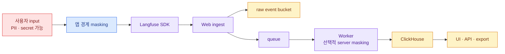

import { LinkCard } from '@astrojs/starlight/components';
import TermIntro from '../../../components/docs/TermIntro.astro';

> 가장 강한 masking 지점은 Langfuse Worker가 아니라 **민감정보가 아직 애플리케이션 안에 있을 때**다

<TermIntro
  terms={[
    ['data minimization', '', '질문에 답하는 데 필요한 최소한의 content와 metadata만 수집하는 원칙이다.'],
    ['client-side masking', '', 'SDK가 network로 보내기 전에 애플리케이션에서 민감정보를 제거하는 방식이다.'],
    ['server-side masking', '', 'Langfuse ingestion pipeline이 중앙 callback으로 event를 가공하는 self-hosted EE 기능이다.'],
    ['project key', '', 'SDK·API 요청을 project에 인증하는 public/secret key 한 쌍이다.'],
    ['RBAC', 'Role-Based Access Control', 'organization·project role에 따라 UI와 관리 기능 권한을 나누는 방식이다.'],
  ]}
/>

## 먼저 데이터 흐름을 분류한다

Server-side masking이 ClickHouse 전에 실행돼도 공식 self-host 경로에서는 raw event가 S3에 먼저 놓일 수 있다.
“중앙 masking이 있으니 민감정보가 저장되지 않는다”라고 가정하지 않는다.

### 수집 allowlist

| 필드 | 기본 정책 | 예외 |
|---|---|---|
| model·usage·latency | 수집 | model명이 기밀 taxonomy면 alias |
| prompt/response | 기본 masking 또는 미수집 | 승인된 workload와 짧은 retention |
| user id | 가명화 | reversible mapping은 별도 보호 |
| session id | 랜덤/opaque | 이메일·전화번호 사용 금지 |
| tool arguments | schema별 allowlist | credential·raw document 제거 |
| retrieved content | document id·score 중심 | 전문은 별도 승인 |
| metadata | key allowlist | 자유-form dump 금지 |

SDK debug mode와 exception stack도 data path다. production에서 debug log가 prompt와 key를 남기지 않는지 확인한다.

### 두 masking 층

| 층 | 장점 | 한계 |
|---|---|---|
| client-side | 민감정보가 app boundary를 떠나지 않음 | 여러 팀의 구현 일관성 필요 |
| server-side callback | 중앙 정책과 안전망 | self-hosted EE, callback latency/장애, raw event 선저장 고려 |

가장 민감한 data는 client에서 제거하고 server callback은 우회·누락을 잡는 safety net으로 쓴다. Server callback의
fail-open은 availability를 지키지만 masking 없이 저장할 수 있고, fail-closed는 privacy를 지키지만 trace를 버릴 수 있다.
workload classification에 따라 mode와 alert를 정한다.

## Project key와 관리 identity

- public key만으로 인증이 끝나지 않는다. secret key와 함께 Basic Auth에 사용한다.
- frontend/browser에 secret key를 넣지 않는다. backend 또는 collector가 trace를 보낸다.
- production·staging과 독립 service를 project/key로 분리한다.
- 한 key를 전사 공용으로 쓰지 않고 workload owner·rotation·last used를 추적한다.
- key를 log·trace metadata·Helm value repository에 남기지 않는다.
- rotation은 새 key 배포 → ingest 확인 → old key revoke 순으로 겹쳐서 한다.

## UI authentication과 authorization

Self-hosted는 email/password와 SSO를 지원한다. 조직이 OIDC/SSO를 쓰면 public URL과 `NEXTAUTH_URL`, callback URL,
account linking을 검증하고 username/password 비활성화 여부를 정한다.

| 계층 | 통제 |
|---|---|
| instance | 누가 account를 만들 수 있는가 |
| organization | owner·admin·member 역할 |
| project | trace·prompt·dataset 접근 |
| prompt deployment | `production` label 변경 권한 |
| API | project key와 관리 API 권한 |

Enterprise 기능 여부가 role·protected label·SSO 형태에 영향을 줄 수 있으므로 license availability를 도입 version에서
확인한다.

## Network와 TLS

Langfuse container 자체가 TLS termination을 맡지 않는다. Gateway/Load Balancer 또는 service mesh에서 TLS를 처리하고,
다음 hop의 암호화 요구를 정한다.

- SDK → Gateway: TLS, 사내 CA와 hostname 검증
- Gateway → Web: 내부 HTTP 허용 또는 mTLS
- Web/Worker → storage: provider가 지원하는 TLS와 server identity 검증
- Worker → judge LLM: LiteLLM allowlist와 data zone 보존
- Admin UI: SSO·CSP·cookie domain과 public trace 기능 통제

NetworkPolicy는 Web과 Worker를 같은 egress rule로 묶지 않는다. Web은 client ingress를 받고, Worker는 queue/storage와
선택적 LLM callback으로 나간다.

## Encryption과 key backup

공식 문서에서 API key는 `SALT`로 hash되고 console JWT는 `NEXTAUTH_SECRET`, 저장된 LLM/integration credential은
`ENCRYPTION_KEY`로 보호된다. Storage at-rest encryption과 application-level encryption은 서로 대체하지 않는다.

이 key들은 Git이나 일반 ConfigMap이 아니라 Secret manager에 두고 DB backup의 전체 수명만큼 복구 가능하게 보존한다.
key rotation 전에 어떤 column을 재암호화해야 하는지 version별 절차를 확인한다.

## 공개 trace와 export

Trace/session public sharing은 일반 project membership check를 우회하는 의도적 예외다. 내부 production에서는 기본
비활성·승인 정책을 두고, 공개 전에 prompt·tool argument·metadata·media 전체를 확인한다.

Blob export, PostHog/Mixpanel 연동, backup도 새로운 data processor이자 egress다. UI만 private라고 데이터가 사내에
머무는 것이 아니다.

## 보안 검증 checklist

- canary PII와 fake secret이 client masking 뒤 어디에도 남지 않는가
- S3 raw event와 error log도 검사했는가
- project key를 revoke하면 새 ingest가 거절되는가
- SSO offboarding 뒤 project 접근이 즉시 사라지는가
- production label을 허용된 role만 바꿀 수 있는가
- NetworkPolicy가 Worker의 임의 internet egress를 막는가
- backup restore 후 encryption key로 저장 credential을 읽을 수 있는가
- public link와 export가 security review 범위에 들어가는가

## 참고 자료

- [Data Masking](https://langfuse.com/self-hosting/security/data-masking) — client-side와 server-side EE masking의 순서·fail mode.
- [Self-hosted Authentication and SSO](https://langfuse.com/self-hosting/security/authentication-and-sso) — email/password·OIDC와 계정 설정.
- [Encryption](https://langfuse.com/self-hosting/configuration/encryption) — TLS·at-rest와 application key의 역할.
- [Langfuse Security FAQ](https://langfuse.com/security/security-faq) — project API key와 self-host shared responsibility.

<LinkCard
  title="11. 일상 운영과 관측"
  description="Langfuse가 관측하는 앱과 Langfuse 자체를 구분하고 queue freshness·storage·SLO를 운영한다."
  href="/langfuse/11-operations/"
/>
