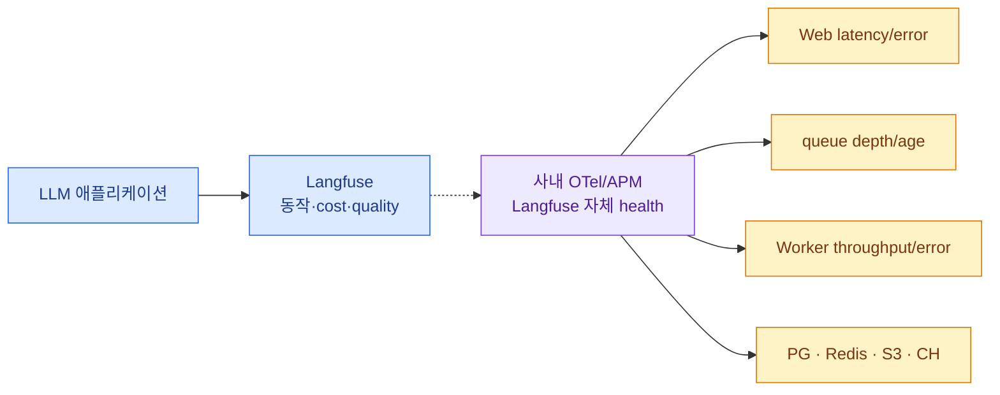

import { LinkCard } from '@astrojs/starlight/components';
import TermIntro from '../../../components/docs/TermIntro.astro';

> Langfuse dashboard가 열리는 것보다 중요한 SLO는 **방금 받은 trace가 언제 검색 가능해지는가**다

<TermIntro
  terms={[
    ['ingest availability', '', 'SDK event를 Web API가 받아 durable pipeline에 넣을 수 있는 비율이다.'],
    ['data freshness', '', 'event를 받은 시각부터 ClickHouse query와 UI에 나타날 때까지 걸리는 시간이다.'],
    ['queue depth', '', 'Worker가 아직 처리하지 못한 job 수로 burst와 지속 backlog를 구분하는 신호다.'],
    ['oldest job age', '', 'queue에서 가장 오래 기다린 event의 나이로 사용자가 겪는 실제 지연에 가깝다.'],
    ['self-observability', '', 'Langfuse 자체 Web·Worker·storage를 외부 OTel·metric·log stack으로 관측하는 일이다.'],
  ]}
/>

## 두 관측 평면을 나눈다

Langfuse로 Langfuse 자체 장애를 관측하면 backend 장애 때 증거도 함께 사라진다. Web/Worker는 별도 collector와
Prometheus/log stack으로 보낸다.

## 핵심 SLI

| 영역 | SLI | 대표 alert |
|---|---|---|
| ingest | OTLP request rate·2xx/4xx/5xx·p95 | 5xx 급증, auth 401 급증 |
| freshness | ingest timestamp → query visible | p95 freshness SLO 초과 |
| queue | waiting/active/failed, oldest age | depth와 age가 함께 증가 |
| Worker | consume throughput·error·CPU | 처리율이 유입률보다 지속 낮음 |
| ClickHouse | insert/query latency·merge·disk | disk headroom 부족, query timeout |
| Postgres | connection·query·lock·disk | max connection 접근, migration lock |
| Redis | latency·memory·eviction·failover | queue command error, memory pressure |
| S3 | put/get latency·error·capacity | raw event write 실패 |
| prompt | fetch error·cache miss latency | cold start에서 prompt fetch 실패 |

Queue depth가 크더라도 처리율이 더 크면 burst를 흡수 중일 수 있다. depth가 작아도 오래된 한 job이 막혀 있으면 특정
project data가 늦는다. depth, oldest age, arrival/consume rate를 같이 본다.

## Health endpoint와 synthetic

Probe는 process lifecycle에 쓰고 synthetic은 pipeline SLO에 쓴다.

1. 고유한 trace id와 작은 payload를 OTLP로 보낸다.
2. ingest status와 latency를 기록한다.
3. 제한 시간 안에 Observations API v2에서 찾는다.
4. observation에 environment·release·usage가 보이는지 검증한다.
5. 별도 synthetic prompt를 `production` label로 fetch한다.

Synthetic이 실패하면 사용자 LLM 요청을 실패시키지 않고 Langfuse pipeline incident로 연다.

## Langfuse 자체 OTel

Self-hosted Web과 Worker는 `OTEL_EXPORTER_OTLP_ENDPOINT`, `OTEL_SERVICE_NAME`, sampling ratio를 설정해 내부 span을
외부 collector로 보낼 수 있다. Web과 Worker service name을 분리하고 export endpoint가 Langfuse 자신을 다시
가리키는 loop가 되지 않게 한다.

## Capacity routine

매주 또는 traffic change 전에 다음을 본다.

- observation/day, event bytes/day와 agent step 분포
- Web request/CPU와 Worker consume/CPU의 비율
- queue peak와 drain 시간
- ClickHouse disk 증가율·merge·query range
- Postgres connection headroom과 slow query
- S3 event/media bucket 증가와 retention delete
- online evaluator 비율·judge token·cost

HPA로 Worker만 늘려도 ClickHouse insert·S3 read·DB connection이 함께 늘어난다. downstream이 포화된 상황에서 replica를
늘리면 병목을 더 세게 두드릴 수 있다.

## 변경 관리

| 변경 | canary 확인 |
|---|---|
| server/chart upgrade | migration, ingest freshness, query, prompt fetch |
| SDK major/patch | tree shape, attribute propagation, duplicate/drop span |
| prompt label 이동 | 실제 version 분포, quality/cost online score |
| masking rule | canary PII 제거, payload size, callback fail mode |
| retention | ClickHouse/S3 delete와 dataset link |
| Worker scale | queue drain, CH insert, duplicate 처리 |

SDK upgrade는 application dependency 변경이면서 telemetry schema 변경이다. trace count만 같다고 성공이 아니라 name/type,
parent, usage, trace-wide attribute가 같은지 비교한다.

## 운영 주기

### 매일

- ingest error와 freshness SLO
- queue backlog·failed job
- ClickHouse/Redis/Postgres/S3 health와 disk
- masking callback·judge evaluator failure

### 매주

- release·prompt version별 score·cost·latency
- low-score trace를 dataset으로 승격
- noisy observation name·불필요 payload 정리
- capacity trend와 retention 효과

### Release마다

- server/SDK compatibility matrix 확인
- backup·rollback point와 migration plan
- synthetic trace·prompt·score·experiment smoke test
- graceful shutdown에서 SDK/Worker event 유실 확인

## Alert를 사용자 영향으로 번역한다

| 신호 | 사용자에게 보이는 것 |
|---|---|
| Web ingest 5xx | trace가 client queue에서 retry되거나 유실 |
| Redis queue backlog | 앱은 정상, UI data가 늦음 |
| ClickHouse query timeout | ingest는 되지만 table/dashboard가 느림 |
| Postgres 장애 | login·prompt·dataset과 일부 API 실패 |
| S3 put 실패 | raw event를 durable하게 받지 못함 |
| evaluator 실패 | trace는 있으나 quality score가 빠짐 |

이 번역이 incident severity와 fail-open 결정을 만든다. Langfuse 장애 때문에 production answer까지 막을지 여부는 prompt
cache와 instrumentation 동기/비동기 경계에서 미리 정한다.

## 참고 자료

- [Scaling Langfuse](https://langfuse.com/self-hosting/configuration/scaling) — Worker CPU·queue depth와 ingest 확장.
- [Health and Readiness Endpoints](https://langfuse.com/self-hosting/configuration/health-readiness-endpoints) — probe와 stuck queue check.
- [Observability via OpenTelemetry](https://langfuse.com/self-hosting/configuration/observability) — Web·Worker 내부 span export.
- [Platform Architecture](https://langfuse.com/handbook/product-engineering/architecture) — 비동기 pipeline의 경계.

<LinkCard
  title="12. 장애 진단"
  description="Trace가 없거나 늦고, prompt fetch·query·평가가 실패할 때 pipeline 경계별로 원인을 좁힌다."
  href="/langfuse/12-troubleshooting/"
/>
