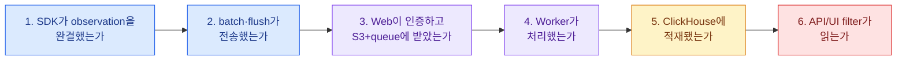

import { LinkCard } from '@astrojs/starlight/components';
import TermIntro from '../../../components/docs/TermIntro.astro';

> “Trace가 없다”를 한 증상으로 보지 말고 **만들기·보내기·받기·처리하기·조회하기**로 가른다

<TermIntro
  terms={[
    ['diagnostic ladder', '', '가장 바깥 증상에서 안쪽 dependency로 한 경계씩 확인하는 고정 진단 순서다.'],
    ['producer', '', 'Langfuse SDK나 OTel exporter로 observation을 보내는 애플리케이션 process다.'],
    ['backlog', '', '유입 속도보다 처리 속도가 낮아 queue에 누적된 job이다.'],
    ['freshness lag', '', 'ingest가 성공한 시각과 observation이 query에 보이는 시각의 차이다.'],
    ['poison event', '', '특정 payload나 schema 문제로 반복 실패하며 queue 처리를 방해하는 event다.'],
  ]}
/>

## 진단 사다리

UI refresh를 반복하기 전에 synthetic trace id 하나로 이 순서를 따른다. 여러 요청을 섞으면 각 경계의 log를 연결하기
어렵다.

### 증상별 첫 분기

| 증상 | 첫 확인 | 다음 경계 |
|---|---|---|
| 모든 trace가 없음 | endpoint·key·SDK debug·egress | Web access log·401/5xx |
| short job만 trace 없음 | flush/shutdown | client queue와 process lifecycle |
| ingest 2xx인데 늦음 | queue depth·oldest age | Worker error·ClickHouse insert |
| 특정 project만 없음 | project key·v4 header·SDK version | project filter·migration mode |
| root만 있고 child 없음 | context propagation·span filter | SDK integration 중복/allowlist |
| user/session filter에서 child 없음 | attribute propagation | root-only legacy mapping |
| UI는 느리고 ingest 정상 | ClickHouse query·disk·merge | query range·FINAL/migration state |
| prompt fetch 실패 | Web/Redis/Postgres·label 존재 | cache cold start·network |
| score만 없음 | evaluator target/name·queue | judge credential·structured output |

## Producer에서 Web까지

### Producer와 flush

다음을 같은 container에서 확인한다.

- `LANGFUSE_HOST`가 내부 endpoint와 base path를 정확히 가리키는가
- public/secret key가 같은 project의 pair인가
- 사내 CA와 TLS hostname 검증이 성공하는가
- proxy/NetworkPolicy가 OTLP HTTP를 허용하는가
- SDK debug에 export filter나 batch retry가 보이는가
- root·child observation이 exception 경로에서도 종료되는가
- CLI/serverless/termination 전에 flush 또는 shutdown하는가

Application 요청 성공은 exporter 성공과 독립이다. SDK가 logging만 하고 exception을 application으로 던지지 않는
경우가 있으므로 app status 200만 보지 않는다.

### Web ingest

Web access log에서 synthetic trace의 request 시각, status, project authentication을 찾는다.

- 401/403: key pair·Basic Auth·project·secret rotation
- 404: base path나 `/api/public/otel` endpoint 오류
- 413: Gateway/body size와 batch payload
- 429: Gateway 또는 application rate limit
- 5xx: Web log와 S3 put·Redis enqueue·Postgres lookup

Web 2xx 뒤에는 raw event object와 queue job이 연결돼야 한다. S3는 성공하고 Redis enqueue가 실패한 경우의 retry와
orphan object를 version 동작에서 확인한다.

## 3. Queue와 Worker

Queue depth·oldest age·arrival/consume rate와 failed job을 본다.

| 패턴 | 해석 |
|---|---|
| depth 급증 후 감소 | 일시 burst를 drain 중 |
| depth와 oldest age 지속 증가 | Worker throughput 또는 downstream 병목 |
| depth는 낮고 failed 증가 | poison event·credential·schema 문제 |
| 특정 Worker만 idle | consumer registration·queue assignment·network |
| CPU 100%, CH 정상 | parsing·masking·evaluator CPU 포화 |

Worker를 늘리기 전에 ClickHouse insert latency와 S3/Redis error를 본다. downstream이 원인이면 replica 추가가 backlog를
더 빠르게 downstream으로 밀어 장애를 키울 수 있다.

`/api/health?failIfQueueConsumptionStuck=true`는 장시간 어떤 queue job도 집거나 끝내지 못한 Worker를 찾는 보조 수단이다.
저traffic 다중 replica에서는 idle이 정상일 수 있으므로 threshold를 환경에 맞춘다.

## 4. ClickHouse와 v4 migration

Ingest가 처리됐는데 query에 없으면 다음을 확인한다.

- ClickHouse connection·insert error·readonly replica
- disk free와 merge/mutation backlog
- server write mode가 `events_only`, `dual`, `legacy` 중 무엇인가
- producer가 Python 4.7.0+/JS 5.4.0+ 또는 v4 ingestion header를 쓰는가
- historic backfill이 최신 data보다 우선순위를 방해하는가
- API가 deprecated endpoint가 아니라 Observations API v2를 보는가

전환 중 오래된 SDK/OTel producer는 new table 반영이 최대 수 분 늦을 수 있다. “가끔 10분 뒤 생긴다”면 network보다
compatibility와 write path를 먼저 본다.

## 5. Tree가 끊긴다

Root와 child가 서로 다른 trace로 보이면 비동기 boundary에서 OTel context가 유실됐는지 본다.

- thread/process/queue를 건널 때 context를 명시적으로 전달했는가
- framework integration과 수동 span이 서로 다른 tracer provider를 쓰는가
- smart span filter가 중간 parent만 drop했는가
- 이미 종료/export한 span을 뒤늦게 update하려 했는가
- 동일 LLM call을 wrapper와 수동 generation으로 중복 계측했는가

임시로 SDK debug를 켜 dropped span과 instrumentation scope를 확인하되 production payload 노출 시간을 제한한다.

## 6. Prompt와 evaluator

Prompt 문제는 trace ingestion과 다른 path다.

- name·type(text/chat)·`production` label이 존재하는가
- cache hit인지 cold fetch인지 구분했는가
- 일부 Pod만 stale version이면 TTL과 startup time이 다른가
- variable schema가 새 prompt version과 맞는가

Evaluator 문제는 target observation name/type, input/output mapping, judge LLM connection과 structured output parsing을
확인한다. Trace가 있어도 score가 없는 것은 ingestion incident와 severity가 다르다.

## Incident evidence bundle

- 영향 시간과 project/environment/release
- synthetic trace id, application request id, LiteLLM call id
- SDK/server/chart/ClickHouse version과 v4 write mode
- Web ingest status, queue depth/age, Worker failure sample
- ClickHouse insert/query/disk 상태
- 최근 prompt/evaluator/masking/retention 변경
- payload 전문이 제거된 최소 재현 event

## 하지 않을 것

- trace가 안 보인다고 SDK flush를 모든 요청마다 호출하기
- ClickHouse query가 느리다고 무작정 Worker를 늘리기
- liveness에 모든 storage와 외부 LLM call을 넣기
- key 문제를 master/admin credential 배포로 우회하기
- v4 전환 검증 전에 old table을 truncate하기
- masking 장애를 확인하려고 production prompt 전문을 log에 출력하기

## 참고 자료

- [Self-hosting Troubleshooting](https://langfuse.com/self-hosting/troubleshooting-and-faq) — 공식 증상별 점검과 지원 경로.
- [Event Queuing and Batching](https://langfuse.com/docs/observability/features/queuing-batching) — SDK flush와 retry 동작.
- [Health and Readiness](https://langfuse.com/self-hosting/configuration/health-readiness-endpoints) — Worker queue stuck probe.
- [Versions & Compatibility](https://langfuse.com/docs/compatibility) — v4 real-time SDK와 deprecated API 경계.

<LinkCard
  title="13. 용어 사전"
  description="Observation-first 모델, 평가와 self-hosting에서 반복되는 말을 한곳에서 다시 찾는다."
  href="/langfuse/13-glossary/"
/>
