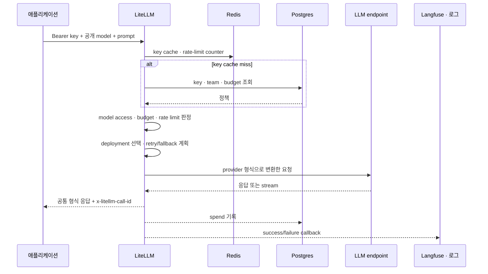

import { LinkCard } from '@astrojs/starlight/components';
import TermIntro from '../../../components/docs/TermIntro.astro';

> 장애를 빨리 가르려면 설정 파일보다 먼저 **요청이 멈출 수 있는 순서**를 외운다

<TermIntro
  terms={[
    ['request path', '', '클라이언트 요청이 응답으로 돌아오기까지 동기적으로 거치는 경로다.'],
    ['call_id', '', 'LiteLLM이 요청마다 만드는 식별자. gateway 로그와 외부 관측 데이터를 잇는 첫 단서다.'],
    ['callback', '', '요청 성공·실패 뒤 관측이나 외부 시스템으로 정보를 보내는 확장 지점이다.'],
    ['streaming', '', '응답 전체를 기다리지 않고 token 조각을 연결된 HTTP stream으로 계속 보내는 방식이다.'],
  ]}
/>

## 전체 순서

앞부분은 **들여보낼지**, 가운데는 **어디로 보낼지**, 끝부분은 **무슨 일이 있었는지 남길지**를 결정한다.
이 세 구간을 섞으면 provider 장애를 인증 장애로 오해한다.

## 1단계 — 인증과 정책 조회

`Authorization: Bearer ...`의 virtual key를 먼저 확인한다. key 정보가 Redis나 메모리 cache에 없으면
Postgres에서 찾는다. 여기에는 만료, 허용 모델, key·user·team의 budget 같은 정책이 걸린다.

이 구간의 대표 실패는 다음과 같다.

- 401/403: key가 없거나 허용 모델 밖이다.
- budget 관련 거절: key나 team의 기간 한도를 넘었다.
- DB timeout: cache miss인데 Postgres에서 정책을 못 읽었다.

provider까지 packet이 나가기 전이므로 이 실패를 모델 서버에서 찾지 않는다.

## 2단계 — 속도 제한

LiteLLM은 server·key·user·team 수준의 RPM(Requests Per Minute)과 TPM(Tokens Per Minute)을 확인할 수 있다.
여러 replica가 있을 때 Redis가 없으면 각 프로세스가 자기 counter만 세므로 전역 제한이 아니다.

:::caution[함정]
`replicas: 3`인데 Redis 없이 key의 RPM을 100으로 두면, load balancer 분산에 따라 이용자는 대략 세 프로세스의
한도를 각각 사용할 수 있다. 설정값이 100이라는 사실만으로 플랫폼 한도가 100이 되지 않는다.
:::

## 3단계 — deployment 선택

요청의 `model`은 공개 `model_name`이다. Router는 같은 이름 아래의 deployment 중 하나를 고르고,
실패 시 retry·cooldown·fallback 정책을 적용한다. 선택 결과는 다음 장들에서 다루지만 지금은
**인증을 통과한 뒤 provider 변환 전에 일어난다**는 위치만 잡는다.

## 4단계 — provider 변환

애플리케이션은 OpenAI 호환 요청을 보내지만 실제 endpoint는 Anthropic·Bedrock·Vertex AI·vLLM일 수 있다.
LiteLLM SDK 계층이 parameter와 응답, provider exception을 공통 형태로 바꾼다.

공통 형식이 모든 provider의 의미가 같다는 뜻은 아니다. tool call, reasoning, image, context window처럼
지원 범위가 다른 기능은 공개 모델 계약별 통합 시험이 필요하다.

## 5단계 — 응답 이후의 기록

공식 아키텍처에서는 응답을 클라이언트에 돌려준 뒤 spend logging, rate-limit accounting과 logging callback을
비동기 background task로 수행한다. 따라서 사용자 요청 성공과 관측 데이터 도착은 같은 시각이 아닐 수 있다.

운영자는 최소한 다음 식별자를 보존한다.

- `x-litellm-call-id`: LiteLLM 요청과 callback을 잇는다.
- 공개 모델명과 실제 deployment/model id: routing 결과를 확인한다.
- team·key의 비식별 식별자: 어느 정책이 적용됐는지 찾는다.
- provider status와 latency: gateway와 upstream을 가른다.

## streaming에서 달라지는 것

첫 token이 클라이언트에 전달된 뒤 upstream이 끊기면 다른 provider로 조용히 갈아타서 하나의 정상 응답처럼
합칠 수 없다. 이미 보낸 bytes를 되돌릴 수 없기 때문이다. streaming은 다음 시간을 따로 본다.

| 구간 | 질문 |
|---|---|
| 연결 전 | 인증·rate limit·routing이 얼마나 걸렸나 |
| 첫 token까지 | gateway queue인가, provider의 TTFT인가 |
| stream 중 | 중간 끊김과 client disconnect가 있는가 |
| 종료 뒤 | usage·cost와 callback이 정상 기록됐는가 |

## 참고 자료

- [Life of a Request](https://docs.litellm.ai/docs/proxy/architecture) — 요청 전 정책 확인부터 응답 뒤 비동기 작업까지의 공식 순서.
- [LiteLLM logging](https://docs.litellm.ai/docs/proxy/logging) — `call_id`, 응답 header와 callback 데이터.
- [Health checks](https://docs.litellm.ai/docs/proxy/health) — 요청 시험과 Kubernetes probe를 구분하는 기준.

<LinkCard
  title="2. 모델과 설정"
  description="공개 모델명 하나 뒤에 실제 provider deployment를 어떻게 배치하는지 읽는다."
  href="/litellm/02-model-config/"
/>
