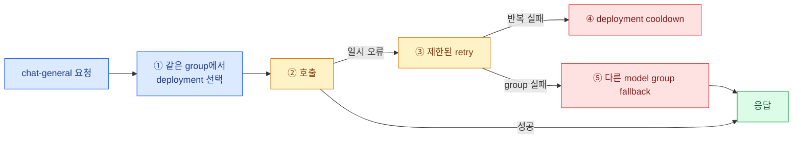

import { LinkCard } from '@astrojs/starlight/components';
import TermIntro from '../../../components/docs/TermIntro.astro';

> 신뢰성 설정은 실패를 없애지 않는다 — **실패에 쓸 수 있는 시간과 시도 횟수를 배분한다**

<TermIntro
  terms={[
    ['load balancing', '', '같은 model group 안의 여러 deployment 중 이번 요청을 보낼 곳을 고르는 일이다.'],
    ['retry', '', '실패한 호출을 같은 deployment 또는 같은 group 안에서 다시 시도하는 일이다.'],
    ['cooldown', '', '반복 실패한 deployment를 일정 시간 후보에서 빼는 상태다.'],
    ['fallback', '', '현재 model group이 실패한 뒤 다른 model group으로 넘어가는 동작이다.'],
  ]}
/>

## 네 동작의 순서



같은 모델명 두 항목은 load balancing 후보다. `chat-general → chat-small`은 fallback이다. 이 둘을
구분해야 장애 시 실제 품질·비용·데이터 경로가 왜 바뀌었는지 설명할 수 있다.

## routing 전략은 목표에서 고른다

공식 production 문서는 높은 처리량에 기본 `simple-shuffle`을 권장하며, 사용량 기반 전략은 요청 경로에
Redis 조회를 더할 수 있다고 설명한다. 전략 이름보다 먼저 목표를 정한다.

| 목표 | 확인할 것 |
|---|---|
| 균등 분산 | deployment별 capacity가 비슷한가 |
| 비용 최소화 | 저가 endpoint의 quota와 품질 계약을 지키는가 |
| latency 최소화 | 측정 창·cold start·지역 차이를 어떻게 반영하나 |
| provider quota 소진 방지 | RPM/TPM과 cooldown 상태를 replica가 공유하는가 |

사내 GPU endpoint는 replica 수가 같아도 GPU 종류·model parallelism·queue 길이가 다를 수 있다. LiteLLM의
routing만으로 model server 내부 queue를 완전히 이해한다고 가정하지 않는다.

## retry budget을 먼저 계산한다

요청 timeout이 30초인데 10초 timeout 호출을 세 번 한 뒤 fallback을 두 번 하면 gateway overhead를 빼도
사용자 제한을 넘는다. 다음 관계로 상한을 먼저 본다.

```text
전체 최악 시간 ≈ deployment 시도 시간의 합 + retry backoff + fallback 시도 시간
```

retry는 무료가 아니다.

- 같은 요청의 비용이 여러 provider에서 발생할 수 있다.
- 생성형 응답은 재시도마다 내용이 달라질 수 있다.
- upstream이 처리했지만 응답만 유실된 경우 중복 실행이 된다.
- tool call이나 외부 mutation을 포함하면 애플리케이션의 idempotency가 필요하다.

## fallback은 계약 변경이다

다른 provider나 작은 모델로 넘어가면 성공률은 오르지만 품질·지역·가격·안전 정책이 바뀔 수 있다.
그래서 fallback graph를 단순 장애 대응 목록이 아니라 **승인된 계약 전환표**로 관리한다.

| 실패 종류 | 가능한 정책 | 사전 확인 |
|---|---|---|
| 429·5xx·timeout | 동급 deployment retry 후 동급 group fallback | 총 latency와 중복 비용 |
| context 초과 | 더 긴 context group | token 가격과 prompt 호환 |
| content policy | 승인된 다른 policy group | 조직 정책상 우회가 허용되는가 |
| 내부 모델 장애 | 외부 provider | 데이터 반출 등급이 허용되는가 |

:::caution[함정]
민감 데이터용 사내 모델의 fallback을 무조건 외부 provider로 두지 않는다. 가용성보다 데이터 경계가 우선인
모델은 실패를 명확히 반환하는 편이 맞다.
:::

## streaming 실패는 별도 계약이다

첫 token 전 오류는 다른 deployment로 바꿀 여지가 있다. 첫 token 뒤 오류는 이미 클라이언트가 일부 응답을
받았으므로 투명한 재시도가 어렵다. client는 partial response를 폐기할지, 사용자에게 이어서 시도하게 할지
정해야 한다.

## 장애 주입으로 검증한다

공식 문서는 최근 Proxy에서 `mock_testing_fallbacks`류 요청 flag가 효과가 없다고 명시한다. 비운영 환경에서
실제 retry 가능한 provider 오류를 만들고 정상 요청으로 검증한다.

1. deployment 하나에 429 또는 5xx를 내게 한다.
2. 실제 시도 횟수와 선택 순서를 로그로 확인한다.
3. 전체 latency가 client timeout 안인지 잰다.
4. fallback 뒤 실제 모델·지역·비용을 확인한다.
5. streaming은 첫 token 전과 후 실패를 따로 시험한다.
6. 장애가 끝난 뒤 cooldown에서 자동 복귀하는지 본다.

## 참고 자료

- [Fallbacks](https://docs.litellm.ai/docs/proxy/reliability) — 일반·context·content policy fallback과 실제 오류 기반 시험.
- [Routing and Load Balancing](https://docs.litellm.ai/docs/routing-load-balancing) — Router의 deployment 선택 범위.
- [Production Best Practices](https://docs.litellm.ai/docs/proxy/prod) — Redis와 `simple-shuffle`, request timeout 운영 기준.

<LinkCard
  title="5. Kubernetes 운영 구조"
  description="정책 계층을 여러 Pod로 만들 때 Service, Postgres, Redis와 migration을 어떻게 배치하는지 본다."
  href="/litellm/05-k8s-architecture/"
/>
