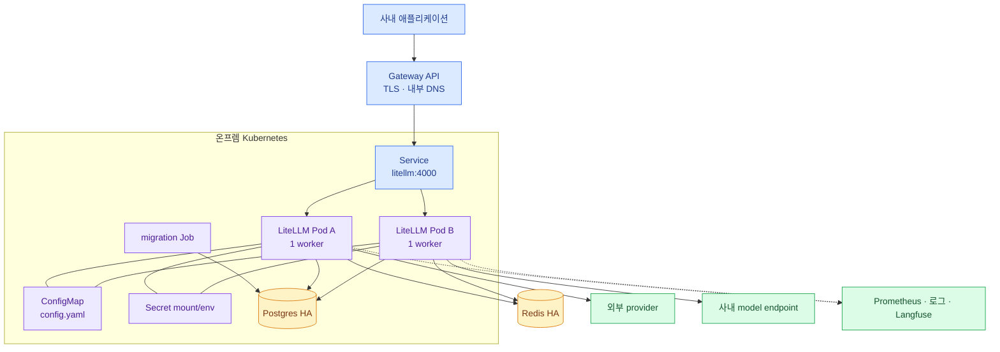

import { Card, CardGrid, LinkCard } from '@astrojs/starlight/components';
import TermIntro from '../../../components/docs/TermIntro.astro';

> Kubernetes에서 LiteLLM Pod는 가볍게 복제할 수 있다 — **어렵고 중요한 것은 Pod 밖의 공유 상태**다

<TermIntro
  terms={[
    ['monolithic', '', 'gateway traffic, 관리 API와 UI를 하나의 LiteLLM image·배포 단위로 운영하는 모드다.'],
    ['componentized', '', 'gateway·backend·ui를 나눠 각각 독립적으로 배포하고 확장하는 모드다.'],
    ['PDB', 'PodDisruptionBudget', '자발적 중단 중 동시에 사라져도 되는 Pod 수를 제한한다.'],
    ['migration job', '', '새 release가 요구하는 Postgres schema 변경을 serving Pod보다 앞서 한 번만 실행하는 Job이다.'],
  ]}
/>

## 권장 시작 구조



첫 production은 **monolithic chart, 2개 이상 replica, worker 1개/Pod**로 시작하는 편이 운영 경계가 작다.
트래픽 계층과 관리 UI의 확장·보안·release 주기를 분리해야 할 이유가 생기면 componentized 모드로 간다.

## 두 배포 모드

<CardGrid>
<Card title="Monolithic" icon="puzzle">
하나의 `litellm` 서비스가 LLM traffic, 관리 API와 UI를 제공한다. 공식 `litellm-helm` chart의 단순 경로다.
작은 플랫폼 팀이 요청 흐름과 상태부터 익히기에 적합하다.
</Card>
<Card title="Componentized" icon="seti:folder">
gateway `:4000`, backend `:4001`, UI `:3000`을 나눈다. gateway만 크게 확장하거나 관리 경로를 별도 정책으로
노출할 수 있지만 Service·routing·probe·version 호환의 운영 대상이 늘어난다.
</Card>
</CardGrid>

"microservices가 더 production답다"는 이유만으로 나누지 않는다. gateway와 관리 평면을 독립 확장하거나
장애·보안 경계를 분리할 명확한 요구가 있을 때 선택한다.

## northbound와 southbound 네트워크

LiteLLM은 양쪽 네트워크가 모두 중요하다.

| 방향 | 연결 | 실패 시 보이는 현상 |
|---|---|---|
| northbound | client → Gateway → LiteLLM Service | DNS·TLS·401·연결 timeout |
| state | LiteLLM → Postgres·Redis | readiness 실패, 인증·limit 불일치 |
| southbound internal | LiteLLM → vLLM/KServe/GPUStack | 특정 model 5xx·timeout |
| southbound external | LiteLLM → egress proxy → provider | proxy auth·CA·방화벽·429 |
| telemetry | LiteLLM → Langfuse/OTel, Prometheus → LiteLLM | 요청은 성공하지만 trace·metric 유실 |

NetworkPolicy와 방화벽은 이 방향별 allowlist로 만든다. LiteLLM Pod에 목적지 제한 없는 인터넷 egress를
주는 것은 provider 추가를 편하게 하지만 데이터 반출 경계도 없앤다.

## replica와 worker

공식 production 지침은 Kubernetes에서 Uvicorn worker를 Pod마다 하나 두고 Pod를 수평 확장하는 구성을
권장한다. 여러 worker를 한 Pod에 넣으면 CPU·메모리·DB connection·background job 수가 worker 수만큼
늘고 HPA가 내부 process를 구분하지 못한다.

```text
총 process 수 = replica 수 × Pod당 worker 수
```

Redis 필요 여부와 DB connection 상한은 Pod 수가 아니라 이 process 수를 기준으로 본다.

## probe와 종료

- liveness: `/health/liveliness` — process가 살아 있는지 본다.
- readiness: `/health/readiness` — traffic을 받을 준비와 configured DB 연결을 본다.
- model health: 별도 운영 점검 — 실제 provider가 추론 가능한지 본다.

liveness에서 provider 호출을 하면 provider 장애 때 모든 Pod가 재시작되는 연쇄 장애가 난다. 반대로 readiness가
너무 느슨하면 DB를 못 읽는 Pod가 traffic을 받는다. 세 질문을 한 endpoint로 합치지 않는다.

종료 때는 readiness를 먼저 내리고 기존 streaming 요청을 drain할 시간을 준다. `terminationGracePeriodSeconds`,
preStop/lifecycle과 Gateway timeout을 실제 최대 stream 시간에 맞춘다.

## 가용성 체크리스트

- replica는 서로 다른 node에 분산되고 PDB가 있는가
- Postgres·Redis도 LiteLLM과 다른 단일 장애점에 묶이지 않았는가
- HPA 최대 replica에서 DB connection 상한을 넘지 않는가
- migration은 별도 Job 한 곳만 실행하는가
- Gateway가 readiness를 보고 unhealthy Pod를 제외하는가
- rollout 중 긴 streaming 요청이 끊기지 않는가

## 참고 자료

- [Production Deployment](https://docs.litellm.ai/docs/proxy/deploy) — monolithic/componentized 구조, Helm과 상태 저장소.
- [Production Best Practices](https://docs.litellm.ai/docs/proxy/prod) — worker 1개/Pod, autoscaling과 graceful operation.
- [Health Checks](https://docs.litellm.ai/docs/proxy/health) — liveness·readiness와 model health의 차이.

<LinkCard
  title="6. 배포와 업그레이드"
  description="Helm values, Secret, migration과 검증 순서를 하나의 재현 가능한 release 흐름으로 만든다."
  href="/litellm/06-deploy/"
/>
