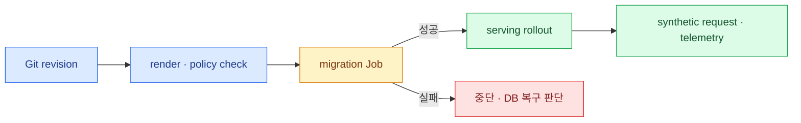

import { FileTree, LinkCard, Steps } from '@astrojs/starlight/components';
import TermIntro from '../../../components/docs/TermIntro.astro';

> 설치 성공은 Pod가 Running인 상태가 아니다 — **실제 요청·정책·상태·관측이 한 바퀴 도는 상태**다

<TermIntro
  terms={[
    ['Helm chart', '', 'Kubernetes 객체와 설정 기본값을 versioned package로 묶은 배포 단위다.'],
    ['image digest', '', '내용이 바뀌지 않는 container image의 해시 식별자다. tag보다 강한 재현성을 준다.'],
    ['schema migration', '', '새 application version에 맞게 database 구조를 순방향으로 바꾸는 작업이다.'],
    ['rollout', '', '기존 Pod를 새 revision Pod로 점진 교체하는 배포 과정이다.'],
  ]}
/>

## 배포 전에 준비할 것

LiteLLM chart보다 먼저 다음 의존성이 준비돼야 한다.

- HA Postgres와 전용 database/user, connection budget
- HA Redis와 인증·TLS, router/coordination 용도
- provider별 egress 경로, egress proxy와 사내 CA bundle
- 내부 DNS·TLS·Gateway API route
- secret manager에서 동기화한 master key·salt key·provider credential
- Prometheus scrape와 중앙 로그, 선택한 Langfuse endpoint

Postgres와 Redis를 chart 안의 임시 subchart로 함께 띄워 production 상태를 맡기지 않는다. 각각의 backup,
upgrade, failover와 용량 정책이 LiteLLM rollout과 분리돼야 한다.

## Git 구조

<FileTree>
- platform/
  - litellm/
    - **Chart.yaml** — wrapper 또는 dependency version 고정
    - **values.yaml** — 공통 topology와 resource
    - values-prod.yaml — production host·replica·limit
    - config/
      - **config.yaml** — 공개 모델·router·callback 정책
    - dashboards/ — 운영 dashboard와 alert rule
    - runbooks/ — rollout·DB·Redis·provider 장애 절차
</FileTree>

Secret 원문과 generated manifest는 이 트리에 두지 않는다. Secret 이름과 key contract만 version control한다.

## values의 뼈대

다음은 monolithic chart 구조를 읽기 위한 예다. `1.94.0`은 이 덱의 기준 릴리스일 뿐이며 실제 적용 전
chart와 image·DB migration 호환을 release note와 staging에서 다시 확인한다.

```yaml
replicaCount: 3

image:
  repository: ghcr.io/berriai/litellm-database
  tag: "v1.94.0"

masterkeySecretName: litellm-masterkey
masterkeySecretKey: masterkey

db:
  useExisting: true
  deployStandalone: false
  endpoint: postgres-rw.database.svc.cluster.local
  database: litellm
  secret:
    name: litellm-db
    usernameKey: username
    passwordKey: password

environmentSecrets:
  - litellm-runtime

proxy_config:
  model_list:
    - model_name: chat-general
      litellm_params:
        model: hosted_vllm/org/internal-model
        api_base: os.environ/INTERNAL_VLLM_API_BASE
  router_settings:
    routing_strategy: simple-shuffle
    redis_host: os.environ/REDIS_HOST
    redis_port: os.environ/REDIS_PORT
    redis_password: os.environ/REDIS_PASSWORD
  litellm_settings:
    callbacks: [prometheus, langfuse]
    json_logs: true
```

공식 chart의 전체 values schema는 release마다 확인한다. 문서의 YAML을 그대로 운영 Git에 붙이는 대신
`helm show values`와 rendered manifest diff로 현재 chart가 실제 만드는 객체를 본다.

## 설치 순서

<Steps>
1. **release artifact를 고정한다**

   chart version, image tag와 digest, signature 검증 결과를 release 기록에 남긴다.

2. **Secret contract를 확인한다**

   master key, salt key, DB·Redis·provider key의 이름만 출력하고 값은 로그하지 않는다.

3. **manifest를 render하고 정책 검사한다**

   resource request/limit, securityContext, ServiceAccount, PDB, probe, NetworkPolicy 연결을 확인한다.

4. **migration Job을 먼저 완료한다**

   serving Pod에는 `DISABLE_SCHEMA_UPDATE=true`를 두고, migration log와 schema version을 확인한다.

5. **staging에서 한 바퀴 시험한다**

   readiness → virtual key 발급 → 모델 호출 → spend → Prometheus → Langfuse 순서로 확인한다.

6. **production을 점진 rollout한다**

   error rate, p95 latency, DB connection, Redis error, callback failure를 보며 한 revision씩 바꾼다.
</Steps>

## GitOps와 migration

Argo CD가 Helm hook을 다루는 방식과 chart의 migration hook annotation을 실제로 확인한다. sync wave나 PreSync
Job으로 순서를 고정하되, 실패한 migration Job을 자동 반복해 DB를 계속 두드리지 않게 한다.



## rollback의 실제 경계

image rollback과 DB schema rollback은 같은 일이 아니다. 새 migration이 이전 application과 호환되는지
release note와 staging에서 확인해야 한다. 안전한 기본 순서는 다음과 같다.

- DB backup과 복원 시간을 먼저 확인한다.
- migration 전후 schema와 old/new image의 호환표를 만든다.
- 문제가 application에만 있으면 호환 가능한 이전 image로 rollback한다.
- destructive migration이면 즉시 DB down migration을 추측하지 말고 vendor 절차와 복원 판단을 따른다.

## 참고 자료

- [Production Deployment](https://docs.litellm.ai/docs/proxy/deploy) — 공식 OCI chart, Secret, migration job과 배포 검증.
- [Production Best Practices](https://docs.litellm.ai/docs/proxy/prod) — production 설정, DB migration과 read-only filesystem.
- [Security Best Practices](https://docs.litellm.ai/docs/proxy/security_best_practices) — 정확한 version/digest 고정과 image signature 검증.

<LinkCard
  title="7. Postgres와 Redis"
  description="두 저장소가 무엇을 기억하며 각각 끊겼을 때 gateway의 어떤 약속이 깨지는지 분리한다."
  href="/litellm/07-state/"
/>
