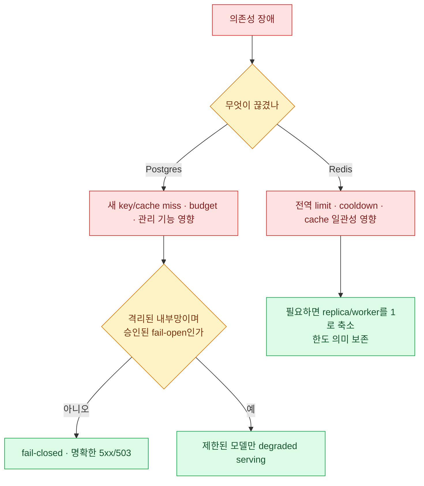

import { LinkCard } from '@astrojs/starlight/components';
import TermIntro from '../../../components/docs/TermIntro.astro';

> Postgres와 Redis는 둘 다 "상태"가 아니다 — **하나는 기억이고 다른 하나는 여러 process의 합의**다

<TermIntro
  terms={[
    ['system of record', '', '복구 뒤에도 보존돼야 하는 신뢰 가능한 원본 기록이다. 여기서는 Postgres다.'],
    ['coordination state', '', '여러 process가 같은 제한·cooldown·lock을 보도록 맞추는 빠른 공유 상태다.'],
    ['connection pool', '', '매 요청마다 새 DB 연결을 만들지 않도록 process가 보유하는 연결 집합이다.'],
    ['fail-open', '', '정책 저장소를 확인할 수 없어도 요청을 허용하는 장애 정책이다.'],
  ]}
/>

## 역할을 나란히 본다

| 저장소 | 기억하는 것 | 잃거나 끊기면 |
|---|---|---|
| Postgres | key·user·team·spend log·DB 관리 설정 | cache miss 인증, 관리 기능, 비용 기록과 config 원본이 깨진다 |
| Redis | rate-limit counter·router cooldown·분산 cache·invalidation·job lock | replica가 서로 다른 제한과 route 상태를 보고 cache가 분열된다 |

Postgres backup이 Redis를 대신하지 않고, Redis persistence가 Postgres backup을 대신하지 않는다.

## Postgres는 요청 경로에 있다

key cache miss와 budget 판정, 관리 API와 spend 기록이 DB에 닿는다. 공식 아키텍처는 응답 뒤 spend write를
비동기로 두지만, DB 연결 고갈과 긴 transaction은 다음 요청의 인증 조회에도 영향을 준다.

production 문서는 DB connection pool 상한을 다음처럼 계산하라고 안내한다.

```text
process당 pool limit ≤ DB 허용 연결 수 / (최대 replica 수 × worker 수)
```

평소 replica가 아니라 HPA의 `maxReplicas`를 넣는다. DB의 전체 connection에서 운영·migration·backup·failover용
여유도 먼저 뺀다.

## spend write를 데이터베이스 hot spot으로 만들지 않는다

요청마다 같은 key·team의 누적치를 갱신하면 높은 트래픽에서 write contention이 생긴다. 공식 production
지침은 batch write를 제공하고, 매우 높은 트래픽에서는 Redis transaction buffer로 모아 DB에 flush하는
경로를 설명한다.

최적화 전에 먼저 측정한다.

- 초당 요청과 spend row 증가율
- transaction latency, deadlock, connection saturation
- batch queue와 flush 실패
- prompt·response를 spend log에 저장할 때 row 크기와 보존 비용

## Redis는 replica를 하나처럼 만든다

환경 변수에 `REDIS_HOST`만 넣는 것으로 충분하지 않다. 공식 문서는 router state용 `router_settings`와
분산 cache·limit·invalidation용 `litellm_settings.cache_params`를 모두 연결하라고 안내한다.

```yaml
router_settings:
  redis_host: os.environ/REDIS_HOST
  redis_port: os.environ/REDIS_PORT
  redis_password: os.environ/REDIS_PASSWORD

litellm_settings:
  cache: true
  cache_params:
    type: redis
    host: os.environ/REDIS_HOST
    port: os.environ/REDIS_PORT
    password: os.environ/REDIS_PASSWORD
```

response cache를 쓰지 않더라도 coordination 용도의 Redis는 필요할 수 있다. **cache 기능과 분산 합의를
같은 on/off switch로 생각하지 않는다.**

## 장애 정책



LiteLLM에는 DB unavailable 상태에서 요청을 허용하는 설정이 있지만, 공식 문서도 public internet에서 접근할 수
없는 VPC/내부망에만 쓰라고 경고한다. 인증·budget 확인을 건너뛰는 availability 선택이므로 보안 승인이 필요하다.

## backup과 복구에 포함할 것

- Postgres base backup/PITR와 정기 복원 시험
- `LITELLM_SALT_KEY`의 별도 안전 보관 — 저장된 provider credential 복호화에 필요하며 변경하면 안 된다
- master key rotation 절차와 break-glass 보관
- Git의 공개 모델·router 설정과 실제 DB 관리 설정 export
- Redis 장애 후 counter·cooldown·cache가 초기화될 때의 운영 절차

Redis snapshot을 복원하는 것보다 중요한 것은 failover 뒤 **한도가 느슨해지거나 오래된 key cache가 살아나는
보안 효과**를 이해하는 것이다.

## 참고 자료

- [Production Deployment](https://docs.litellm.ai/docs/proxy/deploy) — Postgres·Redis의 공식 역할과 topology.
- [What Needs Redis](https://docs.litellm.ai/docs/proxy/redis_requirements) — Redis 없이 다중 worker에서 깨지는 기능과 설정 두 경계.
- [Production Best Practices](https://docs.litellm.ai/docs/proxy/prod) — DB pool, batch spend write, transaction buffer와 DB unavailable 정책.

<LinkCard
  title="8. 보안과 네트워크"
  description="중앙 gateway가 모으는 credential과 prompt 데이터의 blast radius를 줄인다."
  href="/litellm/08-security/"
/>
