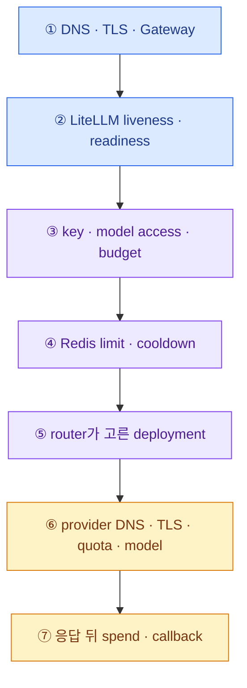
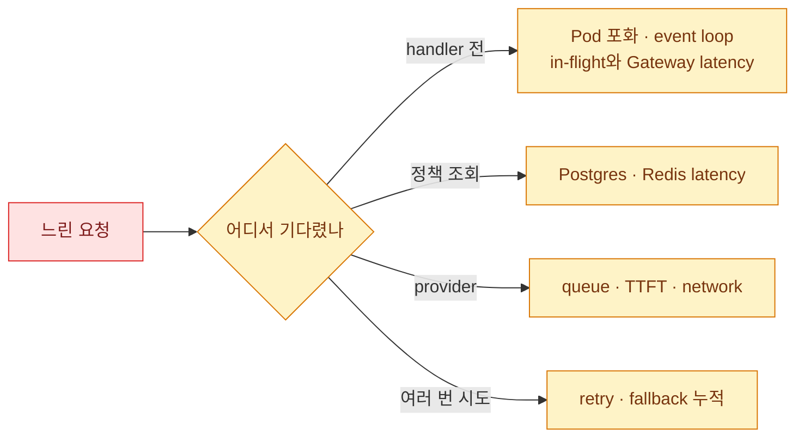

import { LinkCard } from '@astrojs/starlight/components';
import TermIntro from '../../../components/docs/TermIntro.astro';

> 로그를 무작정 읽지 않는다 — **요청이 마지막으로 성공한 경계**를 먼저 찾는다

<TermIntro
  terms={[
    ['diagnostic ladder', '', '바깥 연결부터 내부 의존성까지 한 층씩 통과 여부를 확인하는 진단 순서다.'],
    ['synthetic request', '', '알려진 key·model·prompt로 전체 경로를 반복 검증하는 운영용 요청이다.'],
    ['upstream', '', 'LiteLLM이 호출하는 외부 provider나 사내 model endpoint다.'],
    ['partial response', '', 'streaming 중 일부 token만 전달된 뒤 연결이 끝난 불완전 응답이다.'],
  ]}
/>

## 진단 사다리



각 층의 성공 증거를 하나씩 모은다. provider dashboard가 정상이라는 이유로 client TLS를 건너뛰거나,
Pod가 Running이라는 이유로 DB readiness를 건너뛰지 않는다.

## 첫 5분

```bash
kubectl -n ai-gateway get pod,svc,endpoints
kubectl -n ai-gateway get events --sort-by=.lastTimestamp
kubectl -n ai-gateway logs deploy/litellm --since=15m
```

클러스터 내부에서 probe를 확인한다.

```bash
kubectl -n ai-gateway port-forward svc/litellm 4000:4000
curl -fsS http://127.0.0.1:4000/health/liveliness
curl -fsS http://127.0.0.1:4000/health/readiness
```

그다음 승인된 synthetic virtual key로 작은 모델 요청을 보낸다. shell history와 process list에 key가 남지 않게
운영용 wrapper나 안전한 Secret 주입 방식을 사용한다.

## 증상별 첫 분기

| 증상 | 먼저 볼 경계 | 다음 단서 |
|---|---|---|
| 연결 자체가 안 됨 | DNS·Gateway·Service endpoint | certificate, route, NetworkPolicy |
| Pod는 Running, readiness 503 | Postgres 연결·migration | readiness `db`, DB DNS·TLS·connection |
| 401/403 | virtual key·허용 model·만료 | key owner/team, config 수렴 |
| 예상보다 잦은 429 | Redis와 실제 process 수 | key/team RPM·TPM, provider 429 구분 |
| 특정 model만 5xx | router 선택과 upstream | model group, selected deployment, provider error |
| p99만 급증 | retry·fallback·queue | in-flight, attempt 수, DB·Redis latency |
| stream 중간 끊김 | upstream stream·Gateway timeout | client disconnect, drain, 첫 token 뒤 오류 |
| 응답은 성공, Langfuse 없음 | callback pipeline | callback failure metric, DNS·TLS·Secret |
| Pod마다 결과가 다름 | Redis·DB config polling | cache invalidation, config revision, worker 수 |

## 401과 403

1. client가 LiteLLM용 key를 보내는지 확인한다. provider key를 직접 넣은 것은 다른 자격 증명이다.
2. key가 만료·폐기됐는지, owner/team이 맞는지 본다.
3. 요청한 공개 `model_name`이 허용 목록에 있는지 본다.
4. DB 관리 설정 변경 직후라면 모든 Pod가 polling interval 안에 수렴했는지 본다.
5. master key로 우회해 정상화하지 말고 최소 범위의 새 virtual key로 비교한다.

## 429를 셋으로 나눈다

- LiteLLM key/team limit: 정책대로 막은 것이다.
- LiteLLM global/parallel limit: gateway 보호 장치다.
- provider 429: deployment quota 또는 model server capacity 문제다.

응답 status만으로는 같은 429처럼 보여도 조치는 다르다. `call_id`, exception class, 실제 provider와 retry 횟수를
함께 본다. Redis 장애 뒤 각 Pod의 counter가 갈라졌으면 "429가 적어지는" 현상도 장애다.

## timeout과 긴 tail latency



평균 latency가 아니라 attempt별 시간과 p99를 본다. fallback 성공은 최종 status를 200으로 만들 수 있어도
앞선 실패 시간이 사라지지 않는다.

## DB 장애

- readiness의 DB 상태와 Postgres connection saturation을 확인한다.
- HPA rollout 직후 connection pool 곱셈이 상한을 넘었는지 계산한다.
- migration Job과 serving Pod가 동시에 schema 작업을 하지 않았는지 본다.
- spend batch queue와 deadlock·slow query를 확인한다.
- 승인 없이 `allow_requests_on_db_unavailable`로 fail-open하지 않는다.

## Redis 장애

- `router_settings`와 `cache_params`가 같은 Redis/올바른 coordination Redis를 가리키는지 본다.
- Sentinel/Cluster failover 뒤 client가 새 primary를 찾았는지 본다.
- limit, cooldown, revoked key invalidation이 Pod마다 달라졌는지 시험한다.
- 보안상 전역 limit이 중요하면 복구까지 serving process를 하나로 줄이는 degraded mode를 검토한다.

## trace가 없는 장애

Langfuse가 없다고 LLM 호출이 없었던 것은 아니다. LiteLLM `call_id`로 gateway 로그와 spend 기록을 먼저 찾고,
callback failure metric과 Langfuse ingest를 확인한다. prompt redaction 정책 때문에 내용만 비어 있는 경우와
callback 전체가 유실된 경우도 구분한다.

## 정기 장애 훈련

- LiteLLM Pod 하나 강제 종료와 긴 stream drain
- Postgres primary failover와 readiness 변화
- Redis failover 뒤 전역 RPM/TPM 유지
- provider 429·5xx와 fallback 순서·총 latency
- 내부 model endpoint DNS/TLS 장애
- Langfuse 중단 중 요청 성공과 callback failure 알림
- 잘못된 config와 migration 실패 시 rollout 중단

## 참고 자료

- [Health Checks](https://docs.litellm.ai/docs/proxy/health) — probe와 실제 model health 점검.
- [LiteLLM Debugging](https://docs.litellm.ai/docs/proxy/debugging) — Proxy 로그·correlation id와 공통 오류의 공식 진입점.
- [Production Best Practices](https://docs.litellm.ai/docs/proxy/prod) — DB·Redis·worker와 production logging.
- [Fallbacks](https://docs.litellm.ai/docs/proxy/reliability) — 실제 provider 오류로 retry/fallback을 검증하는 방법.

<LinkCard
  title="12. 용어 사전"
  description="모델·정책·routing·Kubernetes 운영 용어를 한 표에서 다시 맞춘다."
  href="/litellm/12-glossary/"
/>
